# Oil & Gas Upstream Operations Workflow Diagrams

**Last Updated**: January 2025  
**Status**: Comprehensive Visual Guide  
**Purpose**: Complete visual representation of upstream oil and gas operations
workflows

This document provides detailed Mermaid diagrams illustrating the complete
business workflow of upstream oil and gas operators, from lease acquisition
through production and revenue distribution.

## 🎯 **Overview: Complete Upstream Operations Lifecycle**

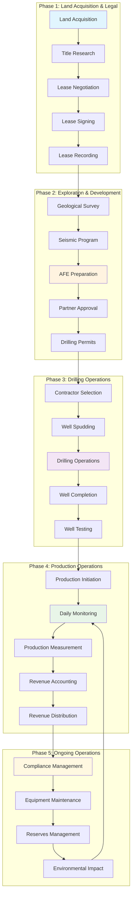

## 🏛️ **Phase 1: Land Management & Lease Administration**

### **1.1 Lease Acquisition Workflow**

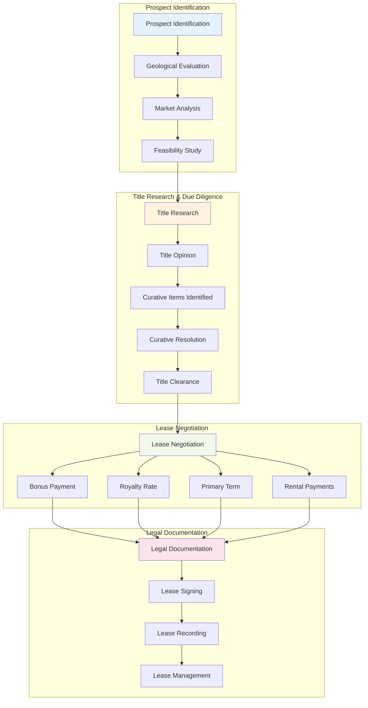

### **1.2 Title Management & Curative Process**

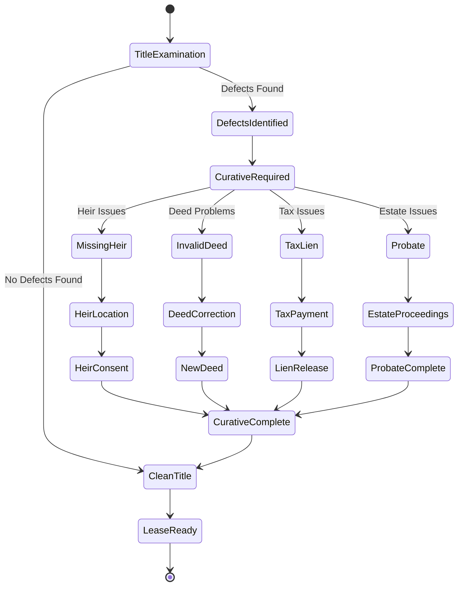

## 💰 **Phase 2: Financial Operations & AFE Management**

### **2.1 AFE (Authorization for Expenditure) Workflow**

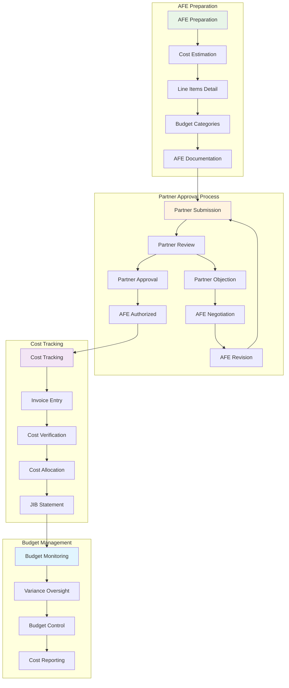

### **2.2 Revenue Distribution & Division Orders**

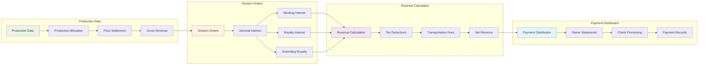

## 🔧 **Phase 3: Drilling Operations Workflow**

### **3.1 Daily Drilling Reports (DDR) Process**

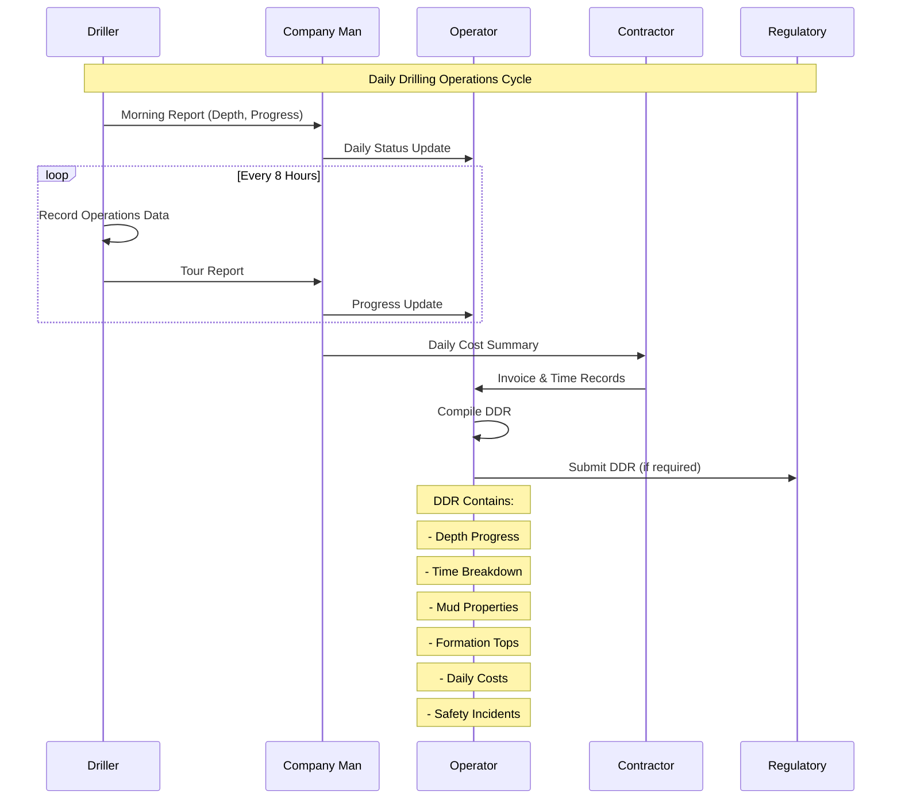

### **3.2 Well Completion Operations**

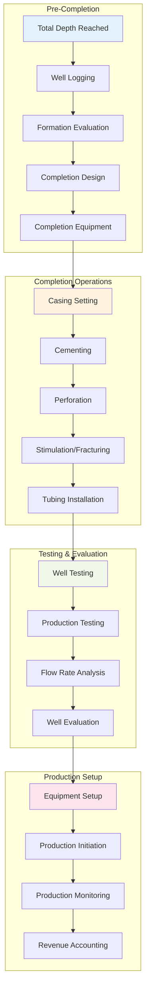

## 📊 **Phase 4: Production Operations & Monitoring**

### **4.1 Daily Production Workflow**

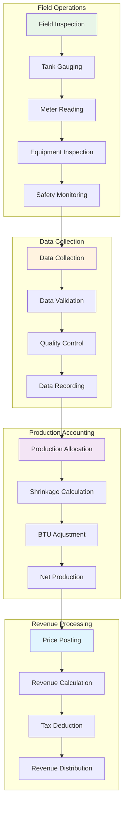

### **4.2 Custody Transfer & Measurement**

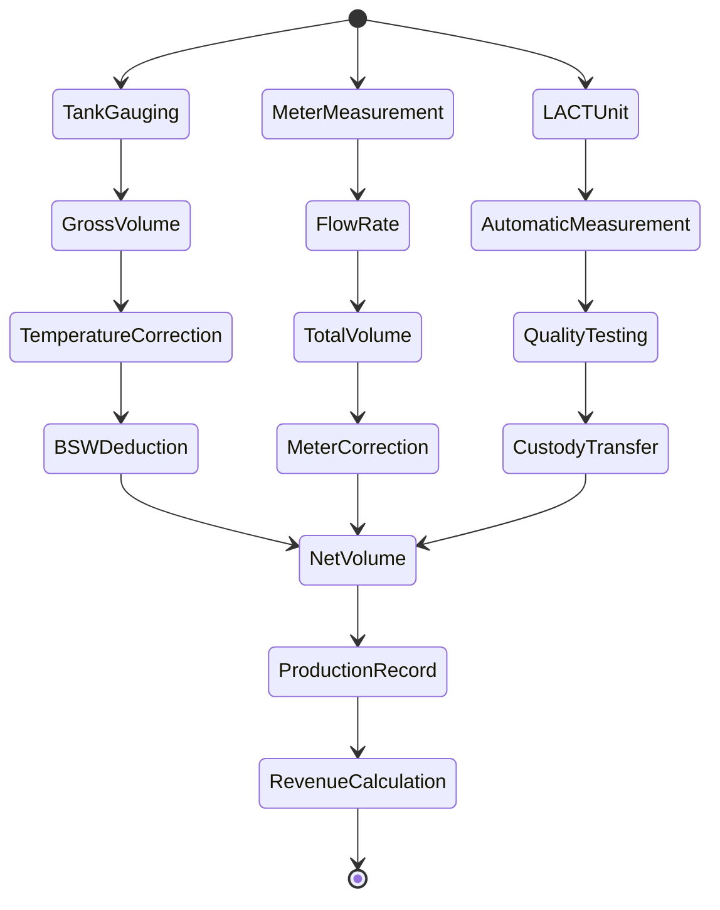

## 🏛️ **Phase 5: Regulatory Compliance & Environmental**

### **5.1 Automated Regulatory Reporting Workflow**

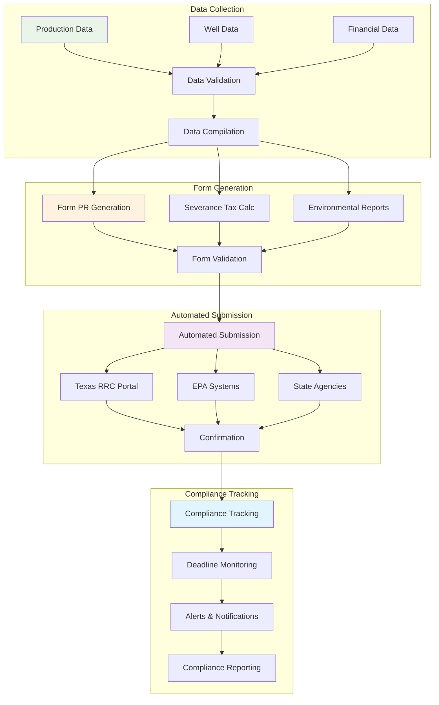

### **5.2 Environmental Incident Management**

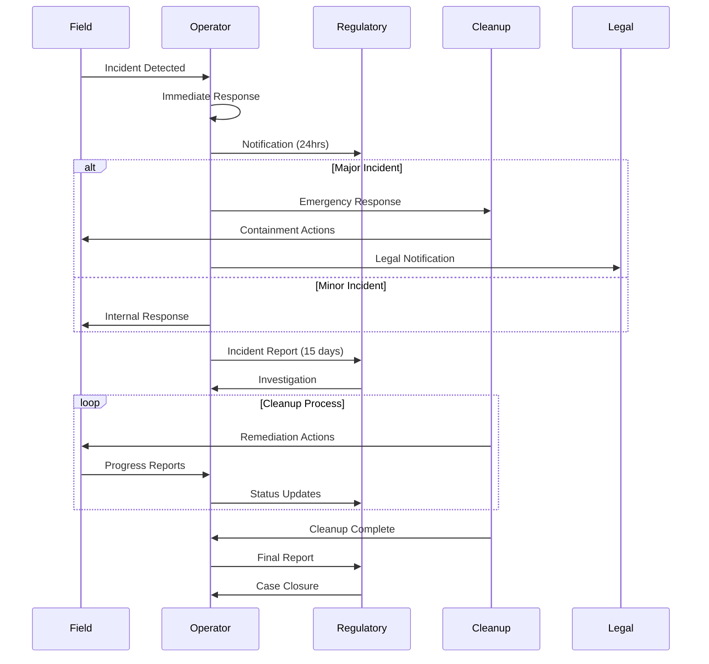

## 🔗 **Phase 6: Industry Software Integration Workflow**

### **6.1 Data Integration Architecture**

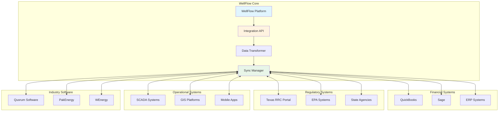

## 📈 **Complete Business Process Integration**

### **6.2 End-to-End Workflow Integration**

```mermaid
journey
    title Oil & Gas Upstream Operations Journey
    section Land Acquisition
      Prospect Identification: 3: Geologist
      Title Research: 2: Landman
      Lease Negotiation: 4: Landman
      Lease Recording: 5: Legal
    section Development
      AFE Preparation: 3: Engineer
      Partner Approval: 2: Partners
      Drilling Permits: 4: Regulatory
      Contractor Selection: 5: Operations
    section Drilling
      Well Spudding: 4: Driller
      Daily Operations: 3: Company Man
      Well Completion: 5: Completion Crew
      Well Testing: 4: Engineer
    section Production
      Production Start: 5: Operator
      Daily Monitoring: 4: Pumper
      Revenue Accounting: 3: Accountant
      Distribution: 5: Partners
    section Compliance
      Regulatory Reporting: 2: Compliance
      Environmental Monitoring: 3: Environmental
      Audit Preparation: 4: Management
      Continuous Operations: 5: All
```

## 🔄 **Phase 7: Reserves Management & SEC Reporting**

### **7.1 Reserves Estimation Workflow**

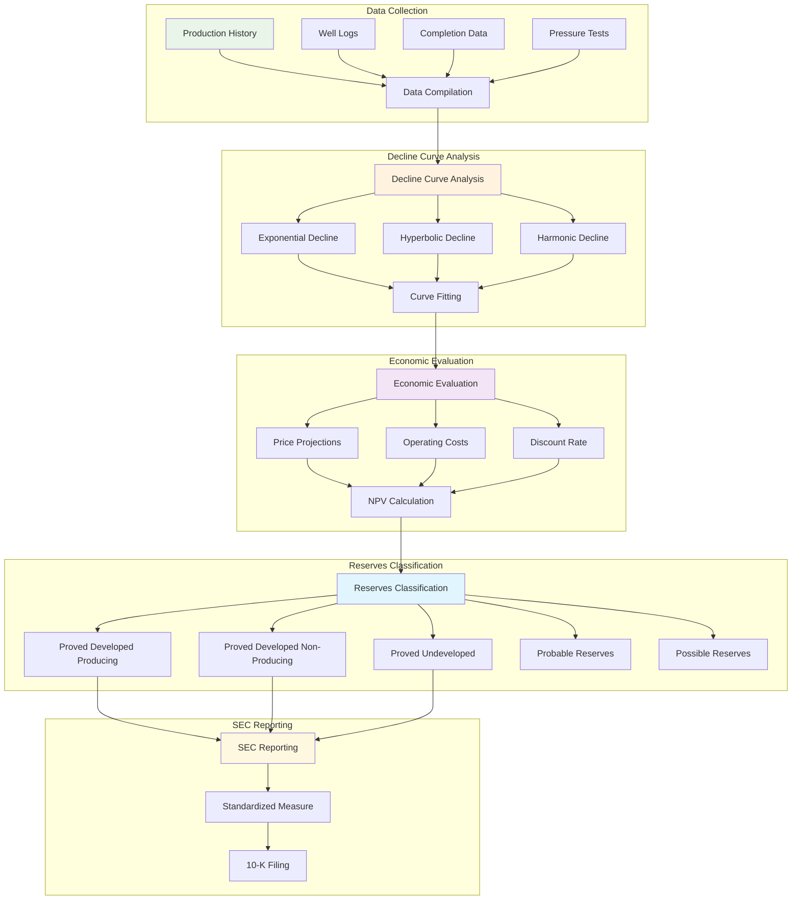

### **7.2 SEC Reserves Reporting Process**

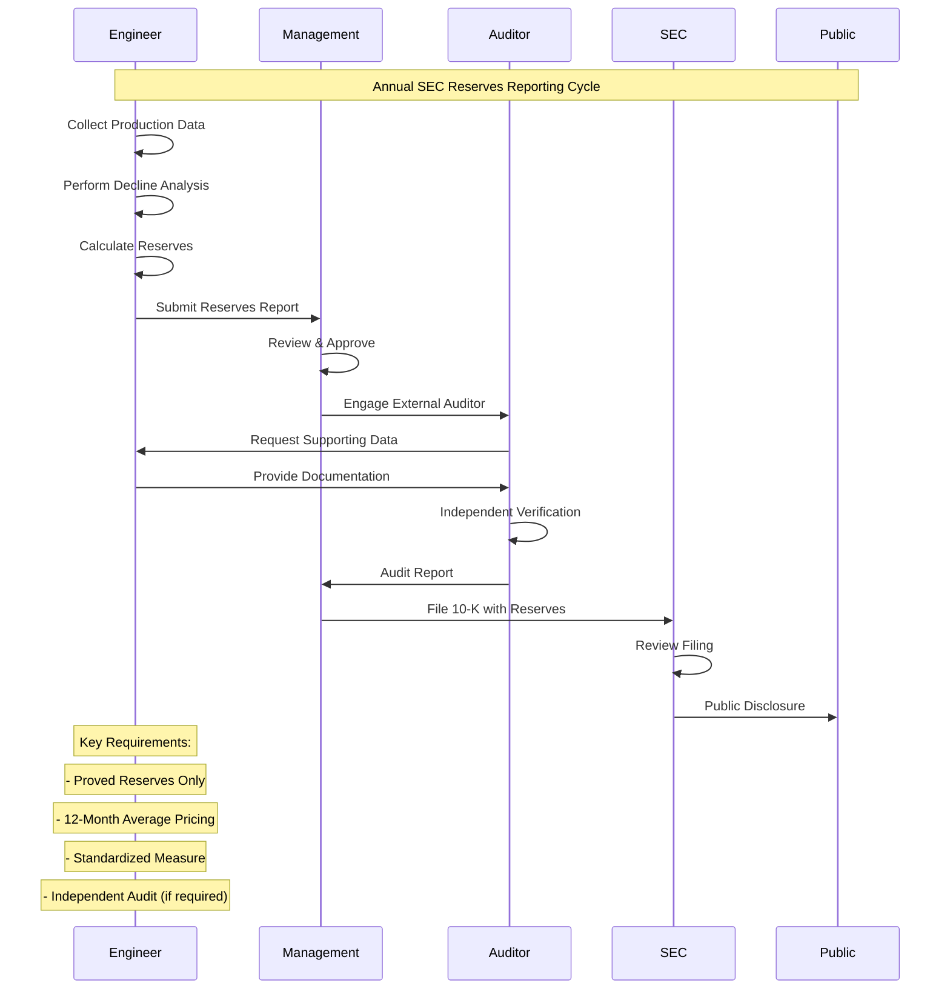

## 🏭 **Phase 8: Field Operations & Maintenance**

### **8.1 Pumper Route & Field Inspection Workflow**

```mermaid
flowchart LR
    subgraph "Route Planning"
        RP[Route Planning] --> WA[Well Assignment]
        WA --> OP[Optimize Path]
        OP --> ST[Schedule Time]
        ST --> RR[Route Ready]
    end

    subgraph "Daily Inspection"
        RR --> WV[Well Visit]
        WV --> VI[Visual Inspection]
        VI --> TG[Tank Gauging]
        TG --> MR[Meter Reading]
        MR --> EI[Equipment Inspection]
        EI --> SI[Safety Inspection]
    end

    subgraph "Data Recording"
        SI --> DR[Data Recording]
        DR --> PD[Production Data]
        DR --> MD[Maintenance Data]
        DR --> SD[Safety Data]
        PD --> MU[Mobile Upload]
        MD --> MU
        SD --> MU
    end

    subgraph "Issue Management"
        MU --> IA[Issue Analysis]
        IA --> WO[Work Order]
        IA --> EM[Emergency]
        IA --> RO[Routine Operation]
        WO --> MS[Maintenance Schedule]
        EM --> IR[Immediate Response]
        RO --> NI[Next Inspection]
    end

    style RP fill:#e8f5e8
    style WV fill:#fff3e0
    style DR fill:#f3e5f5
    style IA fill:#e1f5fe
```

### **8.2 Work Order Management System**

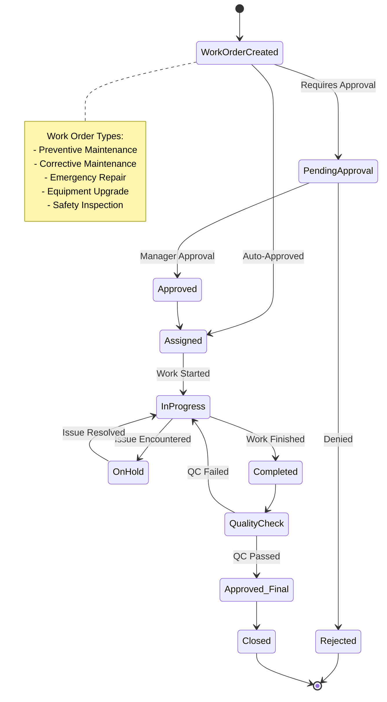

## 🌍 **Phase 9: Environmental Compliance & Monitoring**

### **9.1 Air Emissions Monitoring & Reporting**

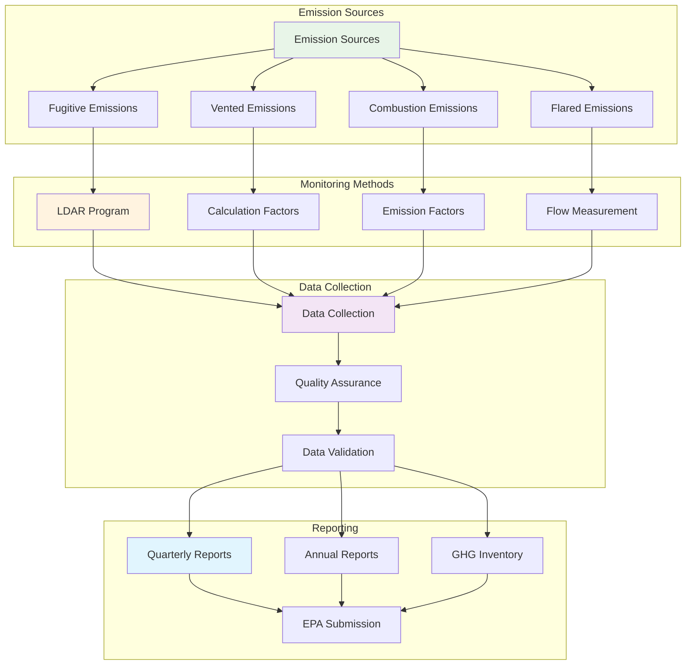

### **9.2 Spill Response & Remediation Process**

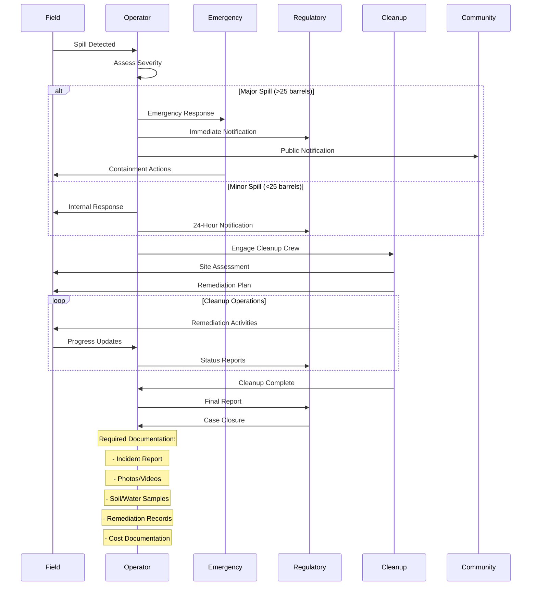

This comprehensive workflow diagram system provides visual representation of all
major upstream oil and gas operations, from initial land acquisition through
ongoing production and compliance management. Each diagram shows the
interconnected nature of operations and the critical data flows between
different business processes.

## 📋 **Diagram Usage Guide**

### **For Implementation Planning**

- Use Phase 1-2 diagrams for financial system design
- Reference Phase 3-4 for operational workflows
- Apply Phase 5-6 for compliance and integration planning

### **For System Architecture**

- Integration diagrams show data flow requirements
- State diagrams define business rule logic
- Sequence diagrams illustrate API interaction patterns

### **For User Experience Design**

- Journey maps guide user interface design
- Workflow diagrams inform navigation structure
- Process flows define user task sequences

### **For Compliance Validation**

- Regulatory workflows ensure compliance coverage
- Environmental processes meet EPA requirements
- SEC reporting flows satisfy disclosure obligations
