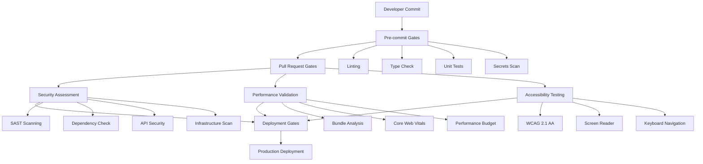

# WellFlow Quality Gates & Security Framework

## 🛡️ Overview

WellFlow implements enterprise-grade quality gates and security scanning
designed specifically for critical oil & gas production monitoring
infrastructure. Our comprehensive framework ensures compliance with industry
standards including NIST Cybersecurity Framework, IEC 62443, API 1164, and OWASP
security guidelines.

## 🏗️ Architecture



## 🚀 Quick Start

### Prerequisites

```bash
# Install required tools
npm install -g @lhci/cli @axe-core/cli pa11y
pip install checkov
brew install gitleaks trivy
```

### Running Quality Gates

#### Full Security Suite

```bash
# Run all security scans
pnpm run security:full

# Individual security scans
pnpm run security:api              # API security testing
pnpm run security:infrastructure   # Infrastructure scanning
pnpm run sast:scan                 # Static analysis
pnpm run secrets:scan              # Secrets detection
```

#### Performance Testing

```bash
# Performance analysis
pnpm run performance:report

# Individual performance tests
pnpm run performance:analyze       # Bundle size analysis
pnpm run performance:budget        # Budget compliance check
```

#### Accessibility Testing

```bash
# Accessibility validation
pnpm run accessibility:test

# Individual accessibility tools
pnpm run accessibility:axe         # Axe-Core scanning
pnpm run accessibility:pa11y       # Pa11y validation
pnpm run accessibility:lighthouse  # Lighthouse accessibility
```

#### License Compliance

```bash
# License compliance check
pnpm run license:check
pnpm run license:report
```

## 🔒 Security Framework

### Static Application Security Testing (SAST)

- **Tool**: Semgrep with custom oil & gas industry rules
- **Coverage**: JavaScript, TypeScript, Python, YAML, Docker
- **Standards**: OWASP Top 10, CWE Top 25
- **Configuration**: `.semgrep.yml`

### Secrets Detection

- **Tool**: GitLeaks
- **Scope**: All files, commit history, environment variables
- **Patterns**: API keys, passwords, certificates, private keys
- **Configuration**: `.gitleaks.toml`

### Dependency Vulnerability Scanning

- **Tools**: pnpm audit, Snyk (optional)
- **Frequency**: Every commit, daily scheduled scans
- **Thresholds**: Zero critical, <5 high severity vulnerabilities
- **Auto-remediation**: Automated security updates

### API Security Testing

- **Tools**: Custom OWASP scanner, ZAP, Nuclei
- **Coverage**: OWASP API Security Top 10
- **Tests**: Authentication, authorization, injection, data exposure
- **Standards**: NIST, IEC 62443 compliance

### Infrastructure Security

- **Tools**: Checkov, Trivy, Terrascan, Hadolint
- **Scope**: Docker, Kubernetes, Terraform, GitHub Actions
- **Standards**: CIS Benchmarks, NIST guidelines
- **Compliance**: Industrial cybersecurity (IEC 62443)

## 📊 Performance Monitoring

### Bundle Size Budgets

```json
{
  "budgets": {
    "javascript": "500KB",
    "css": "100KB",
    "total": "600KB"
  },
  "rationale": "Optimized for critical infrastructure and field operations"
}
```

### Core Web Vitals Targets

- **Largest Contentful Paint (LCP)**: <2.5 seconds
- **First Input Delay (FID)**: <100 milliseconds
- **Cumulative Layout Shift (CLS)**: <0.1
- **Performance Score**: >90 (Lighthouse)

### API Performance Standards

- **Health Check**: <100ms response time
- **Data Retrieval**: <500ms for paginated results
- **Real-time Updates**: <200ms WebSocket latency

## ♿ Accessibility Requirements

### WCAG 2.1 AA Compliance

- **Level A**: All success criteria must pass
- **Level AA**: All success criteria must pass
- **Testing**: Automated (Axe-Core, Pa11y) + Manual validation
- **Score Target**: >95 (Lighthouse Accessibility)

### Industry-Specific Requirements

- **Field Operations**: High contrast for outdoor visibility
- **Emergency Response**: Full keyboard navigation
- **Control Rooms**: Screen reader compatibility
- **Mobile Operations**: Touch-friendly interfaces

## 🏭 Industry Compliance

### Oil & Gas Standards

- **NIST Cybersecurity Framework**: Comprehensive security controls
- **IEC 62443**: Industrial automation and control systems security
- **API 1164**: Pipeline SCADA security guidelines
- **NERC CIP**: Critical infrastructure protection
- **TSA Pipeline Security**: Transportation security directives

### Security Frameworks

- **OWASP Top 10**: Web application security
- **OWASP API Security Top 10**: API-specific vulnerabilities
- **CIS Controls**: Critical security controls
- **SANS Top 25**: Most dangerous software errors

## 🔧 Configuration

### Environment Variables

```bash
# Security scanning
export SEMGREP_APP_TOKEN="your-token"
export SNYK_TOKEN="your-token"

# Performance monitoring
export LIGHTHOUSE_CI_TOKEN="your-token"

# Compliance reporting
export SONARQUBE_TOKEN="your-token"
```

### Quality Gate Thresholds

```yaml
# .quality-gates.yml
security:
  critical_vulnerabilities: 0
  high_vulnerabilities: 0
  secrets_detected: 0

performance:
  bundle_size_kb: 600
  lighthouse_performance: 90
  core_web_vitals_passing: true

accessibility:
  wcag_aa_compliance: true
  lighthouse_accessibility: 95
  axe_violations: 0

compliance:
  license_violations: 0
  dependency_vulnerabilities: 0
```

## 📋 GitHub Actions Workflows

### Automated Quality Gates

- **Security Scanning**: `.github/workflows/security-scan.yml`
- **Performance Monitoring**: `.github/workflows/performance-monitoring.yml`
- **Accessibility Testing**: `.github/workflows/accessibility-testing.yml`
- **License Compliance**: `.github/workflows/license-compliance.yml`
- **Infrastructure Security**: `.github/workflows/infrastructure-security.yml`

### Workflow Triggers

- **Push to main/develop**: Full quality gate suite
- **Pull Requests**: Comprehensive validation
- **Scheduled**: Daily security scans, weekly performance audits
- **Manual**: On-demand quality gate execution

## 📊 Reporting and Monitoring

### Automated Reports

- **Security Dashboard**: Real-time vulnerability status
- **Performance Metrics**: Bundle size trends, Core Web Vitals
- **Accessibility Audit**: WCAG compliance tracking
- **Compliance Status**: Industry standard adherence

### Report Locations

```
security-reports/
├── semgrep-results.json          # SAST findings
├── gitleaks-report.json          # Secrets detection
├── api-security-report.json      # API security assessment
├── infrastructure-security-report.json  # Infrastructure scan
└── dependency-audit.json         # Vulnerability scan

performance-reports/
├── bundle-analysis.json          # Bundle size analysis
├── lighthouse-results.json       # Performance metrics
└── core-web-vitals.json         # Web vitals data

accessibility-reports/
├── axe-results.json              # Axe-Core findings
├── pa11y-results.json            # Pa11y validation
└── accessibility-summary.json    # Combined results
```

## 🚨 Emergency Procedures

### Quality Gate Bypass

**When**: Critical production issues requiring immediate deployment
**Authorization**: Dual approval (Lead Engineer + Security Officer) **Process**:

1. Document emergency justification
2. Create bypass approval ticket
3. Deploy with enhanced monitoring
4. Schedule immediate remediation
5. Conduct post-incident review

### Security Incident Response

**Severity Classification**:

- 🚨 **Critical**: Production impact, active exploitation
- 🔴 **High**: Significant risk, urgent attention required
- 🟡 **Medium**: Moderate risk, timely resolution needed
- 🔵 **Low**: Minor improvements, standard process

**Response Times**:

- Critical: 15 minutes
- High: 2 hours
- Medium: 24 hours
- Low: 1 week

## 📚 Documentation

### Core Documents

- **[Quality Gates Overview](./QUALITY_GATES.md)**: Comprehensive framework
  documentation
- **[Security Runbook](./SECURITY_RUNBOOK.md)**: Incident response procedures
- **[Performance Guidelines](./PERFORMANCE.md)**: Performance optimization guide
- **[Accessibility Standards](./ACCESSIBILITY.md)**: WCAG compliance
  requirements

### Tool Documentation

- **[Semgrep Configuration](../.semgrep.yml)**: SAST scanning rules
- **[GitLeaks Configuration](../.gitleaks.toml)**: Secrets detection patterns
- **[Performance Budget](../performance-budget.json)**: Bundle size limits
- **[Lighthouse Config](../lighthouse.config.js)**: Performance testing setup

## 🛠️ Development Workflow

### Pre-commit Hooks

```bash
# Installed automatically with husky
npm run prepare

# Manual execution
pnpm run pre-commit
```

### Local Quality Gates

```bash
# Run before creating PR
pnpm run quality:check

# Fix common issues
pnpm run lint:fix
pnpm run format
pnpm run test:fix
```

### CI/CD Integration

```bash
# Quality gates run automatically on:
# - Every commit to main/develop
# - All pull requests
# - Scheduled daily/weekly scans
# - Manual workflow dispatch
```

## 📞 Support

### Team Contacts

- **Security Team**: <security@wellflow.com>
- **DevOps Team**: <devops@wellflow.com>
- **Quality Assurance**: <qa@wellflow.com>

### Escalation Process

1. **Level 1**: Development Team
2. **Level 2**: Team Lead
3. **Level 3**: Engineering Manager
4. **Level 4**: CISO/CTO

### External Resources

- **OWASP**: <https://owasp.org/>
- **NIST Cybersecurity**: <https://www.nist.gov/cyberframework>
- **IEC 62443**: <https://www.iec.ch/cyber-security>
- **WCAG Guidelines**: <https://www.w3.org/WAI/WCAG21/>

## 🔄 Continuous Improvement

### Metrics Tracking

- Quality gate pass rates (target: >95%)
- Security finding resolution time (target: <24h critical)
- Performance regression detection
- Accessibility compliance trends

### Regular Reviews

- **Monthly**: Quality gate effectiveness review
- **Quarterly**: Tool evaluation and updates
- **Annually**: Compliance framework assessment
- **Ongoing**: Industry standard updates

---

**Version**: 1.0.0  
**Last Updated**: December 2024  
**Maintained By**: WellFlow Security & Quality Assurance Teams

For questions or contributions, please contact: <qa@wellflow.com>
