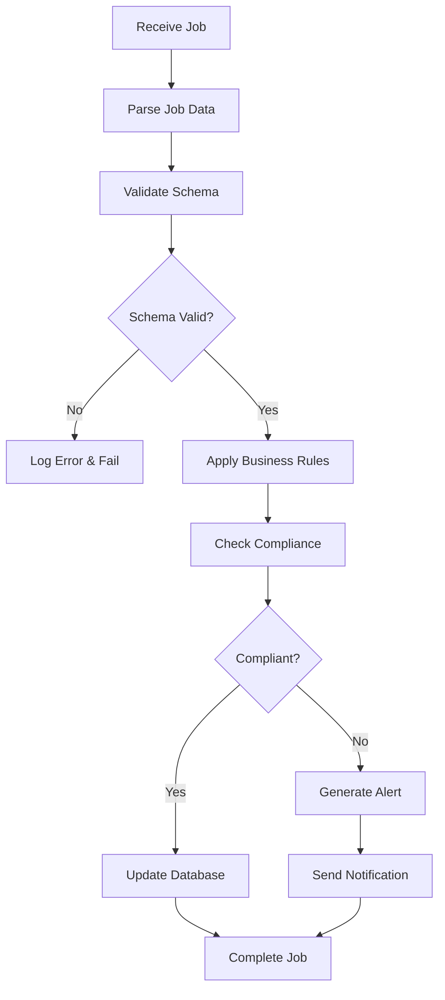

# WellFlow Job Processors Documentation

## Overview

Job processors are the core components that handle background job execution in the WellFlow queue system. Each processor is responsible for a specific type of operation and implements industry-specific business logic for oil & gas operations.

## Architecture

### Processor Structure

All processors follow a consistent pattern:

```typescript
@Processor('queue-name')
export class ProcessorName {
  private readonly logger = new Logger(ProcessorName.name);

  @Process('job-type')
  async processJob(job: Job<JobDataType>): Promise<JobResultType> {
    // Job processing logic
  }
}
```

### Error Handling

Processors implement comprehensive error handling:
- Structured error logging
- Retry logic with exponential backoff
- Dead letter queue for failed jobs
- Audit trail for compliance

## Data Validation Processor

**File**: `apps/api/src/jobs/processors/data-validation.processor.ts`
**Queue**: `data-validation`

### Purpose

Validates oil & gas production data for accuracy, completeness, and regulatory compliance.

### Job Types

#### Production Data Validation
```typescript
interface ProductionValidationJob {
  wellId: string;
  leaseId: string;
  operatorId: string;
  location: {
    latitude: number;
    longitude: number;
    county: string;
    state: string;
  };
  production: {
    oil: number;    // barrels per day
    gas: number;    // MCF per day
    water: number;  // barrels per day
  };
  timestamp: string;
  validationType: 'production_data' | 'historical_data' | 'compliance_check';
  includeHistorical: boolean;
  notifyOnFailure: boolean;
}
```

#### Well Data Integrity Check
```typescript
interface WellIntegrityJob {
  wellId: string;
  checkType: 'structural' | 'environmental' | 'safety';
  inspectionDate: string;
  inspector: string;
  findings: WellInspectionFinding[];
  complianceStatus: 'compliant' | 'non_compliant' | 'pending';
}
```

### Validation Rules

1. **Production Data Validation**
   - Oil production: 0-10,000 barrels/day
   - Gas production: 0-50,000 MCF/day
   - Water production: 0-5,000 barrels/day
   - Geographic coordinates within valid ranges
   - County/state consistency checks

2. **Regulatory Compliance**
   - EPA reporting requirements
   - State regulatory compliance (Texas, Oklahoma, etc.)
   - Environmental impact thresholds
   - Safety standard adherence

3. **Data Quality Checks**
   - Missing data detection
   - Outlier identification
   - Historical trend analysis
   - Cross-reference validation

### Processing Flow



## Report Generation Processor

**File**: `apps/api/src/jobs/processors/report-generation.processor.ts`
**Queue**: `report-generation`

### Purpose

Generates regulatory and operational reports for oil & gas operations.

### Report Types

#### Production Reports
```typescript
interface ProductionReportJob {
  reportId: string;
  reportType: 'production_daily' | 'production_monthly' | 'production_quarterly';
  organizationId: string;
  dateRange: {
    start: string;
    end: string;
  };
  format: 'pdf' | 'excel' | 'csv';
  includeCharts: boolean;
  recipients: string[];
  priority: 'low' | 'medium' | 'high' | 'urgent';
  wells?: string[];
  leases?: string[];
}
```

#### Compliance Reports
```typescript
interface ComplianceReportJob {
  reportId: string;
  reportType: 'compliance_monthly' | 'environmental_quarterly' | 'safety_weekly';
  organizationId: string;
  regulatoryBody: 'EPA' | 'RRC' | 'OSHA' | 'DOT';
  dateRange: DateRange;
  format: ReportFormat;
  autoSubmit: boolean;
  certificationRequired: boolean;
}
```

### Report Generation Process

1. **Data Collection**
   - Query production databases
   - Aggregate well data
   - Calculate metrics and KPIs
   - Validate data completeness

2. **Report Assembly**
   - Apply report templates
   - Generate charts and visualizations
   - Format data according to specifications
   - Add regulatory headers and footers

3. **Quality Assurance**
   - Data accuracy verification
   - Compliance rule validation
   - Format consistency checks
   - Regulatory requirement verification

4. **Distribution**
   - Generate final report files
   - Send to specified recipients
   - Archive for compliance records
   - Update audit trails

### Supported Formats

| Format | Use Case | Features |
|--------|----------|----------|
| **PDF** | Regulatory submissions | Professional formatting, charts, signatures |
| **Excel** | Data analysis | Formulas, pivot tables, multiple sheets |
| **CSV** | Data export | Raw data, system integration |

## Email Notification Processor

**File**: `apps/api/src/jobs/processors/email-notification.processor.ts`
**Queue**: `email-notifications`

### Purpose

Sends critical alerts, notifications, and communications for oil & gas operations.

### Notification Types

#### Safety Alerts
```typescript
interface SafetyAlertJob {
  notificationId: string;
  type: 'safety_alert';
  severity: 'critical' | 'high' | 'medium' | 'low';
  message: string;
  wellId?: string;
  leaseId?: string;
  location: GeoLocation;
  recipients: string[];
  escalationRules: EscalationRule[];
  requiresAcknowledgment: boolean;
}
```

#### Compliance Notifications
```typescript
interface ComplianceNotificationJob {
  notificationId: string;
  type: 'compliance_due' | 'permit_renewal' | 'inspection_required';
  dueDate: string;
  regulatoryBody: string;
  requirements: string[];
  recipients: string[];
  reminderSchedule: ReminderSchedule;
}
```

#### Operational Alerts
```typescript
interface OperationalAlertJob {
  notificationId: string;
  type: 'production_threshold' | 'equipment_maintenance' | 'report_ready';
  priority: 'urgent' | 'high' | 'medium' | 'low';
  message: string;
  actionRequired: boolean;
  deadline?: string;
  recipients: string[];
}
```

### Email Templates

#### Safety Alert Template
```html
<!DOCTYPE html>
<html>
<head>
    <title>WellFlow Safety Alert</title>
</head>
<body>
    <div class="alert-header critical">
        <h1>🚨 CRITICAL SAFETY ALERT</h1>
    </div>
    <div class="alert-content">
        <p><strong>Well ID:</strong> {{wellId}}</p>
        <p><strong>Location:</strong> {{location}}</p>
        <p><strong>Alert:</strong> {{message}}</p>
        <p><strong>Time:</strong> {{timestamp}}</p>
    </div>
    <div class="alert-actions">
        <a href="{{acknowledgeUrl}}" class="btn-acknowledge">
            Acknowledge Alert
        </a>
    </div>
</body>
</html>
```

#### Compliance Reminder Template
```html
<!DOCTYPE html>
<html>
<head>
    <title>WellFlow Compliance Reminder</title>
</head>
<body>
    <div class="reminder-header">
        <h1>📋 Compliance Reminder</h1>
    </div>
    <div class="reminder-content">
        <p><strong>Due Date:</strong> {{dueDate}}</p>
        <p><strong>Regulatory Body:</strong> {{regulatoryBody}}</p>
        <p><strong>Requirements:</strong></p>
        <ul>
            {{#each requirements}}
            <li>{{this}}</li>
            {{/each}}
        </ul>
    </div>
</body>
</html>
```

### Notification Routing

Recipients are determined by:
- **Role-based routing**: safety@, compliance@, operations@
- **Geographic routing**: Regional managers and operators
- **Escalation rules**: Automatic escalation for critical alerts
- **On-call schedules**: 24/7 coverage for critical operations

## Error Handling & Monitoring

### Error Categories

1. **Validation Errors**
   - Invalid job data format
   - Missing required fields
   - Business rule violations

2. **Processing Errors**
   - Database connection failures
   - External API timeouts
   - Resource unavailability

3. **System Errors**
   - Memory limitations
   - Network connectivity issues
   - Service dependencies

### Retry Strategy

```typescript
const retryOptions = {
  attempts: 3,
  backoff: {
    type: 'exponential',
    delay: 2000,
  },
  removeOnComplete: 100,
  removeOnFail: 50,
};
```

### Monitoring & Alerting

- **Job Success/Failure Rates**: Track processing success rates
- **Processing Times**: Monitor job execution duration
- **Queue Depths**: Alert on queue backlog buildup
- **Error Patterns**: Identify recurring issues
- **Resource Usage**: Monitor CPU, memory, and network usage

## Performance Optimization

### Concurrency Management

```typescript
@Process({ name: 'process-job', concurrency: 5 })
async processJob(job: Job): Promise<void> {
  // Process with controlled concurrency
}
```

### Memory Management

- Stream large datasets instead of loading into memory
- Implement garbage collection for temporary files
- Use connection pooling for database operations
- Cache frequently accessed data

### Database Optimization

- Use indexed queries for data retrieval
- Implement read replicas for reporting
- Batch database operations where possible
- Use prepared statements for repeated queries

## Testing

### Unit Tests

```typescript
describe('DataValidationProcessor', () => {
  it('should validate production data successfully', async () => {
    const job = createMockJob({
      wellId: 'WELL-123',
      production: { oil: 500, gas: 1200, water: 100 }
    });
    
    const result = await processor.processProductionValidation(job);
    
    expect(result.isValid).toBe(true);
    expect(result.errors).toHaveLength(0);
  });
});
```

### Integration Tests

```typescript
describe('Report Generation Integration', () => {
  it('should generate and distribute monthly report', async () => {
    const job = createReportJob({
      reportType: 'production_monthly',
      format: 'pdf',
      recipients: ['test@wellflow.com']
    });
    
    await processor.processReportGeneration(job);
    
    expect(emailService.send).toHaveBeenCalledWith({
      to: ['test@wellflow.com'],
      subject: expect.stringContaining('Monthly Production Report'),
      attachments: expect.arrayContaining([
        expect.objectContaining({ filename: expect.stringMatching(/\.pdf$/) })
      ])
    });
  });
});
```

## Security Considerations

### Data Protection

- Sanitize sensitive data in logs
- Encrypt data at rest and in transit
- Implement access controls for job data
- Audit all data access and modifications

### Compliance

- Maintain audit trails for regulatory compliance
- Implement data retention policies
- Ensure GDPR/CCPA compliance for personal data
- Regular security assessments and updates

### Authentication & Authorization

- Validate job origins and permissions
- Implement role-based access controls
- Secure inter-service communications
- Regular security token rotation

This documentation provides comprehensive coverage of the WellFlow job processors, their functionality, and operational considerations.
