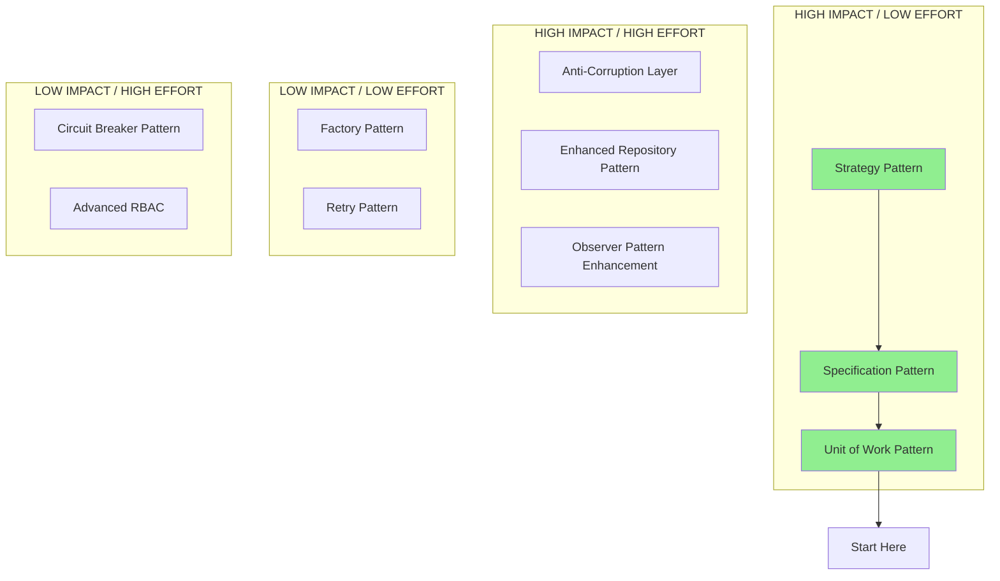

# API Codebase Pattern Analysis and Recommendations

## Current Architecture Assessment

### ✅ Patterns Already Well Implemented

1. **Hexagonal Architecture (Clean Architecture)** - ⭐⭐⭐⭐⭐
   - Clear separation: `presentation/` → `application/` → `domain/` →
     `infrastructure/`
   - Well-defined boundaries between layers
   - Dependencies point inward toward domain

2. **CQRS Pattern** - ⭐⭐⭐⭐⭐
   - Separate commands and queries
   - Command handlers in `application/handlers/`
   - Query handlers properly separated
   - Event bus integration

3. **Domain-Driven Design** - ⭐⭐⭐⭐⭐
   - Rich domain entities (e.g., `Well` entity with business logic)
   - Value objects (`ApiNumber`, `Coordinates`, `Location`)
   - Domain events (`WellStatusChangedEvent`)
   - Proper aggregate roots

4. **DTO Pattern** - ⭐⭐⭐⭐⭐
   - Clean data transfer boundaries
   - Validation decorators
   - Separation between API and domain models

5. **Repository Pattern** - ⭐⭐⭐⭐⭐
   - Interface-driven design
   - Clean abstraction over data access
   - Base repository for common operations

## Recommended Pattern Improvements

### 🚀 High Priority Implementations

#### 1. **Unit of Work Pattern** - MISSING

**Files to Update:**

- `src/infrastructure/repositories/unit-of-work.ts` (create new)
- `src/application/handlers/*.handler.ts` (update all command handlers)

```typescript
// Create: src/infrastructure/repositories/unit-of-work.ts
export class UnitOfWork {
  private transaction: DatabaseTransaction;

  async begin(): Promise<void> {
    /* Start transaction */
  }
  async commit(): Promise<void> {
    /* Commit transaction */
  }
  async rollback(): Promise<void> {
    /* Rollback transaction */
  }
}

// Update: src/application/handlers/create-well.handler.ts
@CommandHandler(CreateWellCommand)
export class CreateWellHandler {
  constructor(
    private readonly wellRepository: WellRepository,
    private readonly unitOfWork: UnitOfWork, // ADD THIS
    private readonly eventBus: EventBus
  ) {}

  async execute(command: CreateWellCommand): Promise<string> {
    await this.unitOfWork.begin();
    try {
      // Business logic
      await this.wellRepository.save(well);
      await this.unitOfWork.commit();
      // Publish events after successful commit
      this.publishEvents(well);
    } catch (error) {
      await this.unitOfWork.rollback();
      throw error;
    }
  }
}
```

#### 2. **Specification Pattern** - PARTIALLY MISSING

**Files to Update:**

- `src/domain/specifications/` (create directory)
- `src/domain/specifications/well-specifications.ts` (create new)
- `src/infrastructure/repositories/well.repository.ts` (enhance)

```typescript
// Create: src/domain/specifications/well-specifications.ts
export abstract class Specification<T> {
  abstract isSatisfiedBy(candidate: T): boolean;
  abstract toSqlClause(): SqlClause;
}

export class ActiveWellsSpecification extends Specification<Well> {
  isSatisfiedBy(well: Well): boolean {
    return [WellStatus.PRODUCING, WellStatus.DRILLING].includes(
      well.getStatus()
    );
  }

  toSqlClause(): SqlClause {
    return inArray(wellsTable.status, ['PRODUCING', 'DRILLING']);
  }
}
```

#### 3. **Strategy Pattern for Business Logic** - MISSING

**Files to Update:**

- `src/domain/strategies/` (create directory)
- `src/domain/strategies/payment-calculation.strategy.ts` (create new)
- `src/application/handlers/calculate-payment.handler.ts` (update)

```typescript
// Create: src/domain/strategies/payment-calculation.strategy.ts
export interface PaymentCalculationStrategy {
  calculate(lease: Lease, production: Production): PaymentAmount;
}

export class RoyaltyPaymentStrategy implements PaymentCalculationStrategy {
  calculate(lease: Lease, production: Production): PaymentAmount {
    return new PaymentAmount(
      production.getVolume() * lease.getRoyaltyRate() * production.getPrice()
    );
  }
}

export class WorkingInterestStrategy implements PaymentCalculationStrategy {
  calculate(lease: Lease, production: Production): PaymentAmount {
    const grossRevenue = production.getVolume() * production.getPrice();
    const netRevenue = grossRevenue - lease.getOperatingExpenses();
    return new PaymentAmount(netRevenue * lease.getWorkingInterest());
  }
}
```

### 🔧 Medium Priority Implementations

#### 4. **Anti-Corruption Layer for External APIs** - MISSING

**Files to Update:**

- `src/infrastructure/external-apis/` (create directory)
- `src/infrastructure/external-apis/regulatory-api.adapter.ts` (create new)

```typescript
// Current problematic code pattern (if exists):
// Direct API calls mixed with business logic

// Recommended ACL pattern:
export class RegulatoryApiAdapter {
  constructor(private readonly httpClient: HttpClient) {}

  async submitReport(
    domainReport: RegulatoryReport
  ): Promise<SubmissionResult> {
    // Translate domain model to external API format
    const apiPayload = this.translateToExternalFormat(domainReport);

    try {
      const response = await this.httpClient.post('/api/reports', apiPayload);
      return this.translateFromExternalFormat(response.data);
    } catch (error) {
      throw new ExternalApiError(`Failed to submit report: ${error.message}`);
    }
  }

  private translateToExternalFormat(
    report: RegulatoryReport
  ): ExternalReportFormat {
    // Translation logic
  }
}
```

#### 5. **Observer Pattern Enhancement** - PARTIALLY IMPLEMENTED

**Files to Update:**

- `src/domain/events/` (already exists - enhance)
- `src/application/event-handlers/` (create directory)
- `src/application/event-handlers/well-status-changed.handler.ts` (create new)

```typescript
// Create: src/application/event-handlers/well-status-changed.handler.ts
@EventsHandler(WellStatusChangedEvent)
export class WellStatusChangedHandler
  implements IEventHandler<WellStatusChangedEvent>
{
  constructor(
    private readonly notificationService: NotificationService,
    private readonly auditService: AuditService,
    private readonly reportingService: ReportingService
  ) {}

  async handle(event: WellStatusChangedEvent): Promise<void> {
    // Multiple observers can react to the same event
    await Promise.all([
      this.notificationService.notifyStakeholders(event),
      this.auditService.logStatusChange(event),
      this.reportingService.updateDashboard(event),
    ]);
  }
}
```

### 🛡️ Low Priority (Resilience Patterns)

#### 6. **Circuit Breaker Pattern** - MISSING

**Files to Update:**

- `src/common/resilience/circuit-breaker.ts` (create new)
- `src/infrastructure/external-apis/*.ts` (enhance all external API calls)

#### 7. **Retry Pattern with Exponential Backoff** - MISSING

**Files to Update:**

- `src/common/resilience/retry.decorator.ts` (create new)
- External API service files (apply decorator)

## File-by-File Analysis and Recommendations

### Core Application Files

#### `src/app.module.ts` - ⭐⭐⭐⭐⭐ EXCELLENT

**Current State:** Well-structured, proper dependency injection
**Recommendations:**

- ✅ Already follows best practices
- Consider adding global resilience patterns (circuit breaker, retry)

#### `src/domain/entities/well.entity.ts` - ⭐⭐⭐⭐⭐ EXCELLENT

**Current State:** Rich domain model, proper encapsulation, domain events
**Recommendations:**

- ✅ Perfect DDD implementation
- Consider adding specifications for complex queries

#### `src/application/handlers/create-well.handler.ts` - ⭐⭐⭐⭐ GOOD

**Current State:** Clean CQRS implementation **Recommendations:**

- ⚠️ **Add Unit of Work pattern** for transaction management
- ⚠️ **Add specification pattern** for duplicate API number check

```typescript
// Enhanced version:
@CommandHandler(CreateWellCommand)
export class CreateWellHandler implements ICommandHandler<CreateWellCommand> {
  constructor(
    @Inject('WellRepository')
    private readonly wellRepository: WellRepository,
    private readonly unitOfWork: UnitOfWork, // ADD
    private readonly duplicateApiSpecification: DuplicateApiNumberSpecification, // ADD
    private readonly eventBus: EventBus
  ) {}

  async execute(command: CreateWellCommand): Promise<string> {
    await this.unitOfWork.begin();

    try {
      const apiNumber = new ApiNumber(command.apiNumber);

      // Use specification pattern
      if (!(await this.duplicateApiSpecification.isSatisfiedBy(apiNumber))) {
        throw new ConflictException(
          `Well with API number ${apiNumber.getValue()} already exists`
        );
      }

      // Create and save well
      const well = new Well(/* ... */);
      await this.wellRepository.save(well, this.unitOfWork);

      await this.unitOfWork.commit();

      // Publish events after successful commit
      this.publishDomainEvents(well);

      return wellId;
    } catch (error) {
      await this.unitOfWork.rollback();
      throw error;
    }
  }
}
```

#### `src/presentation/controllers/wells.controller.ts` - ⭐⭐⭐⭐ GOOD

**Current State:** Clean REST API, proper validation, good error handling
**Recommendations:**

- ⚠️ **Add Circuit Breaker** for external API calls
- ⚠️ **Add more comprehensive error mapping**

#### `src/infrastructure/repositories/base.repository.ts` - ⭐⭐⭐ FAIR

**Current State:** Good abstraction, common CRUD operations **Recommendations:**

- ⚠️ **Add specification pattern support**
- ⚠️ **Add Unit of Work integration**
- ⚠️ **Reduce type casting with proper generics**

```typescript
// Enhanced base repository:
export abstract class BaseRepository<T extends PgTable<TableConfig>> {
  // ... existing code ...

  // ADD: Specification pattern support
  async findBySpecification(
    spec: Specification<any>
  ): Promise<T['$inferSelect'][]> {
    const query = this.db.select().from(this.table).where(spec.toSqlClause());
    return query;
  }

  // ADD: Unit of Work support
  async saveWithinTransaction(
    data: T['$inferInsert'],
    unitOfWork: UnitOfWork
  ): Promise<T['$inferSelect']> {
    return unitOfWork
      .getTransaction()
      .insert(this.table)
      .values(data)
      .returning();
  }
}
```

### Repository Layer Analysis

#### All Repository Files - ⭐⭐⭐⭐ GOOD

**Current State:** Clean interfaces, proper abstractions **Missing Patterns:**

1. **Specification Pattern** - Add complex query support
2. **Unit of Work** - Transaction coordination
3. **Factory Pattern** - Repository creation based on context

## Pattern Integration Roadmap

### Phase 1: Foundation (Week 1-2)

1. ✅ **Unit of Work Pattern** - Transaction management
2. ✅ **Specification Pattern** - Complex business rules
3. ✅ **Enhanced Repository Pattern** - Better abstractions

### Phase 2: Business Logic (Week 3-4)

1. ✅ **Strategy Pattern** - Payment calculations, pricing algorithms
2. ✅ **Factory Pattern** - Entity creation based on type
3. ✅ **Enhanced Observer Pattern** - Better event handling

### Phase 3: Resilience (Week 5-6)

1. ✅ **Anti-Corruption Layer** - External API integration
2. ✅ **Circuit Breaker Pattern** - Fault tolerance
3. ✅ **Retry Pattern** - Transient failure handling

### Phase 4: Security & Performance (Week 7-8)

1. ✅ **Enhanced RBAC/CASL** - Fine-grained permissions
2. ✅ **Caching Strategy** - Performance optimization
3. ✅ **Audit Pattern** - Enhanced logging and tracking

## Implementation Priority Matrix



## Best Patterns for Your Project

Based on your oil & gas domain and current architecture:

### 🏆 **Most Beneficial Patterns (Implement First)**

1. **Unit of Work** - Critical for data consistency in financial transactions
2. **Specification Pattern** - Essential for complex well/lease queries
3. **Strategy Pattern** - Perfect for payment calculations and regulatory
   compliance
4. **Anti-Corruption Layer** - Must-have for external regulatory systems

### 💎 **Nice-to-Have Patterns**

1. **Factory Pattern** - Useful for creating different well/lease types
2. **Circuit Breaker** - Important for external API reliability
3. **Enhanced Observer** - Better event-driven architecture

### ⚠️ **Patterns to Avoid/Defer**

1. **Complex State Machines** - Your domain events are sufficient
2. **Over-engineered Abstractions** - Keep domain models simple
3. **Premature Performance Optimization** - Focus on business logic first

## Conclusion

Your codebase already demonstrates excellent architectural patterns. The main
opportunities are:

1. **Transaction Management** (Unit of Work)
2. **Complex Query Support** (Specifications)
3. **Algorithm Variations** (Strategy Pattern)
4. **External System Integration** (Anti-Corruption Layer)

Focus on these four patterns first - they'll provide the highest value for your
oil & gas domain requirements.
