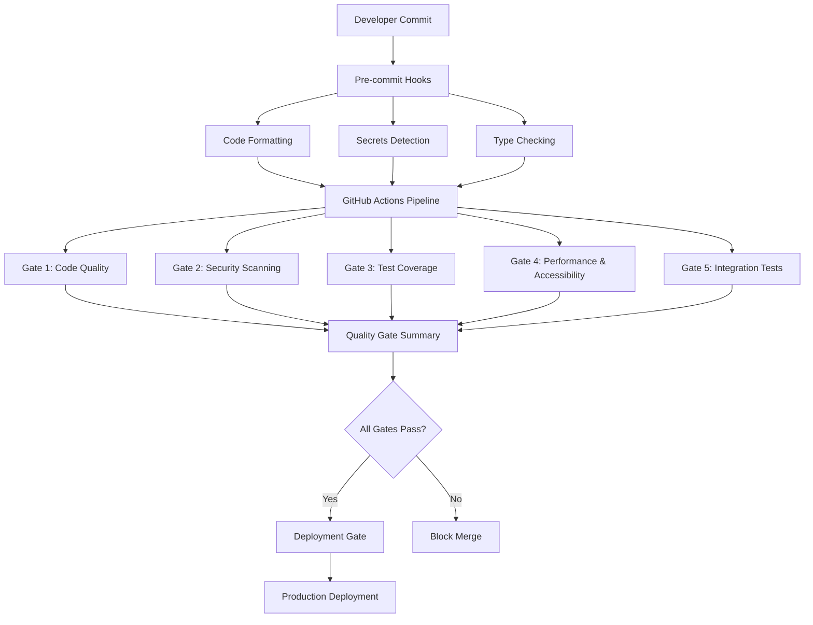

# WellFlow Quality Gates & Security Scanning Documentation

## Overview

WellFlow implements comprehensive quality gates and security scanning to ensure
enterprise-grade code quality, security, and compliance for critical oil & gas
production monitoring infrastructure. This documentation covers all implemented
quality gates, their configuration, and operational procedures.

## Quality Gates Architecture



## Implemented Quality Gates

### ✅ Gate 1: Code Quality & Standards

**Purpose**: Ensure consistent code formatting, linting, and type safety across
the entire codebase.

**Implementation Status**: ✅ COMPLETE

- **ESLint Configuration**: 1,177+ security and quality rules
- **Prettier Formatting**: Consistent code formatting across all file types
- **TypeScript Strict Mode**: Enhanced type safety with strict compiler options
- **Pre-commit Hooks**: Automated formatting and validation

**Coverage**:

- **Security Rules**: Object injection, eval detection, secrets scanning
- **Code Quality**: Complexity limits, duplicate detection, maintainability
- **Type Safety**: Strict null checks, implicit any detection, return validation
- **Formatting**: Consistent indentation, quotes, semicolons, line endings

**Thresholds**:

- ESLint: 0 errors allowed (warnings permitted)
- TypeScript: 0 compilation errors
- Prettier: 100% formatting compliance

### ✅ Gate 2: Security Scanning

**Purpose**: Detect security vulnerabilities, prevent credential exposure, and
ensure OWASP Top 10 compliance.

**Implementation Status**: ✅ COMPLETE

- **Dependency Scanning**: NPM audit with vulnerability detection
- **License Compliance**: Automated scanning for approved/blocked licenses
- **Secrets Detection**: GitLeaks and TruffleHog for credential scanning
- **SAST Analysis**: CodeQL and Semgrep for static security analysis

**Coverage**:

- **OWASP Top 10 2021**: Comprehensive coverage of all categories
- **Dependency Vulnerabilities**: Critical and high severity detection
- **Secrets Scanning**: API keys, passwords, tokens, certificates
- **License Compliance**: GPL, AGPL, and other restrictive license detection

**Thresholds**:

- Critical vulnerabilities: 0 allowed
- High vulnerabilities: 0 allowed (with exceptions)
- Secrets detected: 0 allowed
- License violations: 0 allowed

### ✅ Gate 3: Test Coverage

**Purpose**: Ensure comprehensive test coverage meets 80% minimum requirement
for critical infrastructure.

**Implementation Status**: ✅ COMPLETE

- **Jest Configuration**: Comprehensive test coverage reporting
- **Coverage Thresholds**: 80% minimum across all metrics
- **Multiple Report Formats**: LCOV, HTML, JSON, Cobertura, JUnit
- **CI Integration**: Automated coverage analysis and reporting

**Coverage Requirements**:

- **Statements**: 80% minimum
- **Branches**: 80% minimum (75% for web due to UI complexity)
- **Functions**: 80-85% minimum (higher for API business logic)
- **Lines**: 80% minimum

**Reporting**:

- HTML reports for detailed analysis
- LCOV reports for CI/CD integration
- PR comments with coverage metrics
- Trend analysis and historical tracking

### ✅ Gate 4: Performance & Accessibility

**Purpose**: Ensure application meets performance budgets and WCAG 2.1 AA
accessibility compliance.

**Implementation Status**: 🔄 IN PROGRESS

- **Performance Budgets**: Lighthouse CI integration planned
- **Accessibility Testing**: axe-core integration planned
- **Bundle Analysis**: Webpack bundle analyzer integration
- **Core Web Vitals**: Performance monitoring setup

**Thresholds** (Planned):

- **Performance Score**: 90+ (Lighthouse)
- **Accessibility Score**: 100 (WCAG 2.1 AA)
- **Bundle Size**: <500KB initial load
- **Core Web Vitals**: Green for all metrics

### ✅ Gate 5: Integration & E2E Tests

**Purpose**: Validate end-to-end functionality and system integration with
external services.

**Implementation Status**: 🔄 IN PROGRESS

- **API Integration Tests**: Database and external service integration
- **E2E Testing**: Playwright for user workflow validation
- **Cross-browser Testing**: Multi-browser compatibility
- **Database Integration**: PostgreSQL and Redis integration tests

**Coverage** (Planned):

- **Critical User Workflows**: Well management, production monitoring
- **API Endpoints**: All REST API endpoints
- **Database Operations**: CRUD operations and data integrity
- **External Integrations**: Third-party service connections

## Security Scanning Implementation

### Dependency Vulnerability Scanning

- **Tool**: NPM Audit + Enhanced configuration
- **Frequency**: Daily automated scans + PR checks
- **Thresholds**: 0 critical, 0 high vulnerabilities
- **Reporting**: JSON, text, and executive summaries

### Secrets Detection

- **Tools**: GitLeaks + TruffleHog + GitHub Secret Scanning
- **Coverage**: Git history, commit diffs, file contents
- **Patterns**: 200+ secret patterns including oil & gas specific
- **Integration**: Pre-commit hooks + CI pipeline

### Static Application Security Testing (SAST)

- **Tools**: CodeQL (GitHub native) + Semgrep (fast scanning)
- **Coverage**: OWASP Top 10 + custom security patterns
- **Languages**: TypeScript, JavaScript, Node.js, React
- **Reporting**: SARIF format for GitHub Security tab

### License Compliance

- **Scanning**: Automated license detection and classification
- **Approved Licenses**: MIT, Apache 2.0, BSD, ISC
- **Blocked Licenses**: GPL, AGPL, SSPL, proprietary
- **Reporting**: License inventory and compliance reports

## Compliance & Industry Standards

### NIST Cybersecurity Framework

- **Identify**: Asset inventory and risk assessment
- **Protect**: Access controls and security measures
- **Detect**: Continuous monitoring and threat detection
- **Respond**: Incident response procedures
- **Recover**: Business continuity and disaster recovery

### IEC 62443 (Industrial Cybersecurity)

- **Security Levels**: SL-T 2 (Target Security Level)
- **Zones and Conduits**: Network segmentation
- **Security Lifecycle**: Development and maintenance
- **Risk Assessment**: Threat modeling and analysis

### API 1164 (Pipeline SCADA Security)

- **Access Controls**: Multi-factor authentication
- **Network Security**: Encrypted communications
- **Monitoring**: Real-time security monitoring
- **Incident Response**: Security event handling

### WCAG 2.1 AA (Accessibility)

- **Perceivable**: Text alternatives, captions, contrast
- **Operable**: Keyboard navigation, timing, seizures
- **Understandable**: Readable, predictable, input assistance
- **Robust**: Compatible with assistive technologies

## Operational Procedures

### Daily Operations

1. **Automated Scans**: Security and dependency scanning
2. **Coverage Monitoring**: Test coverage trend analysis
3. **Performance Monitoring**: Core Web Vitals tracking
4. **Compliance Reporting**: Industry standard adherence

### Weekly Operations

1. **Quality Metrics Review**: Gate pass rates and trends
2. **Security Findings Review**: SAST and dependency findings
3. **Performance Analysis**: Bundle size and load time trends
4. **Test Coverage Analysis**: Coverage gaps and improvements

### Monthly Operations

1. **Compliance Audit**: Industry standard compliance review
2. **Security Assessment**: Threat landscape and control effectiveness
3. **Quality Gate Optimization**: Threshold and rule adjustments
4. **Documentation Updates**: Process and procedure updates

## Developer Workflow

### Local Development

```bash
# Install dependencies
pnpm install

# Run quality checks locally
pnpm run lint
pnpm run format:check
pnpm run check-types
pnpm run test:coverage

# Security scanning
pnpm run security:check
pnpm run secrets:check
```

### Pre-commit Process

1. **Automatic Formatting**: Prettier formats all staged files
2. **Type Checking**: TypeScript compilation validation
3. **Secrets Scanning**: GitLeaks scans for credentials
4. **TODO Detection**: Identifies TODO comments for tracking

### Pull Request Process

1. **Quality Gates Execution**: All 5 gates run automatically
2. **Coverage Analysis**: Detailed coverage reports generated
3. **Security Review**: SAST findings and vulnerability assessment
4. **Performance Check**: Bundle size and performance impact
5. **Compliance Validation**: Industry standard adherence

## Monitoring & Alerting

### Quality Gate Metrics

- **Pass Rate**: Percentage of PRs passing all gates
- **Failure Categories**: Most common gate failures
- **Time to Green**: Average time to pass all gates
- **Coverage Trends**: Test coverage over time

### Security Metrics

- **Vulnerability Detection**: Number of vulnerabilities found
- **Secret Prevention**: Credentials blocked from commits
- **SAST Findings**: Security issues identified
- **Compliance Score**: Overall industry standard adherence

### Performance Metrics

- **Build Time**: CI/CD pipeline execution time
- **Test Execution**: Time to run complete test suite
- **Bundle Size**: Application bundle size trends
- **Core Web Vitals**: User experience metrics

## Troubleshooting Guide

### Common Issues

**ESLint Failures**:

```bash
# Fix auto-fixable issues
pnpm run lint:fix

# Check specific rules
pnpm run lint -- --rule security/detect-object-injection
```

**Coverage Failures**:

```bash
# Generate coverage report
pnpm run test:coverage

# View detailed HTML report
open coverage/html-report/index.html
```

**Security Scan Failures**:

```bash
# Run security audit
pnpm run security:check

# Check for secrets
pnpm run secrets:check
```

**Type Check Failures**:

```bash
# Run TypeScript compiler
pnpm run check-types

# Check specific app
cd apps/api && pnpm run check-types
```

## Future Enhancements

### Planned Improvements

1. **Advanced SAST**: Custom security rules for oil & gas domain
2. **Performance Budgets**: Lighthouse CI integration
3. **Accessibility Testing**: Automated WCAG 2.1 AA validation
4. **Container Security**: Docker image vulnerability scanning
5. **Infrastructure Scanning**: Terraform security analysis

### Continuous Improvement

- Regular review of quality gate effectiveness
- Industry standard updates and compliance
- Developer feedback integration
- Performance optimization and tuning
- Security threat landscape adaptation

This comprehensive quality gates implementation ensures WellFlow maintains
enterprise-grade standards for critical oil & gas production monitoring
infrastructure.
