# Oil & Gas Small Operator Business Process Map (Current State)

**Document Version**: 1.0  
**Date**: January 2025  
**Scope**: Small to Micro Oil & Gas Operators (1-100 wells)  
**Purpose**: Document current business processes and workflows without
automation

## Executive Summary

This document maps the complete business operations of small oil & gas operators
as they function today, primarily using manual processes, paper-based systems,
and basic digital tools like Excel. Understanding these current workflows is
essential for identifying automation opportunities and pain points.

## Table of Contents

1. [Organizational Structure](#organizational-structure)
2. [Daily Operations Workflow](#daily-operations-workflow)
3. [Monthly Business Cycles](#monthly-business-cycles)
4. [Production Management Process](#production-management-process)
5. [Financial Management Process](#financial-management-process)
6. [Regulatory Compliance Process](#regulatory-compliance-process)
7. [Partner & Stakeholder Management](#partner--stakeholder-management)
8. [Maintenance & Service Management](#maintenance--service-management)
9. [Information Flow & Communication](#information-flow--communication)
10. [Decision-Making Processes](#decision-making-processes)

## Organizational Structure

### Typical Small Operator Organization (10-50 wells)

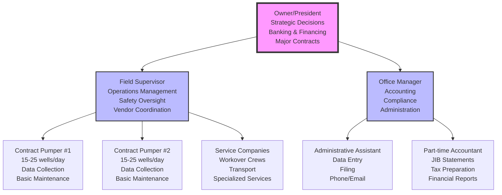

### Micro Operator Organization (1-10 wells)

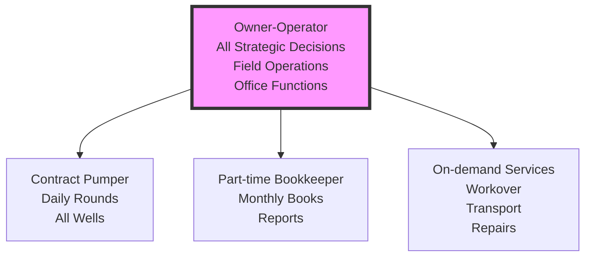

## Daily Operations Workflow

### Field Operations Daily Cycle

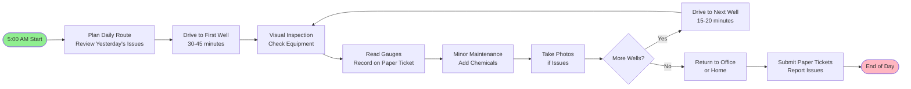

### Office Operations Daily Cycle

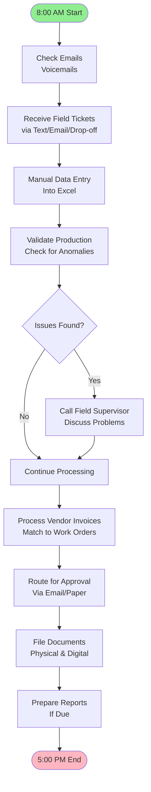

## Monthly Business Cycles

### Week-by-Week Monthly Operations

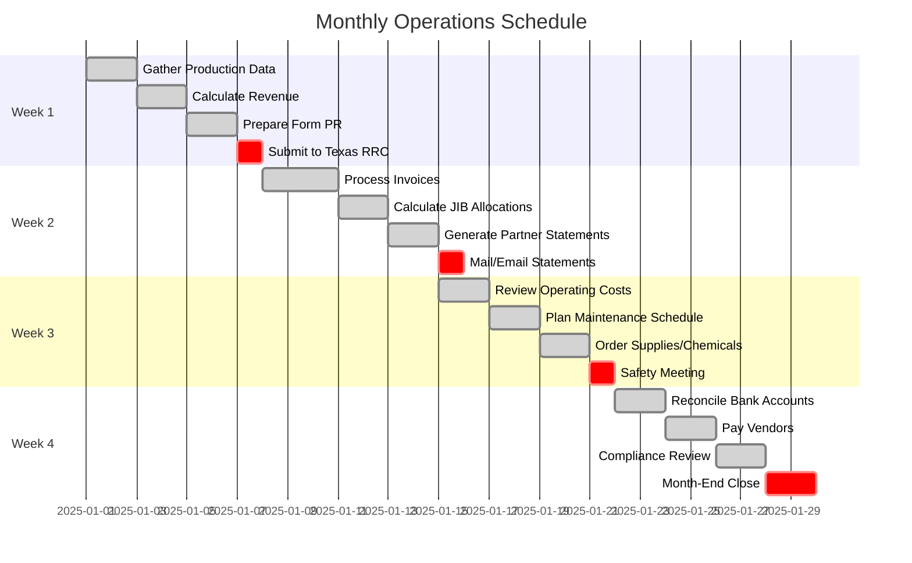

## Production Management Process

### Daily Production Data Flow

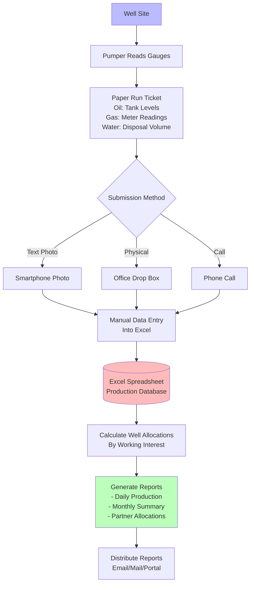

### Production Sales Process

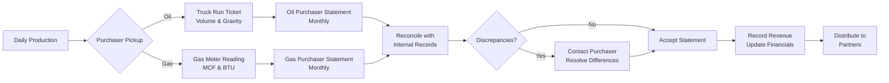

## Financial Management Process

### Joint Interest Billing (JIB) Process

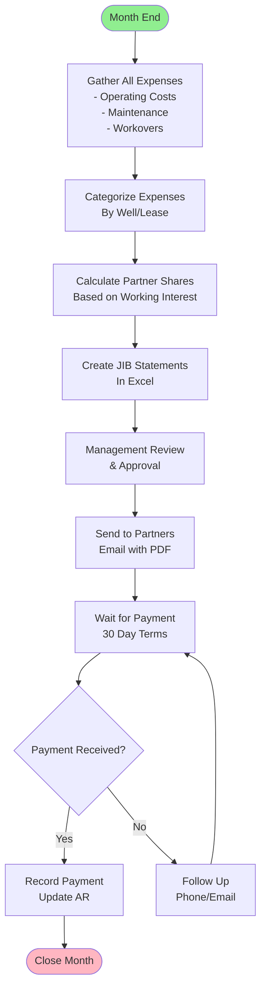

### Revenue Distribution Process

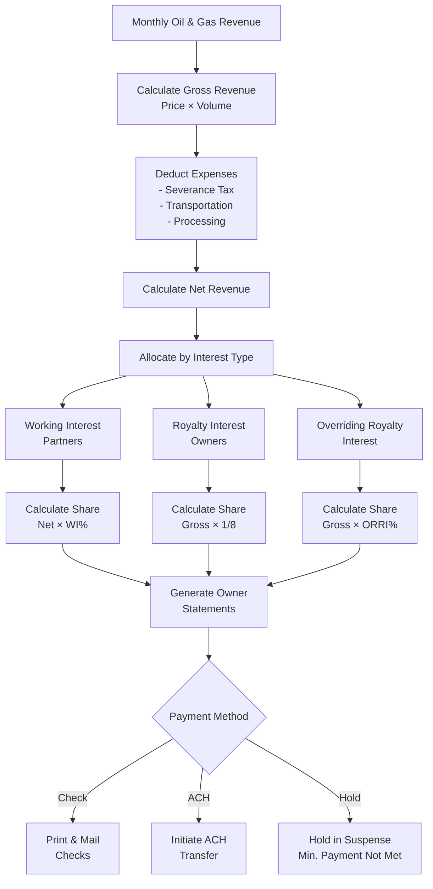

## Regulatory Compliance Process

### Monthly Compliance Workflow

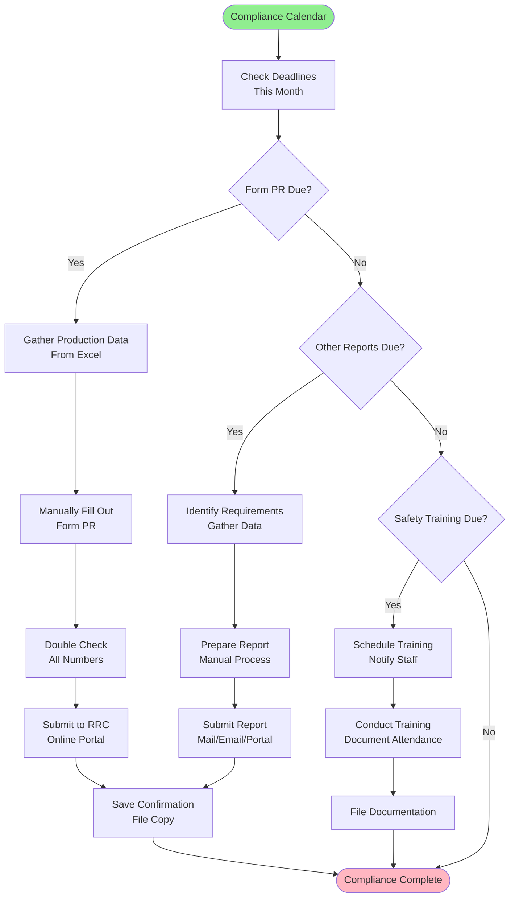

### Environmental Incident Response

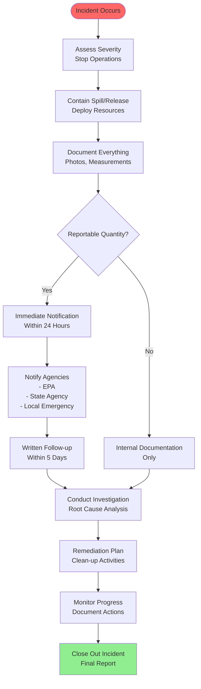

## Partner & Stakeholder Management

### Partner Communication Process

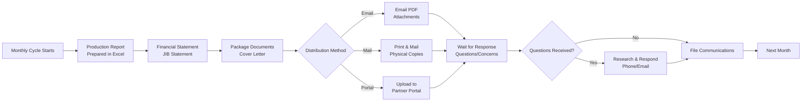

### Working Interest Partner Voting

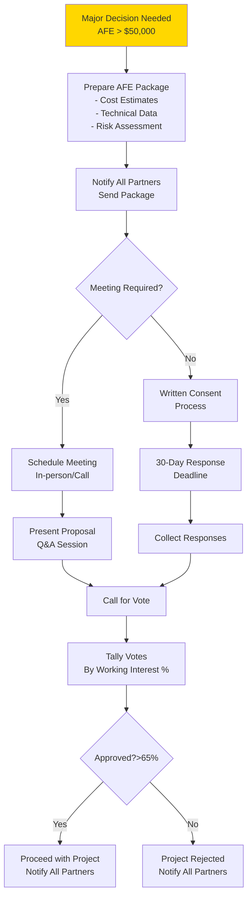

## Maintenance & Service Management

### Routine Maintenance Process

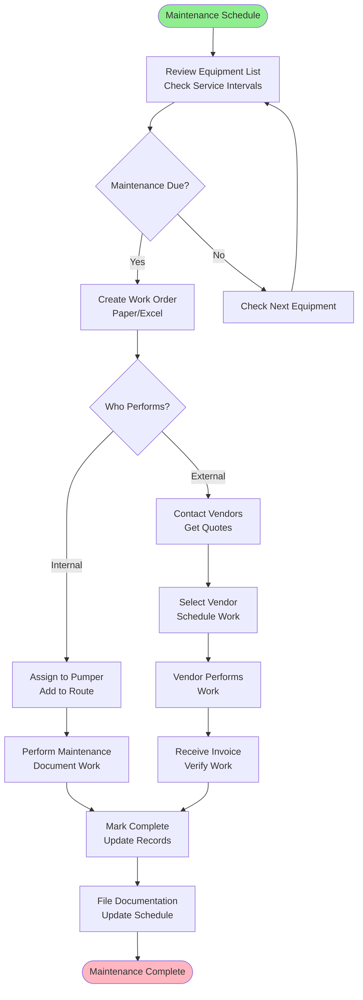

### Emergency Repair Process

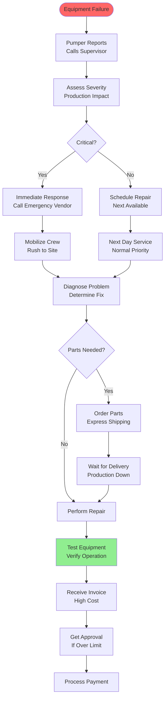

## Information Flow & Communication

### Daily Information Flow

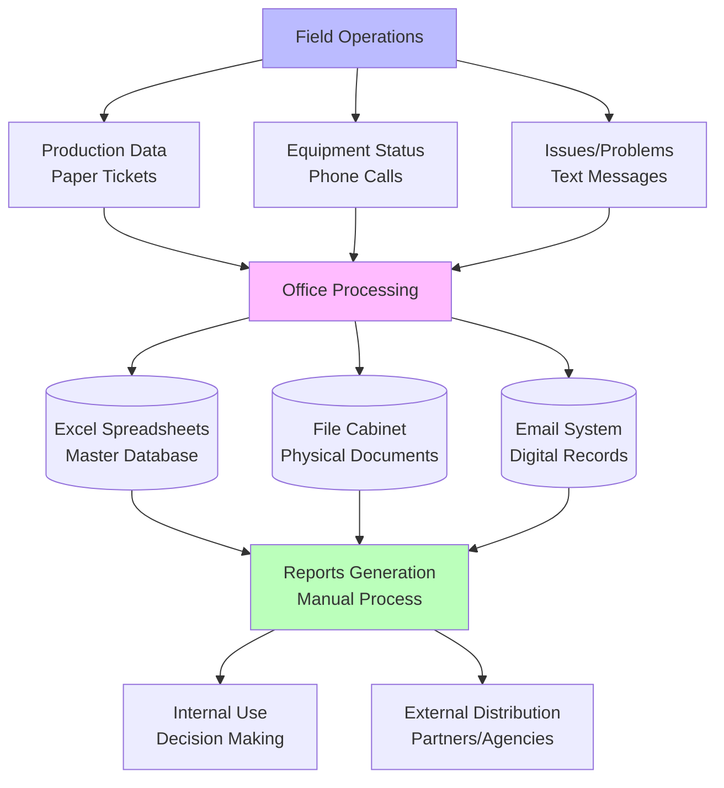

### Communication Channels

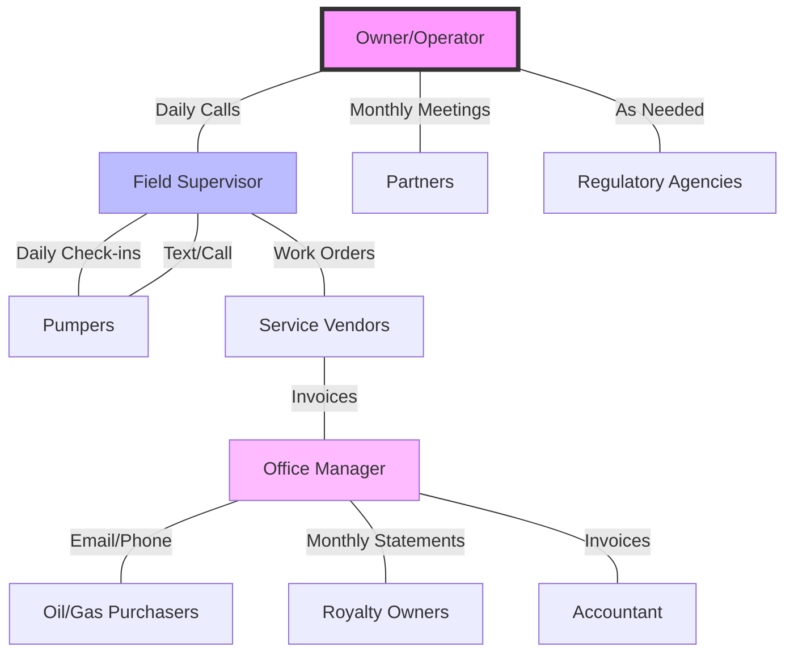

## Decision-Making Processes

### Operational Decision Tree

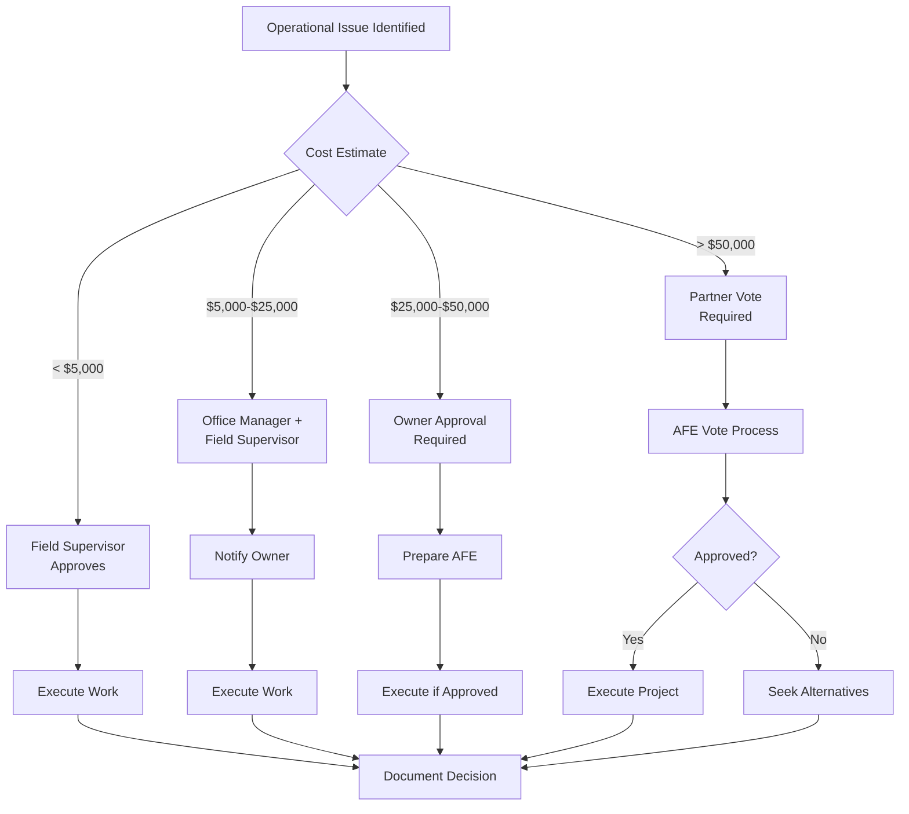

### Financial Decision Process

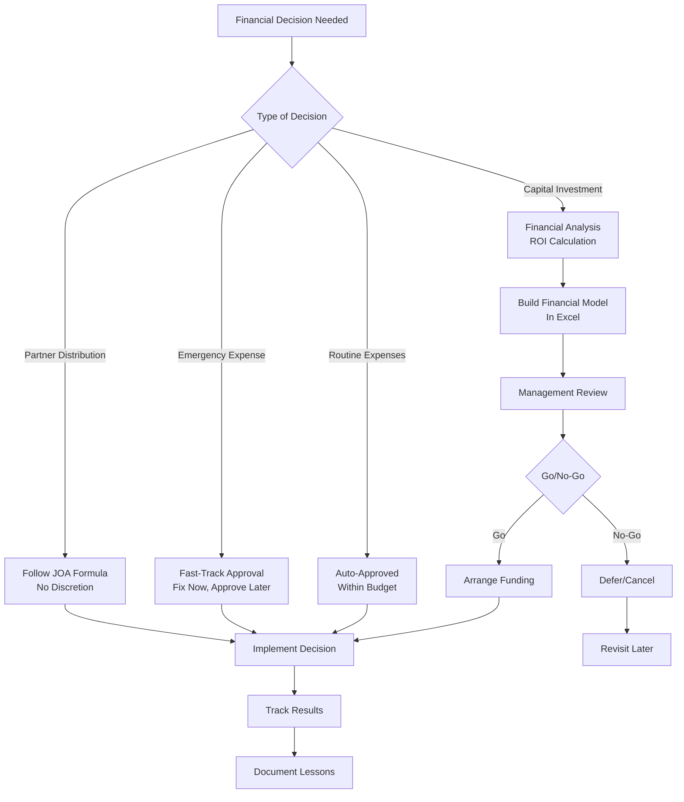

## Key Pain Points in Current Processes

### Time Consumption Analysis

| Process                   | Manual Time | Frequency   | Monthly Hours     |
| ------------------------- | ----------- | ----------- | ----------------- |
| Production Data Entry     | 2-3 hours   | Daily       | 60-90             |
| JIB Statement Preparation | 16-24 hours | Monthly     | 16-24             |
| Regulatory Reporting      | 8-12 hours  | Monthly     | 8-12              |
| Invoice Processing        | 1 hour each | 20-30/month | 20-30             |
| Partner Communications    | 4-6 hours   | Weekly      | 16-24             |
| **Total Administrative**  | -           | -           | **120-180 hours** |

### Error-Prone Areas

1. **Manual Data Entry**: 5-10% error rate in production volumes
2. **Excel Calculations**: Formula errors in complex JIB allocations
3. **Paper Tickets**: Lost or damaged tickets, illegible writing
4. **Communication Gaps**: Missed emails, forgotten phone messages
5. **Compliance Deadlines**: Manual tracking leads to missed deadlines

### Inefficiency Bottlenecks

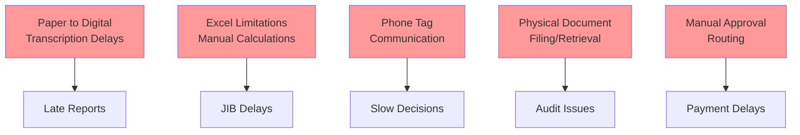

## Conclusion

The current state of small oil & gas operator businesses relies heavily on:

1. **Manual Processes**: 70-80% of work is manual data handling
2. **Paper Systems**: Critical data starts on paper, creating transcription
   delays
3. **Excel Dependency**: Complex business logic trapped in spreadsheets
4. **Person-Dependent Knowledge**: Processes rely on individual knowledge
5. **Reactive Management**: Problems addressed after they occur
6. **Communication Delays**: Multi-step, asynchronous communication paths

These manual processes consume 120-180 hours per month of administrative time
for a typical 20-well operation, representing a significant opportunity for
automation and efficiency improvements. The lack of real-time data and
predictive capabilities means operators are always reacting to yesterday's
problems rather than preventing tomorrow's issues.

---

_This document represents the baseline "as-is" state against which automation
improvements can be measured. Each manual process identified here represents an
opportunity for digital transformation._
