# Design Patterns for Monorepo Architecture

## NestJS API + Next.js Web + React Native Mobile + PostgreSQL + Redis

This guide covers essential patterns for a modern monorepo stack, focusing on
practical implementation strategies and architectural decisions.

---

## SOLID Principles Foundation

Before diving into specific patterns, understanding SOLID principles is crucial
as they underpin all good software design.

### Single Responsibility Principle (SRP)

**"A class should have only one reason to change"**

```typescript
// ❌ Violation - UserService handles too many concerns
@Injectable()
export class UserService {
  async createUser(userData: CreateUserDto): Promise<User> {
    // Validation, database, email, logging all mixed together
    if (!userData.email.includes('@')) throw new Error('Invalid email');
    const user = await this.prisma.user.create({ data: userData });
    await this.sendWelcomeEmail(user.email);
    console.log(`User created: ${user.id}`);
    return user;
  }
}

// ✅ Following SRP - Each class has one responsibility
@Injectable()
export class UserService {
  constructor(
    private userRepo: UserRepository,
    private emailService: EmailService,
    private logger: Logger
  ) {}

  async createUser(userData: CreateUserDto): Promise<User> {
    const user = await this.userRepo.create(userData);
    await this.emailService.sendWelcomeEmail(user.email);
    this.logger.log(`User created: ${user.id}`);
    return user;
  }
}
```

### Open/Closed Principle (OCP)

**"Open for extension, closed for modification"**

```typescript
// ❌ Violation - Must modify code to add new payment types
@Injectable()
export class PaymentProcessor {
  async processPayment(type: string, amount: number): Promise<void> {
    if (type === 'stripe') {
      // Stripe logic
    } else if (type === 'paypal') {
      // PayPal logic
    }
    // Adding Square requires modifying this method
  }
}

// ✅ Following OCP - New providers extend without modification
interface PaymentProvider {
  processPayment(amount: number): Promise<void>;
}

@Injectable()
export class PaymentProcessor {
  private providers = new Map<string, PaymentProvider>();

  constructor(stripeProvider: StripeProvider, paypalProvider: PayPalProvider) {
    this.providers.set('stripe', stripeProvider);
    this.providers.set('paypal', paypalProvider);
  }

  async processPayment(type: string, amount: number): Promise<void> {
    const provider = this.providers.get(type);
    if (!provider) throw new Error(`Unsupported payment type: ${type}`);
    await provider.processPayment(amount);
  }
}
```

### Liskov Substitution Principle (LSP)

**"Objects should be replaceable with instances of their subtypes"**

```typescript
// ✅ Following LSP - Both cache implementations work identically
interface CacheProvider {
  get(key: string): Promise<string | null>;
  set(key: string, value: string, ttl?: number): Promise<void>;
}

@Injectable()
export class RedisCache implements CacheProvider {
  async get(key: string): Promise<string | null> {
    return this.redis.get(key);
  }

  async set(key: string, value: string, ttl = 300): Promise<void> {
    await this.redis.setex(key, ttl, value);
  }
}

@Injectable()
export class MemoryCache implements CacheProvider {
  private cache = new Map<string, { value: string; expires: number }>();

  async get(key: string): Promise<string | null> {
    const item = this.cache.get(key);
    if (!item || item.expires < Date.now()) return null;
    return item.value;
  }

  async set(key: string, value: string, ttl = 300): Promise<void> {
    this.cache.set(key, { value, expires: Date.now() + ttl * 1000 });
  }
}

// Either implementation works without changes
@Injectable()
export class UserService {
  constructor(private cache: CacheProvider) {}
}
```

### Interface Segregation Principle (ISP)

**"Clients should not depend on interfaces they don't use"**

```typescript
// ❌ Violation - Repository forced to implement unrelated methods
interface UserOperations {
  create(user: CreateUserDto): Promise<User>;
  findById(id: string): Promise<User>;
  sendEmail(id: string, subject: string): Promise<void>;
  generateReport(filters: any): Promise<Report>;
}

// ✅ Following ISP - Segregated interfaces
interface UserRepository {
  create(user: CreateUserDto): Promise<User>;
  findById(id: string): Promise<User>;
}

interface UserEmailService {
  sendEmail(id: string, subject: string): Promise<void>;
}

interface UserReportService {
  generateReport(filters: any): Promise<Report>;
}
```

### Dependency Inversion Principle (DIP)

**"Depend on abstractions, not concretions"**

```typescript
// ❌ Violation - Direct dependencies on concrete classes
@Injectable()
export class UserService {
  private prisma = new PrismaService(); // Concrete dependency
  private redis = new RedisService(); // Concrete dependency
}

// ✅ Following DIP - Depends on abstractions
@Injectable()
export class UserService {
  constructor(
    private userRepo: UserRepository, // Abstraction
    private cache: CacheService // Abstraction
  ) {}
}

@Module({
  providers: [
    UserService,
    { provide: 'UserRepository', useClass: PrismaUserRepository },
    { provide: 'CacheService', useClass: RedisCacheService },
  ],
})
export class UserModule {}
```

---

## Core Architectural Patterns

### Hexagonal Architecture (Ports and Adapters)

**Purpose**: Isolate business logic from external concerns (frameworks,
databases, APIs)

**When to use**:

- Complex business rules that shouldn't depend on NestJS specifics
- Need to swap data sources or frameworks
- Want testable business logic

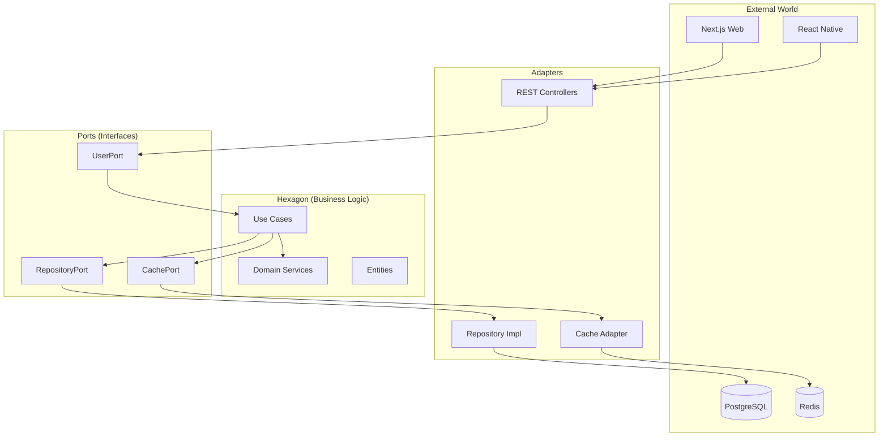

**Implementation**:

```typescript
// Domain Entity (Core)
export class User {
  constructor(
    private id: string,
    private email: string,
    private name: string
  ) {}

  updateProfile(name: string): void {
    // Business logic here
    this.name = name;
  }
}

// Port (Interface)
export interface UserRepository {
  findById(id: string): Promise<User | null>;
  save(user: User): Promise<void>;
}

// Use Case (Business Logic)
export class UpdateUserProfileUseCase {
  constructor(private userRepo: UserRepository) {}

  async execute(userId: string, name: string): Promise<void> {
    const user = await this.userRepo.findById(userId);
    if (!user) throw new Error('User not found');

    user.updateProfile(name);
    await this.userRepo.save(user);
  }
}

// Adapter (NestJS Implementation)
@Injectable()
export class PostgresUserRepository implements UserRepository {
  constructor(private prisma: PrismaService) {}

  async findById(id: string): Promise<User | null> {
    const userData = await this.prisma.user.findUnique({ where: { id } });
    return userData
      ? new User(userData.id, userData.email, userData.name)
      : null;
  }

  async save(user: User): Promise<void> {
    await this.prisma.user.update({
      where: { id: user.id },
      data: { name: user.name },
    });
  }
}
```

---

### Repository Pattern

**Purpose**: Abstract data access logic from business logic

**When to use**:

- Multiple data sources (PostgreSQL + Redis)
- Complex queries that need abstraction
- Testing with mock data

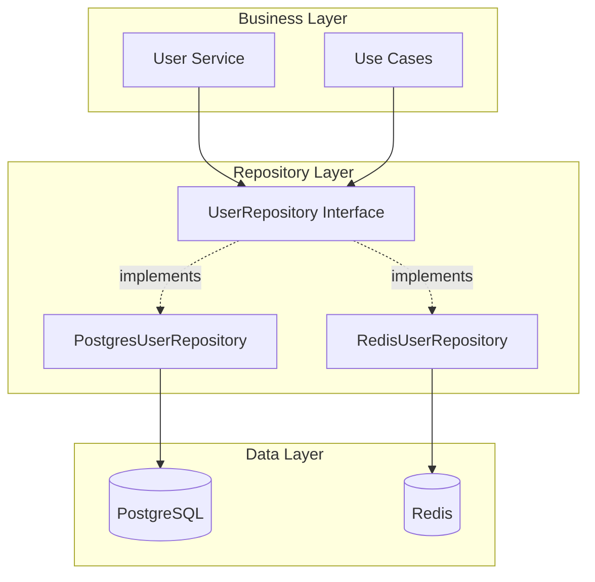

**Implementation**:

```typescript
// Repository Interface
export interface UserRepository {
  findById(id: string): Promise<User | null>;
  findByEmail(email: string): Promise<User | null>;
  save(user: User): Promise<User>;
  delete(id: string): Promise<void>;
  findAll(filters: UserFilters): Promise<User[]>;
}

// PostgreSQL Implementation
@Injectable()
export class PostgresUserRepository implements UserRepository {
  constructor(private prisma: PrismaService) {}

  async findById(id: string): Promise<User | null> {
    const user = await this.prisma.user.findUnique({ where: { id } });
    return user ? this.toDomain(user) : null;
  }

  private toDomain(userData: any): User {
    return new User(userData.id, userData.email, userData.name);
  }
}

// Composite Repository (PostgreSQL + Redis)
@Injectable()
export class CachedUserRepository implements UserRepository {
  constructor(
    private pgRepo: PostgresUserRepository,
    private redis: RedisService
  ) {}

  async findById(id: string): Promise<User | null> {
    // Try cache first
    const cached = await this.redis.get(`user:${id}`);
    if (cached) return JSON.parse(cached);

    // Fallback to database
    const user = await this.pgRepo.findById(id);
    if (user) {
      await this.redis.setex(`user:${id}`, 300, JSON.stringify(user));
    }
    return user;
  }
}
```

---

### Backend for Frontend (BFF)

**Purpose**: Tailor API responses for specific client needs

**When to use**:

- Different data requirements between web and mobile
- Performance optimization for mobile
- Client-specific business logic

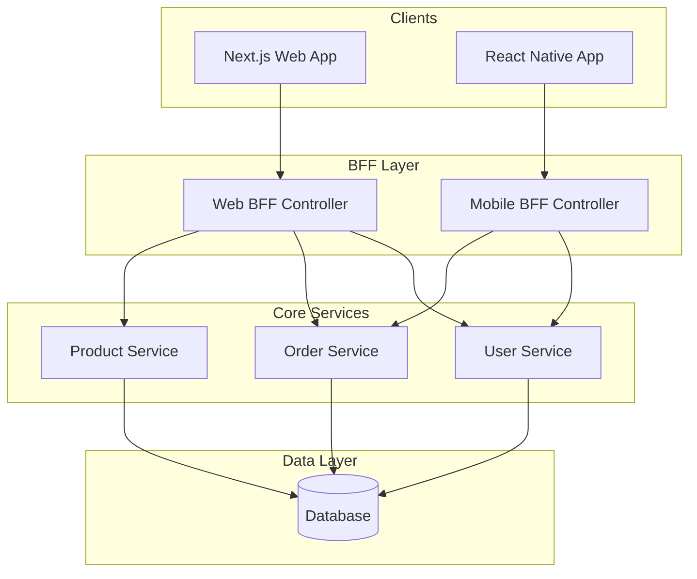

**Implementation**:

```typescript
// Shared DTOs
export class UserProfileDto {
  id: string;
  email: string;
  name: string;
  avatar?: string;
}

export class MobileUserProfileDto {
  id: string;
  name: string;
  avatar?: string;
  // Reduced payload for mobile
}

// Web BFF Controller
@Controller('web/users')
export class WebUserController {
  constructor(private userService: UserService) {}

  @Get(':id/profile')
  async getProfile(@Param('id') id: string): Promise<UserProfileDto> {
    const user = await this.userService.findById(id);
    return {
      id: user.id,
      email: user.email,
      name: user.name,
      avatar: user.avatar,
      // Full data for web
    };
  }
}

// Mobile BFF Controller
@Controller('mobile/users')
export class MobileUserController {
  constructor(private userService: UserService) {}

  @Get(':id/profile')
  async getProfile(@Param('id') id: string): Promise<MobileUserProfileDto> {
    const user = await this.userService.findById(id);
    return {
      id: user.id,
      name: user.name,
      avatar: user.avatar,
      // Minimal data for mobile
    };
  }
}
```

---

## Data Patterns

### Unit of Work

**Purpose**: Manage transactions and coordinate changes across multiple
repositories

**When to use**:

- Complex operations spanning multiple entities
- Need atomic transactions
- Batch operations for performance

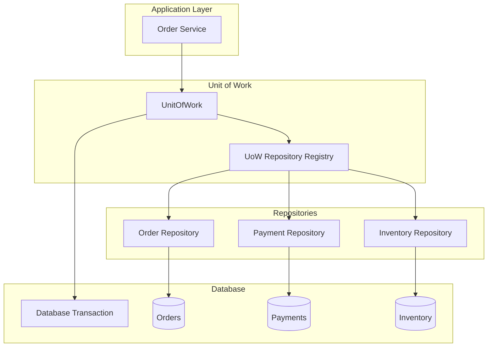

**Implementation**:

```typescript
export interface UnitOfWork {
  orderRepository: OrderRepository;
  paymentRepository: PaymentRepository;
  inventoryRepository: InventoryRepository;

  begin(): Promise<void>;
  commit(): Promise<void>;
  rollback(): Promise<void>;
}

@Injectable()
export class PrismaUnitOfWork implements UnitOfWork {
  private transaction?: PrismaTransaction;

  constructor(private prisma: PrismaService) {}

  get orderRepository() {
    return new OrderRepository(this.transaction || this.prisma);
  }

  get paymentRepository() {
    return new PaymentRepository(this.transaction || this.prisma);
  }

  get inventoryRepository() {
    return new InventoryRepository(this.transaction || this.prisma);
  }

  async begin(): Promise<void> {
    this.transaction = await this.prisma.$begin();
  }

  async commit(): Promise<void> {
    if (this.transaction) {
      await this.transaction.$commit();
      this.transaction = undefined;
    }
  }

  async rollback(): Promise<void> {
    if (this.transaction) {
      await this.transaction.$rollback();
      this.transaction = undefined;
    }
  }
}

// Usage in Service
@Injectable()
export class OrderService {
  constructor(private uow: UnitOfWork) {}

  async createOrder(orderData: CreateOrderDto): Promise<void> {
    await this.uow.begin();

    try {
      // Create order
      const order = await this.uow.orderRepository.create(orderData);

      // Process payment
      await this.uow.paymentRepository.processPayment(
        order.id,
        orderData.payment
      );

      // Update inventory
      await this.uow.inventoryRepository.reduceStock(orderData.items);

      await this.uow.commit();
    } catch (error) {
      await this.uow.rollback();
      throw error;
    }
  }
}
```

---

### Cache-Aside Pattern

**Purpose**: Lazy loading cache strategy with Redis

**When to use**:

- Expensive database queries
- Frequently accessed data
- Read-heavy workloads

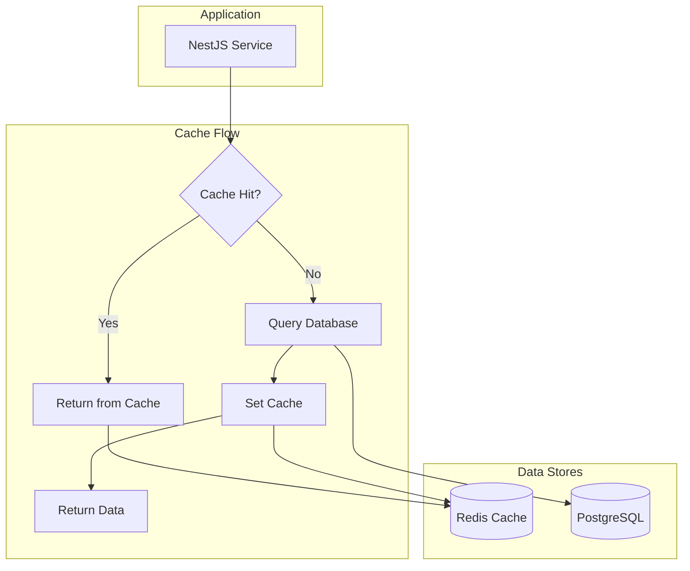

**Implementation**:

```typescript
@Injectable()
export class CacheService {
  constructor(private redis: RedisService) {}

  async get<T>(key: string): Promise<T | null> {
    const cached = await this.redis.get(key);
    return cached ? JSON.parse(cached) : null;
  }

  async set(key: string, value: any, ttl: number = 300): Promise<void> {
    await this.redis.setex(key, ttl, JSON.stringify(value));
  }

  async invalidate(pattern: string): Promise<void> {
    const keys = await this.redis.keys(pattern);
    if (keys.length > 0) {
      await this.redis.del(...keys);
    }
  }
}

@Injectable()
export class UserService {
  constructor(
    private userRepo: UserRepository,
    private cache: CacheService
  ) {}

  async findById(id: string): Promise<User | null> {
    const cacheKey = `user:${id}`;

    // 1. Try cache first
    let user = await this.cache.get<User>(cacheKey);

    if (!user) {
      // 2. Cache miss - query database
      user = await this.userRepo.findById(id);

      if (user) {
        // 3. Set cache for next time
        await this.cache.set(cacheKey, user, 600); // 10 minutes
      }
    }

    return user;
  }

  async updateUser(id: string, data: UpdateUserDto): Promise<User> {
    const user = await this.userRepo.update(id, data);

    // Invalidate cache
    await this.cache.invalidate(`user:${id}`);

    return user;
  }
}
```

---

### Data Transfer Object (DTO) Pattern

**Purpose**: Define data contracts between layers and external systems

**When to use**:

- API input/output validation
- Data transformation between layers
- Type safety across the monorepo

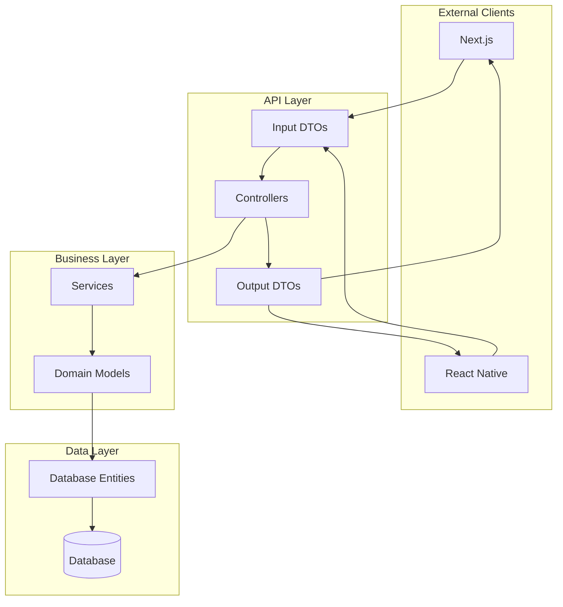

**Implementation**:

```typescript
// Shared DTOs (in packages/shared or libs/dtos)
export class CreateUserDto {
  @IsEmail()
  email: string;

  @IsString()
  @MinLength(2)
  name: string;

  @IsString()
  @MinLength(8)
  password: string;
}

export class UserResponseDto {
  id: string;
  email: string;
  name: string;
  createdAt: Date;

  static fromDomain(user: User): UserResponseDto {
    return {
      id: user.id,
      email: user.email,
      name: user.name,
      createdAt: user.createdAt,
    };
  }
}

export class UpdateUserDto {
  @IsOptional()
  @IsString()
  name?: string;

  @IsOptional()
  @IsString()
  avatar?: string;
}

// Usage in Controller
@Controller('users')
export class UserController {
  constructor(private userService: UserService) {}

  @Post()
  async create(@Body() dto: CreateUserDto): Promise<UserResponseDto> {
    const user = await this.userService.create(dto);
    return UserResponseDto.fromDomain(user);
  }

  @Put(':id')
  async update(
    @Param('id') id: string,
    @Body() dto: UpdateUserDto
  ): Promise<UserResponseDto> {
    const user = await this.userService.update(id, dto);
    return UserResponseDto.fromDomain(user);
  }
}

// Client usage (Next.js/React Native)
import { CreateUserDto, UserResponseDto } from '@monorepo/shared-types';

export async function createUser(
  userData: CreateUserDto
): Promise<UserResponseDto> {
  const response = await fetch('/api/users', {
    method: 'POST',
    headers: { 'Content-Type': 'application/json' },
    body: JSON.stringify(userData),
  });
  return response.json();
}
```

---

## NestJS-Specific Patterns

### Decorator Pattern

**Purpose**: Add metadata and behavior to classes and methods

**When to use**:

- Authentication/authorization
- Validation
- Caching
- Logging/monitoring

```mermaid
graph TB
    subgraph "Decorator Stack"
        AUTH[@Auth]
        CACHE[@Cache]
        LOG[@Log]
        METHOD[Controller Method]
    end

    subgraph "Execution Flow"
        REQUEST[HTTP Request]
        AUTH_GUARD[Auth Guard]
        CACHE_INT[Cache Interceptor]
        LOG_INT[Logging Interceptor]
        HANDLER[Method Handler]
        RESPONSE[HTTP Response]
    end

    REQUEST --> AUTH_GUARD
    AUTH_GUARD --> CACHE_INT
    CACHE_INT --> LOG_INT
    LOG_INT --> HANDLER
    HANDLER --> RESPONSE

    AUTH -.configures.-> AUTH_GUARD
    CACHE -.configures.-> CACHE_INT
    LOG -.configures.-> LOG_INT
```

**Implementation**:

```typescript
// Custom Decorators
export const Auth = (roles?: string[]) => {
  return applyDecorators(
    UseGuards(JwtAuthGuard, RolesGuard),
    SetMetadata('roles', roles || [])
  );
};

export const CacheResponse = (ttl: number = 300) => {
  return applyDecorators(
    UseInterceptors(CacheInterceptor),
    SetMetadata('cache_ttl', ttl)
  );
};

export const LogActivity = (activity: string) => {
  return applyDecorators(
    UseInterceptors(LoggingInterceptor),
    SetMetadata('activity', activity)
  );
};

// Usage in Controller
@Controller('users')
export class UserController {
  @Get(':id')
  @Auth(['user', 'admin'])
  @CacheResponse(600) // 10 minutes
  @LogActivity('get_user_profile')
  async getProfile(@Param('id') id: string): Promise<UserResponseDto> {
    return this.userService.findById(id);
  }

  @Put(':id')
  @Auth(['admin'])
  @LogActivity('update_user')
  async updateUser(
    @Param('id') id: string,
    @Body() dto: UpdateUserDto
  ): Promise<UserResponseDto> {
    return this.userService.update(id, dto);
  }
}

// Custom Guard Implementation
@Injectable()
export class RolesGuard implements CanActivate {
  constructor(private reflector: Reflector) {}

  canActivate(context: ExecutionContext): boolean {
    const requiredRoles = this.reflector.get<string[]>(
      'roles',
      context.getHandler()
    );
    if (!requiredRoles) return true;

    const request = context.switchToHttp().getRequest();
    const user = request.user;

    return requiredRoles.some((role) => user.roles?.includes(role));
  }
}
```

---

### Dependency Injection

**Purpose**: Manage dependencies and enable testability

**When to use**:

- Service composition
- Testing with mocks
- Configuration management

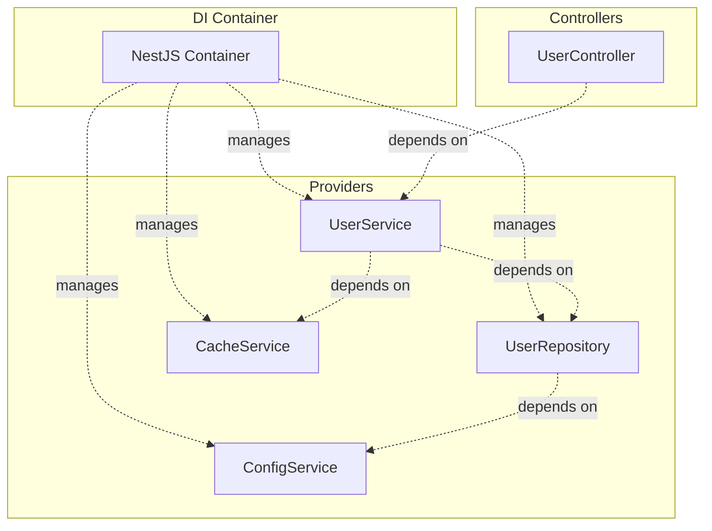

**Implementation**:

```typescript
// Interface for dependency
export interface UserRepository {
  findById(id: string): Promise<User | null>;
  save(user: User): Promise<User>;
}

// Implementation
@Injectable()
export class PostgresUserRepository implements UserRepository {
  constructor(
    private prisma: PrismaService,
    private config: ConfigService
  ) {}

  async findById(id: string): Promise<User | null> {
    // Implementation
  }
}

// Service with dependencies
@Injectable()
export class UserService {
  constructor(
    @Inject('UserRepository') private userRepo: UserRepository,
    private cache: CacheService,
    private logger: Logger
  ) {}

  async findById(id: string): Promise<User | null> {
    this.logger.log(`Finding user ${id}`);
    return this.userRepo.findById(id);
  }
}

// Module configuration
@Module({
  imports: [ConfigModule],
  providers: [
    UserService,
    {
      provide: 'UserRepository',
      useClass: PostgresUserRepository,
    },
    CacheService,
    Logger,
  ],
  controllers: [UserController],
  exports: [UserService],
})
export class UserModule {}

// Testing with mocks
describe('UserService', () => {
  let service: UserService;
  let mockRepo: jest.Mocked<UserRepository>;

  beforeEach(async () => {
    const mockRepository = {
      findById: jest.fn(),
      save: jest.fn(),
    };

    const module = await Test.createTestingModule({
      providers: [
        UserService,
        {
          provide: 'UserRepository',
          useValue: mockRepository,
        },
        {
          provide: CacheService,
          useValue: { get: jest.fn(), set: jest.fn() },
        },
      ],
    }).compile();

    service = module.get(UserService);
    mockRepo = module.get('UserRepository');
  });

  it('should find user by id', async () => {
    const user = new User('1', 'test@example.com', 'Test User');
    mockRepo.findById.mockResolvedValue(user);

    const result = await service.findById('1');
    expect(result).toEqual(user);
  });
});
```

---

### Observer Pattern (Event System)

**Purpose**: Decouple components through event-driven communication

**When to use**:

- Cross-module communication
- Audit logging
- Side effects (emails, notifications)

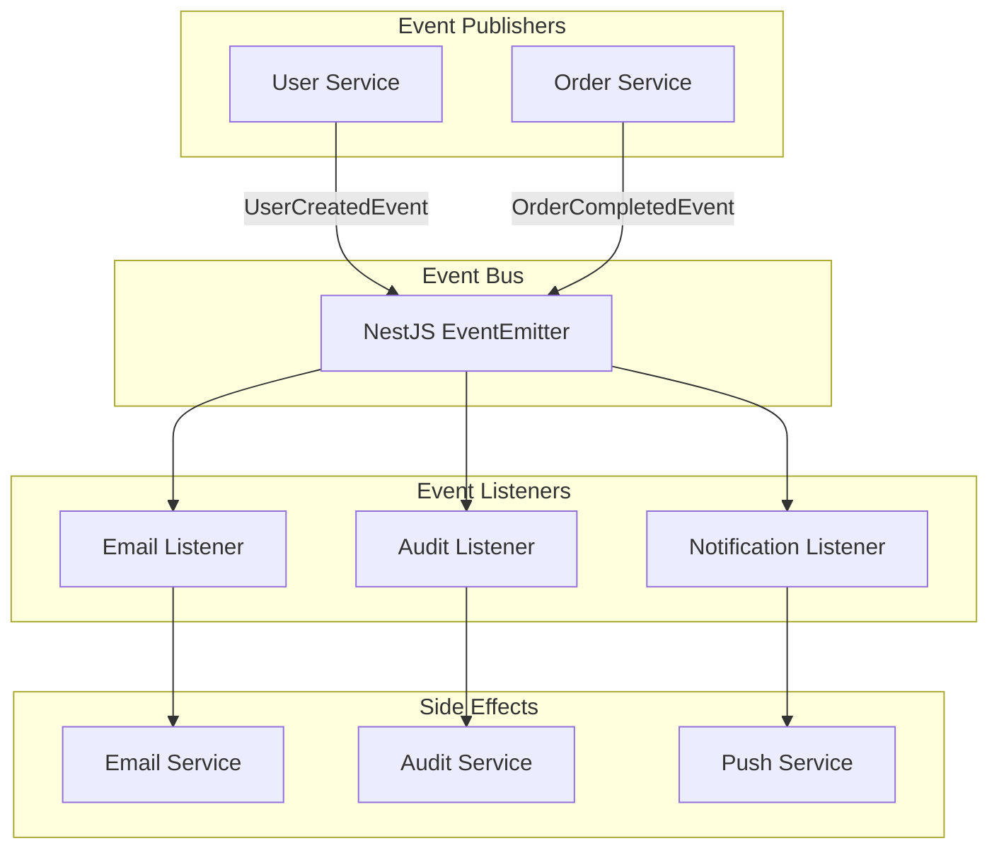

**Implementation**:

```typescript
// Event Classes
export class UserCreatedEvent {
  constructor(
    public readonly userId: string,
    public readonly email: string,
    public readonly name: string
  ) {}
}

export class OrderCompletedEvent {
  constructor(
    public readonly orderId: string,
    public readonly userId: string,
    public readonly total: number
  ) {}
}

// Event Publisher (Service)
@Injectable()
export class UserService {
  constructor(
    private userRepo: UserRepository,
    private eventEmitter: EventEmitter2
  ) {}

  async createUser(userData: CreateUserDto): Promise<User> {
    const user = await this.userRepo.save(new User(userData));

    // Emit event
    this.eventEmitter.emit(
      'user.created',
      new UserCreatedEvent(user.id, user.email, user.name)
    );

    return user;
  }
}

// Event Listeners
@Injectable()
export class EmailListener {
  constructor(private emailService: EmailService) {}

  @OnEvent('user.created')
  async handleUserCreated(event: UserCreatedEvent) {
    await this.emailService.sendWelcomeEmail(event.email, event.name);
  }

  @OnEvent('order.completed')
  async handleOrderCompleted(event: OrderCompletedEvent) {
    await this.emailService.sendOrderConfirmation(event.orderId);
  }
}

@Injectable()
export class AuditListener {
  constructor(private auditService: AuditService) {}

  @OnEvent('user.*') // Wildcard listener
  async handleUserEvents(event: any) {
    await this.auditService.logEvent('user_activity', event);
  }
}

// Module setup
@Module({
  imports: [EventEmitterModule.forRoot()],
  providers: [
    UserService,
    EmailListener,
    AuditListener,
    EmailService,
    AuditService,
  ],
})
export class UserModule {}
```

---

## Monorepo Organization Patterns

### Shared Kernel

**Purpose**: Share common code across multiple applications

**When to use**:

- Common types, interfaces, utilities
- Shared business logic
- API contracts

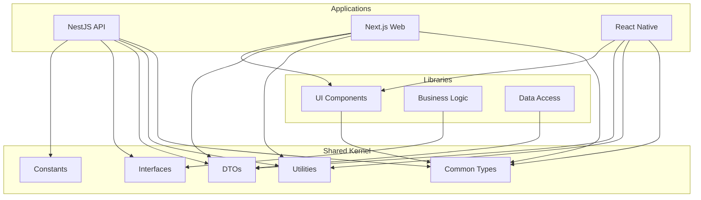

**File Structure**:

```
monorepo/
├── apps/
│   ├── api/                 # NestJS API
│   ├── web/                 # Next.js Web
│   └── mobile/              # React Native
├── packages/
│   ├── shared-types/        # Common TypeScript types
│   ├── shared-utils/        # Utility functions
│   ├── ui-components/       # Shared UI components
│   └── business-logic/      # Domain logic
└── libs/
    ├── database/            # Database schemas/migrations
    └── api-client/          # API client library
```

**Implementation**:

```typescript
// packages/shared-types/src/user.types.ts
export interface User {
  id: string;
  email: string;
  name: string;
  createdAt: Date;
  updatedAt: Date;
}

export interface CreateUserRequest {
  email: string;
  name: string;
  password: string;
}

export interface UserFilters {
  search?: string;
  role?: string;
  createdAfter?: Date;
}

// packages/shared-utils/src/validation.ts
export const isValidEmail = (email: string): boolean => {
  const emailRegex = /^[^\s@]+@[^\s@]+\.[^\s@]+$/;
  return emailRegex.test(email);
};

export const formatCurrency = (amount: number, currency = 'USD'): string => {
  return new Intl.NumberFormat('en-US', {
    style: 'currency',
    currency,
  }).format(amount);
};

// Usage in API (apps/api/src/users/user.service.ts)
import { User, CreateUserRequest } from '@monorepo/shared-types';
import { isValidEmail } from '@monorepo/shared-utils';

@Injectable()
export class UserService {
  async createUser(request: CreateUserRequest): Promise<User> {
    if (!isValidEmail(request.email)) {
      throw new BadRequestException('Invalid email format');
    }
    // Implementation...
  }
}

// Usage in Web App (apps/web/src/hooks/useUsers.ts)
import { User, UserFilters } from '@monorepo/shared-types';
import { apiClient } from '@monorepo/api-client';

export function useUsers(filters: UserFilters) {
  return useQuery(['users', filters], () => apiClient.users.getAll(filters));
}

// packages/api-client/src/users.client.ts
import { User, CreateUserRequest, UserFilters } from '@monorepo/shared-types';

export class UsersClient {
  constructor(private baseUrl: string) {}

  async getAll(filters: UserFilters): Promise<User[]> {
    const params = new URLSearchParams(filters as any);
    const response = await fetch(`${this.baseUrl}/users?${params}`);
    return response.json();
  }

  async create(request: CreateUserRequest): Promise<User> {
    const response = await fetch(`${this.baseUrl}/users`, {
      method: 'POST',
      headers: { 'Content-Type': 'application/json' },
      body: JSON.stringify(request),
    });
    return response.json();
  }
}
```

---

### Module Federation (Optional)

**Purpose**: Runtime sharing of code between applications

**When to use**:

- Micro-frontend architecture
- Independent deployments
- Shared components at runtime

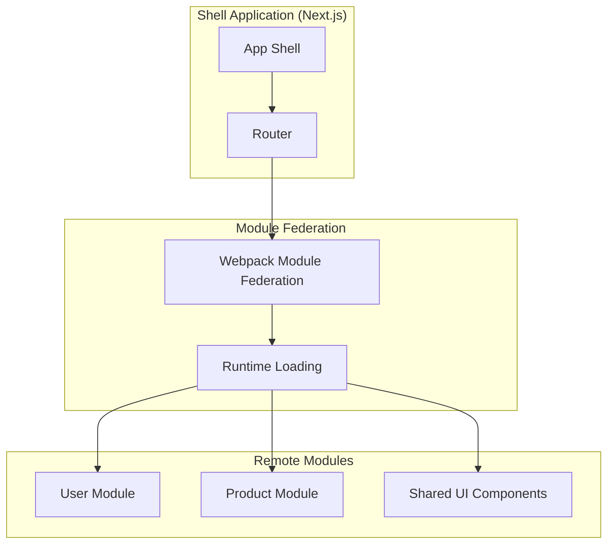

**Implementation**:

```javascript
// apps/web/next.config.js
const ModuleFederationPlugin = require('@module-federation/nextjs-mf');

module.exports = {
  webpack: (config, options) => {
    config.plugins.push(
      new ModuleFederationPlugin({
        name: 'shell',
        remotes: {
          userModule: 'userModule@http://localhost:3001/remoteEntry.js',
          uiComponents: 'uiComponents@http://localhost:3002/remoteEntry.js',
        },
      })
    );
    return config;
  },
};

// Remote module config (user-module/webpack.config.js)
const ModuleFederationPlugin = require('@module-federation/webpack');

module.exports = {
  plugins: [
    new ModuleFederationPlugin({
      name: 'userModule',
      filename: 'remoteEntry.js',
      exposes: {
        './UserProfile': './src/components/UserProfile',
        './UserList': './src/components/UserList',
      },
      shared: {
        react: { singleton: true },
        'react-dom': { singleton: true },
      },
    }),
  ],
};

// Usage in Shell App
import dynamic from 'next/dynamic';

const UserProfile = dynamic(() => import('userModule/UserProfile'), {
  ssr: false,
});

export default function ProfilePage() {
  return <UserProfile userId='123' />;
}
```

---

## Optional Advanced Patterns

### CQRS (Command Query Responsibility Segregation)

**Purpose**: Separate read and write operations for complex domains

**When to use**:

- Complex business logic
- Different read/write performance requirements
- Event sourcing systems

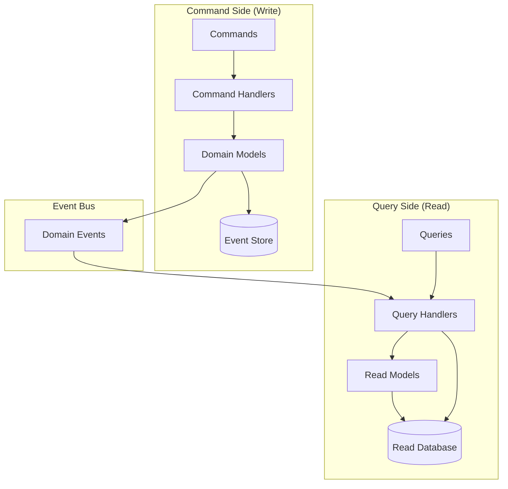

**Implementation**:

```typescript
// Commands
export class CreateUserCommand {
  constructor(
    public readonly email: string,
    public readonly name: string,
    public readonly password: string
  ) {}
}

export class UpdateUserProfileCommand {
  constructor(
    public readonly userId: string,
    public readonly name: string
  ) {}
}

// Command Handlers
@CommandHandler(CreateUserCommand)
export class CreateUserHandler implements ICommandHandler<CreateUserCommand> {
  constructor(
    private userRepo: UserRepository,
    private eventBus: EventBus
  ) {}

  async execute(command: CreateUserCommand): Promise<void> {
    const user = User.create(command.email, command.name, command.password);
    await this.userRepo.save(user);

    // Publish events
    user.getUncommittedEvents().forEach((event) => {
      this.eventBus.publish(event);
    });
  }
}

// Queries
export class GetUserQuery {
  constructor(public readonly userId: string) {}
}

export class GetUsersListQuery {
  constructor(public readonly filters: UserFilters) {}
}

// Query Handlers
@QueryHandler(GetUserQuery)
export class GetUserHandler implements IQueryHandler<GetUserQuery> {
  constructor(private userReadRepo: UserReadRepository) {}

  async execute(query: GetUserQuery): Promise<UserView> {
    return this.userReadRepo.findById(query.userId);
  }
}

// Read Models
export class UserView {
  id: string;
  email: string;
  name: string;
  profileCompleteness: number;
  lastLoginAt?: Date;
}

// Controller using CQRS
@Controller('users')
export class UserController {
  constructor(
    private commandBus: CommandBus,
    private queryBus: QueryBus
  ) {}

  @Post()
  async createUser(@Body() dto: CreateUserDto): Promise<void> {
    await this.commandBus.execute(
      new CreateUserCommand(dto.email, dto.name, dto.password)
    );
  }

  @Get(':id')
  async getUser(@Param('id') id: string): Promise<UserView> {
    return this.queryBus.execute(new GetUserQuery(id));
  }
}
```

---

### Event Sourcing

**Purpose**: Store state as sequence of events rather than current state

**When to use**:

- Audit requirements
- Complex business rules
- Time-travel debugging
- Eventual consistency scenarios

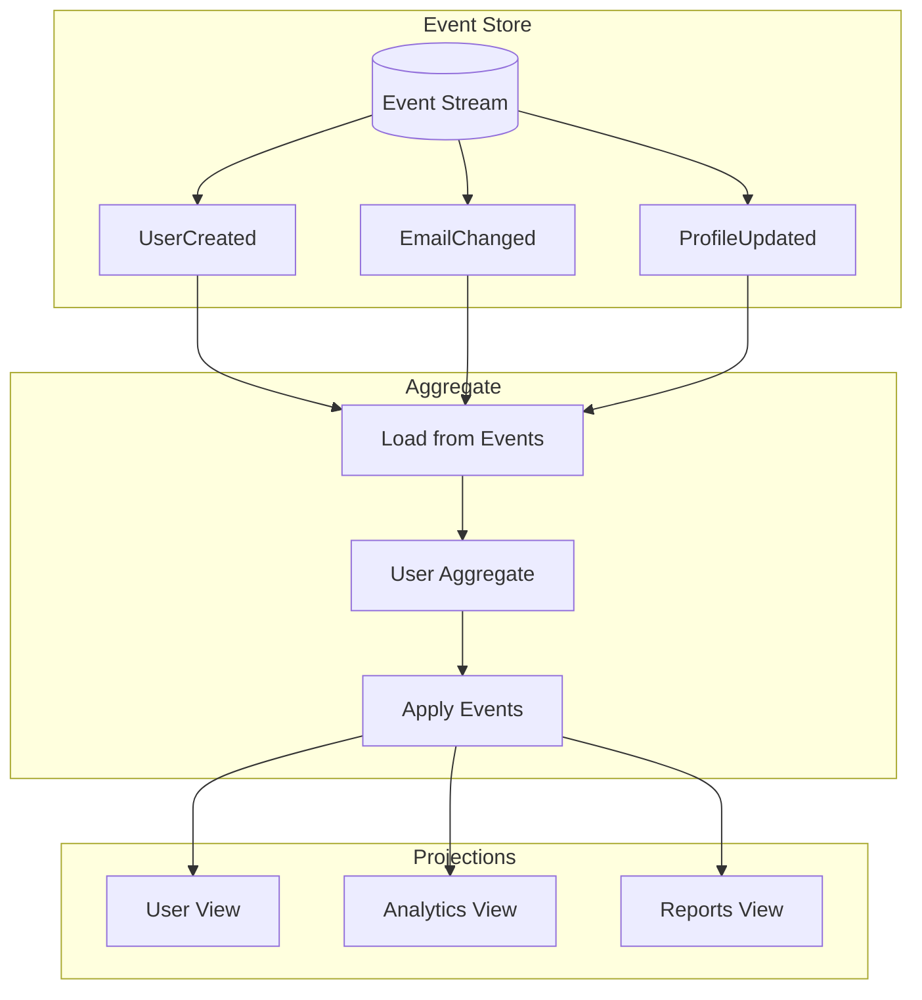

**Implementation**:

```typescript
// Domain Events
export abstract class DomainEvent {
  public readonly eventId: string;
  public readonly aggregateId: string;
  public readonly eventType: string;
  public readonly occurredAt: Date;

  constructor(aggregateId: string) {
    this.eventId = randomUUID();
    this.aggregateId = aggregateId;
    this.eventType = this.constructor.name;
    this.occurredAt = new Date();
  }
}

export class UserCreatedEvent extends DomainEvent {
  constructor(
    aggregateId: string,
    public readonly email: string,
    public readonly name: string
  ) {
    super(aggregateId);
  }
}

export class UserEmailChangedEvent extends DomainEvent {
  constructor(
    aggregateId: string,
    public readonly oldEmail: string,
    public readonly newEmail: string
  ) {
    super(aggregateId);
  }
}

// Aggregate Root
export class User extends AggregateRoot {
  private id: string;
  private email: string;
  private name: string;
  private version: number = 0;

  constructor(id?: string) {
    super();
    this.id = id || randomUUID();
  }

  static create(email: string, name: string): User {
    const user = new User();
    user.apply(new UserCreatedEvent(user.id, email, name));
    return user;
  }

  changeEmail(newEmail: string): void {
    if (this.email === newEmail) return;

    this.apply(new UserEmailChangedEvent(this.id, this.email, newEmail));
  }

  // Event application methods
  private onUserCreatedEvent(event: UserCreatedEvent): void {
    this.email = event.email;
    this.name = event.name;
  }

  private onUserEmailChangedEvent(event: UserEmailChangedEvent): void {
    this.email = event.newEmail;
  }

  // Load from event history
  static fromHistory(events: DomainEvent[]): User {
    const user = new User(events[0].aggregateId);
    events.forEach((event) => user.apply(event, false));
    user.markEventsAsCommitted();
    return user;
  }
}

// Abstract Aggregate Root
export abstract class AggregateRoot {
  private uncommittedEvents: DomainEvent[] = [];

  protected apply(event: DomainEvent, isNew = true): void {
    // Apply the event to update state
    const handler = this[`on${event.eventType}`];
    if (handler) {
      handler.call(this, event);
    }

    if (isNew) {
      this.uncommittedEvents.push(event);
    }
  }

  getUncommittedEvents(): DomainEvent[] {
    return [...this.uncommittedEvents];
  }

  markEventsAsCommitted(): void {
    this.uncommittedEvents = [];
  }
}

// Repository
@Injectable()
export class EventSourcedUserRepository {
  constructor(private eventStore: EventStore) {}

  async findById(id: string): Promise<User | null> {
    const events = await this.eventStore.getEventsForAggregate(id);
    if (events.length === 0) return null;

    return User.fromHistory(events);
  }

  async save(user: User): Promise<void> {
    const events = user.getUncommittedEvents();
    if (events.length === 0) return;

    await this.eventStore.saveEvents(user.id, events);
    user.markEventsAsCommitted();
  }
}
```

---

### Circuit Breaker

**Purpose**: Prevent cascading failures in distributed systems

**When to use**:

- External service calls
- Database connections
- Microservice communication

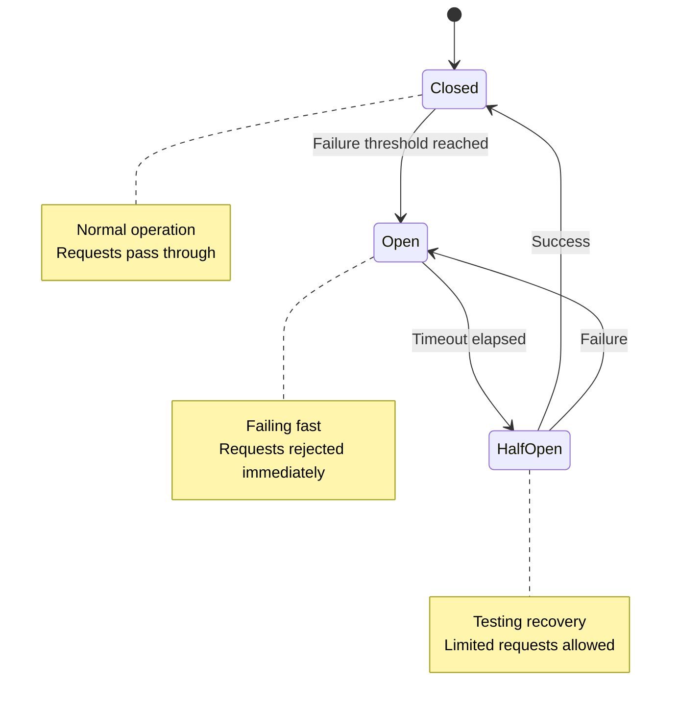

**Implementation**:

```typescript
export enum CircuitState {
  CLOSED = 'CLOSED',
  OPEN = 'OPEN',
  HALF_OPEN = 'HALF_OPEN',
}

export interface CircuitBreakerConfig {
  failureThreshold: number; // Number of failures to open circuit
  recoveryTimeout: number; // Time before trying half-open (ms)
  monitoringPeriod: number; // Period to monitor failures (ms)
  halfOpenMaxCalls: number; // Max calls in half-open state
}

@Injectable()
export class CircuitBreaker {
  private state = CircuitState.CLOSED;
  private failureCount = 0;
  private lastFailureTime = 0;
  private halfOpenCalls = 0;

  constructor(private config: CircuitBreakerConfig) {}

  async execute<T>(operation: () => Promise<T>): Promise<T> {
    if (this.state === CircuitState.OPEN) {
      if (this.shouldAttemptReset()) {
        this.state = CircuitState.HALF_OPEN;
        this.halfOpenCalls = 0;
      } else {
        throw new Error('Circuit breaker is OPEN');
      }
    }

    try {
      const result = await operation();
      this.onSuccess();
      return result;
    } catch (error) {
      this.onFailure();
      throw error;
    }
  }

  private onSuccess(): void {
    this.failureCount = 0;
    if (this.state === CircuitState.HALF_OPEN) {
      this.state = CircuitState.CLOSED;
    }
  }

  private onFailure(): void {
    this.failureCount++;
    this.lastFailureTime = Date.now();

    if (this.state === CircuitState.HALF_OPEN) {
      this.state = CircuitState.OPEN;
    } else if (this.failureCount >= this.config.failureThreshold) {
      this.state = CircuitState.OPEN;
    }
  }

  private shouldAttemptReset(): boolean {
    return Date.now() - this.lastFailureTime >= this.config.recoveryTimeout;
  }
}

// Usage in Service
@Injectable()
export class ExternalApiService {
  private circuitBreaker = new CircuitBreaker({
    failureThreshold: 5,
    recoveryTimeout: 30000, // 30 seconds
    monitoringPeriod: 60000, // 1 minute
    halfOpenMaxCalls: 3,
  });

  async fetchUserData(userId: string): Promise<any> {
    return this.circuitBreaker.execute(async () => {
      const response = await fetch(`https://external-api.com/users/${userId}`);
      if (!response.ok) {
        throw new Error(`HTTP ${response.status}`);
      }
      return response.json();
    });
  }
}

// Decorator for automatic circuit breaking
export function CircuitBreak(config: CircuitBreakerConfig) {
  const circuitBreaker = new CircuitBreaker(config);

  return function (
    target: any,
    propertyName: string,
    descriptor: PropertyDescriptor
  ) {
    const method = descriptor.value;

    descriptor.value = async function (...args: any[]) {
      return circuitBreaker.execute(() => method.apply(this, args));
    };
  };
}

// Usage with decorator
@Injectable()
export class PaymentService {
  @CircuitBreak({
    failureThreshold: 3,
    recoveryTimeout: 60000,
    monitoringPeriod: 300000,
    halfOpenMaxCalls: 2,
  })
  async processPayment(paymentData: any): Promise<any> {
    // External payment processing
    const response = await fetch('https://payment-gateway.com/process', {
      method: 'POST',
      body: JSON.stringify(paymentData),
    });

    if (!response.ok) {
      throw new Error('Payment processing failed');
    }

    return response.json();
  }
}
```

---

## Summary

This comprehensive guide covers the essential patterns for your monorepo
architecture. Start with the core patterns (Hexagonal, Repository, DTO) and
gradually introduce others based on your specific needs. The key is to apply
patterns thoughtfully, solving actual problems rather than adding complexity for
its own sake.

**Recommended Implementation Order:**

1. **DTO Pattern** - Establish type safety across your stack
2. **Repository Pattern** - Abstract data access
3. **Cache-Aside** - Improve performance with Redis
4. **Hexagonal Architecture** - Clean business logic separation
5. **Unit of Work** - Handle complex transactions
6. **BFF** - Optimize for different clients
7. Advanced patterns as complexity grows

Each pattern serves a specific purpose and should be evaluated against your
actual requirements, team size, and system complexity.
