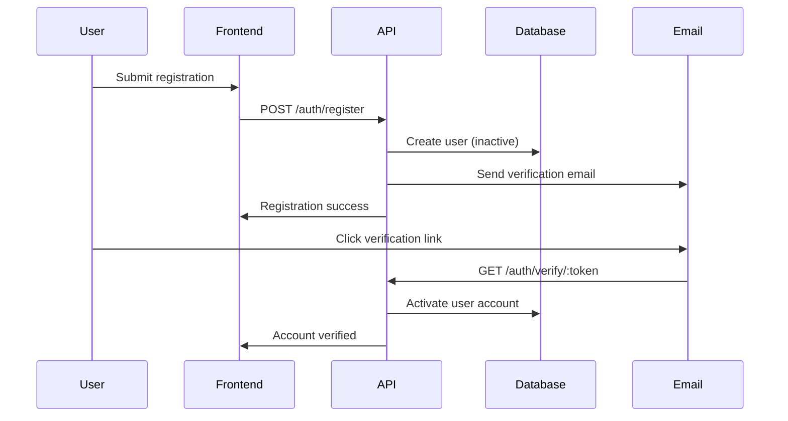
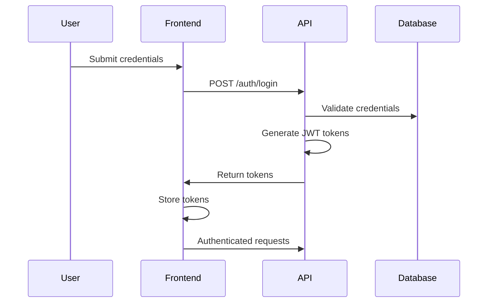

# Sprint 3: Authentication & User Management

## Sprint Overview

**Duration:** 3 weeks **Story Points:** 11 points **Sprint Goal:** Implement
secure authentication system, user management, and role-based access control for
WellFlow platform.

## Sprint Objectives

1. Implement JWT-based authentication with Passport.js
2. Build user registration and login workflows
3. Create role-based access control with CASL
4. Develop user management interface
5. Implement password security and account recovery

## Deliverables

### 1. Authentication System

- **JWT Implementation**
  - Access token and refresh token strategy
  - Token expiration and renewal logic
  - Secure token storage and transmission
  - Token blacklisting for logout
- **Passport.js Integration**
  - Local strategy for email/password
  - JWT strategy for API authentication
  - Session management
  - Authentication guards and decorators

### 2. User Registration & Login

- **Registration Flow**
  - Email verification system
  - Password strength validation
  - Organization creation for new accounts
  - Welcome email automation
- **Login System**
  - Secure password verification
  - Account lockout after failed attempts
  - Remember me functionality
  - Login audit logging

### 3. Role-Based Access Control (RBAC)

- **CASL Authorization**
  - Permission definitions for Owner/Manager/Pumper roles
  - Resource-based access control
  - Dynamic permission checking
  - Multi-tenant permission isolation
- **Role Management**
  - Role assignment and modification
  - Permission inheritance
  - Role-based UI rendering
  - API endpoint protection

### 4. User Management Interface

- **Web Dashboard**
  - User list with role indicators
  - User invitation system
  - Role assignment interface
  - Account status management
- **User Profile Management**
  - Profile editing functionality
  - Password change system
  - Account settings
  - Activity history

### 5. Security Features

- **Password Security**
  - Bcrypt hashing with salt
  - Password complexity requirements
  - Password history prevention
  - Secure password reset flow
- **Account Security**
  - Email verification for sensitive changes
  - Account lockout protection
  - Suspicious activity detection
  - Security audit logging

### 6. Enhanced API Security (OWASP 2023)

- **API Security Hardening**
  - Implement API11: Unsafe Consumption of APIs validation
  - Add SSRF protection for internal network access
  - Enhance third-party API response validation (weather, regulatory APIs)
  - Create API security testing framework
  - **Business Justification**: Protects against third-party API compromises,
    prevents SCADA network access

### 7. Advanced Rate Limiting & DDoS Protection

- **Tiered Rate Limiting**
  - Implement emergency rate limiting (higher limits during incidents)
  - Add IP-based and user-based rate limiting
  - Create rate limiting bypass for emergency scenarios
  - Set up DDoS protection monitoring and alerting
  - **Business Justification**: 95% DDoS impact reduction, critical during
    emergencies like hurricanes

## Technical Requirements

### Authentication Architecture

```typescript
// JWT token structure
interface JWTPayload {
  sub: string; // User ID
  email: string; // User email
  organizationId: string; // Tenant ID
  role: UserRole; // User role
  iat: number; // Issued at
  exp: number; // Expires at
}

// Role definitions
enum UserRole {
  OWNER = 'owner', // Full access
  MANAGER = 'manager', // Operations access
  PUMPER = 'pumper', // Field data entry only
}
```

### CASL Permission System

```typescript
// Permission definitions
const permissions = {
  owner: ['manage', 'all'],
  manager: [
    'read',
    'wells',
    'create',
    'production',
    'read',
    'compliance',
    'update',
    'equipment',
  ],
  pumper: ['create', 'production', 'read', 'wells', 'update', 'production'],
};
```

### Security Requirements

- Password minimum 8 characters with complexity
- JWT tokens expire in 15 minutes (access) / 7 days (refresh)
- Account lockout after 5 failed login attempts
- Email verification required for account activation
- Audit logging for all authentication events

## Acceptance Criteria

### Authentication System

- [ ] Users can register with email verification
- [ ] Users can login with email and password
- [ ] JWT tokens are issued and validated correctly
- [ ] Refresh tokens work for seamless re-authentication
- [ ] Logout invalidates tokens properly
- [ ] Failed login attempts are tracked and limited

### Role-Based Access Control

- [ ] Owners can access all features and data
- [ ] Managers can access operations but not billing
- [ ] Pumpers can only enter production data
- [ ] API endpoints enforce role-based permissions
- [ ] UI shows/hides features based on user role
- [ ] Multi-tenant isolation prevents cross-organization access

### User Management

- [ ] Owners can invite new team members
- [ ] Role assignments work correctly
- [ ] User accounts can be activated/deactivated
- [ ] Profile updates work with proper validation
- [ ] Password changes require current password
- [ ] Account recovery works via email

### Security Features

- [ ] Passwords are hashed with bcrypt
- [ ] Password complexity requirements enforced
- [ ] Account lockout prevents brute force attacks
- [ ] Email verification prevents fake accounts
- [ ] Audit logs capture authentication events
- [ ] Sensitive operations require re-authentication

## Team Assignments

### Backend Lead Developer

- JWT authentication system implementation
- CASL authorization framework setup
- Security middleware and guards
- Authentication API endpoints

### Backend Developer

- User management CRUD operations
- Email verification system
- Password reset functionality
- Audit logging implementation

### Frontend Developer

- Login and registration forms
- User management interface
- Role-based UI components
- Authentication state management

### DevOps Engineer

- Email service configuration (Resend)
- Security monitoring setup
- Authentication performance monitoring
- SSL certificate management

## Dependencies

### From Previous Sprints

- ✅ Database schema with users table
- ✅ API foundation with validation
- ✅ Email service configuration

### External Dependencies

- Passport.js and JWT libraries
- Bcrypt for password hashing
- CASL for authorization
- Resend for email delivery

## Authentication Flow Design

### Registration Flow



### Login Flow



## Security Considerations

### Password Security

- Bcrypt with minimum 12 rounds
- Password complexity: 8+ chars, mixed case, numbers, symbols
- Password history: prevent reuse of last 5 passwords
- Secure password reset with time-limited tokens

### Token Security

- Short-lived access tokens (15 minutes)
- Secure refresh token rotation
- Token blacklisting on logout
- HTTPS-only token transmission

### Account Protection

- Rate limiting on authentication endpoints
- Account lockout after failed attempts
- Email verification for sensitive changes
- Suspicious activity monitoring

## Risks & Mitigation

### Security Risks

- **Token compromise**: Implement short expiration and rotation
- **Brute force attacks**: Account lockout and rate limiting
- **Email verification bypass**: Secure token generation and validation

### Technical Risks

- **Complex permission logic**: Start simple, add complexity gradually
- **Performance impact**: Optimize permission checking
- **Token management**: Implement proper cleanup and rotation

## Definition of Done

### Functional Requirements

- [ ] Complete authentication flow works end-to-end
- [ ] Role-based permissions enforce correctly
- [ ] User management interface fully functional
- [ ] Password security meets requirements
- [ ] Email verification system operational

### Security Requirements

- [ ] Security audit completed and passed
- [ ] Penetration testing on authentication system
- [ ] OWASP security guidelines followed
- [ ] Audit logging captures all security events

### Quality Requirements

- [ ] Unit tests cover >85% of authentication code
- [ ] Integration tests verify complete flows
- [ ] Performance tests show acceptable response times
- [ ] Documentation covers all security procedures

## Success Metrics

- **Authentication Performance**: < 500ms login response time
- **Security**: Zero successful brute force attacks in testing
- **User Experience**: < 3 clicks for common user management tasks
- **Reliability**: 99.9% authentication success rate

## Next Sprint Preparation

- Well and lease data model review
- API endpoint design for well management
- Mobile app authentication integration planning
- Production data entry workflow design

---

**Sprint 3 establishes the security foundation for the entire platform. Proper
implementation here is critical for data protection and regulatory compliance.**
