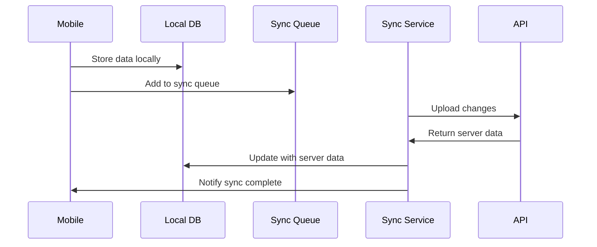

# Sprint 5: Mobile App Foundation & Offline Architecture

## Sprint Overview

**Duration:** 3 weeks  
**Story Points:** 13 points  
**Sprint Goal:** Build React Native mobile app foundation with offline-first
architecture, authentication integration, and core navigation structure.

## Sprint Objectives

1. Set up React Native app with offline-first architecture
2. Implement authentication integration with backend
3. Build core navigation and user interface framework
4. Create offline data synchronization system
5. Establish mobile app development and testing workflow

## Deliverables

### 1. React Native App Setup

- **Project Configuration**
  - React Native CLI setup with TypeScript
  - iOS and Android project configuration
  - Development environment setup
  - Build and deployment pipeline
- **Core Dependencies**
  - Navigation library (React Navigation)
  - State management (Zustand)
  - HTTP client (Axios with TanStack Query)
  - Offline storage (SQLite with WatermelonDB)

### 2. Offline-First Architecture

- **Local Database**
  - SQLite database setup with WatermelonDB
  - Local schema matching backend entities
  - Data synchronization models
  - Conflict resolution strategy
- **Sync Engine**
  - Bidirectional data synchronization
  - Queue management for offline operations
  - Conflict detection and resolution
  - Background sync scheduling

### 3. Authentication Integration

- **Login System**
  - Login form with validation
  - JWT token storage and management
  - Biometric authentication support
  - Auto-login with stored credentials
- **Security Features**
  - Secure token storage (Keychain/Keystore)
  - Session management
  - Automatic token refresh
  - Logout and session cleanup

### 4. Core Navigation & UI

- **Navigation Structure**
  - Tab-based navigation for main sections
  - Stack navigation for detailed views
  - Authentication flow navigation
  - Deep linking support
- **UI Framework**
  - Design system components
  - Theme configuration
  - Responsive layouts for different screen sizes
  - Accessibility support

### 5. Development Workflow

- **Testing Setup**
  - Unit testing with Jest
  - Component testing with React Native Testing Library
  - E2E testing with Detox
  - Device testing on iOS and Android
- **Development Tools**
  - Hot reload and fast refresh
  - Debugging tools and configuration
  - Performance monitoring setup
  - Crash reporting integration

### 6. Mobile Accessibility Framework (WCAG 2.2)

- **Enhanced Mobile Accessibility**
  - Implement enhanced focus management for screen readers
  - Add larger touch targets (minimum 44px) for field use
  - Create accessible authentication flows for cognitive disabilities
  - Set up mobile accessibility testing framework
  - Implement dragging movement alternatives for motor disabilities
  - **Business Justification**: Critical for field workers with disabilities,
    legal compliance, workforce inclusion

## Technical Requirements

### Offline Architecture

```typescript
// Local database schema (WatermelonDB)
const wellSchema = tableSchema({
  name: 'wells',
  columns: [
    { name: 'server_id', type: 'string', isOptional: true },
    { name: 'api_number', type: 'string' },
    { name: 'well_name', type: 'string' },
    { name: 'status', type: 'string' },
    { name: 'last_synced', type: 'number', isOptional: true },
    { name: 'is_dirty', type: 'boolean' },
  ],
});

// Sync strategy
interface SyncOperation {
  type: 'CREATE' | 'UPDATE' | 'DELETE';
  entity: string;
  localId: string;
  serverId?: string;
  data: any;
  timestamp: number;
}
```

### Authentication Flow

```typescript
// Token management
interface AuthTokens {
  accessToken: string;
  refreshToken: string;
  expiresAt: number;
}

// Secure storage
const storeTokens = async (tokens: AuthTokens) => {
  await Keychain.setInternetCredentials(
    'wellflow_tokens',
    'user',
    JSON.stringify(tokens)
  );
};
```

### Performance Requirements

- App startup time: < 3 seconds on average devices
- Offline data access: < 500ms for cached data
- Sync operation: Complete within 30 seconds for typical dataset
- Memory usage: < 100MB for normal operation

## Acceptance Criteria

### Mobile App Foundation

- [ ] React Native app builds and runs on iOS and Android
- [ ] TypeScript configuration works without errors
- [ ] Development environment supports hot reload
- [ ] App follows React Native best practices
- [ ] Performance monitoring captures key metrics

### Offline Architecture

- [ ] Local SQLite database stores data correctly
- [ ] App functions completely offline
- [ ] Data synchronizes when connectivity returns
- [ ] Conflict resolution handles data conflicts
- [ ] Sync status is visible to users

### Authentication

- [ ] Users can login with email and password
- [ ] JWT tokens are stored securely
- [ ] Biometric authentication works (if available)
- [ ] Token refresh happens automatically
- [ ] Logout clears all stored credentials

### Navigation & UI

- [ ] Navigation flows work intuitively
- [ ] UI components follow design system
- [ ] App works on different screen sizes
- [ ] Accessibility features are implemented
- [ ] Loading states and error handling work

### Development Workflow

- [ ] Unit tests run successfully
- [ ] Component tests verify UI behavior
- [ ] E2E tests cover critical user flows
- [ ] Build pipeline produces deployable apps
- [ ] Debugging tools work effectively

## Team Assignments

### Mobile Lead Developer

- React Native app architecture and setup
- Offline synchronization engine
- Authentication integration
- Performance optimization

### Mobile Developer

- UI components and navigation
- Local database implementation
- Testing setup and implementation
- Platform-specific features (iOS/Android)

### Backend Developer

- Mobile API endpoints optimization
- Sync API development
- Authentication token management
- Mobile-specific error handling

### UI/UX Designer

- Mobile design system
- Navigation flow design
- Responsive layout specifications
- Accessibility guidelines

## Dependencies

### From Previous Sprints

- ✅ Backend API with authentication
- ✅ Well and lease management endpoints
- ✅ Database schema and validation

### External Dependencies

- React Native development environment
- iOS and Android development tools
- Device testing hardware/simulators
- App store developer accounts (for testing)

## Mobile Architecture Design

### App Structure

```
src/
├── components/          # Reusable UI components
├── screens/            # Screen components
├── navigation/         # Navigation configuration
├── services/           # API and sync services
├── store/             # State management
├── database/          # Local database models
├── utils/             # Utility functions
└── types/             # TypeScript type definitions
```

### Sync Strategy



## Offline Data Strategy

### Data Storage

- **WatermelonDB**: Reactive local database
- **SQLite**: Underlying storage engine
- **Lazy loading**: Load data as needed
- **Caching**: Intelligent data caching

### Sync Mechanisms

- **Optimistic updates**: Update UI immediately
- **Conflict resolution**: Last-write-wins with user notification
- **Batch operations**: Efficient bulk synchronization
- **Background sync**: Sync when app is backgrounded

## Security Considerations

### Data Protection

- Local database encryption
- Secure credential storage
- Certificate pinning for API calls
- Biometric authentication integration

### Privacy

- Minimal data collection
- User consent for location access
- Secure data transmission
- Local data cleanup on logout

## Risks & Mitigation

### Technical Risks

- **Offline complexity**: Start with simple sync, add complexity gradually
- **Platform differences**: Test thoroughly on both iOS and Android
- **Performance issues**: Profile and optimize early

### User Experience Risks

- **Sync confusion**: Clear sync status indicators
- **Data loss**: Robust conflict resolution
- **Connectivity issues**: Graceful offline handling

## Definition of Done

### Technical Completion

- [ ] Mobile app builds and deploys successfully
- [ ] Offline functionality works without internet
- [ ] Authentication integrates with backend
- [ ] Data synchronization handles conflicts
- [ ] Performance meets specified requirements

### Quality Assurance

- [ ] Unit tests cover core functionality
- [ ] Integration tests verify sync behavior
- [ ] E2E tests cover user workflows
- [ ] Manual testing on multiple devices
- [ ] Accessibility testing completed

### User Experience

- [ ] Navigation flows are intuitive
- [ ] Loading states provide clear feedback
- [ ] Error messages are helpful
- [ ] Offline mode is clearly indicated
- [ ] Sync status is visible to users

## Success Metrics

- **App Performance**: < 3 second startup time
- **Offline Capability**: 100% functionality without internet
- **Sync Reliability**: 99%+ successful sync operations
- **User Experience**: Smooth navigation and interactions

## Next Sprint Preparation

- Production data entry form design
- Field data validation requirements
- Photo capture and attachment workflow
- GPS location integration planning

---

**Sprint 5 establishes the mobile foundation that field workers will use daily.
Offline capability and reliable sync are critical for field operations
success.**
