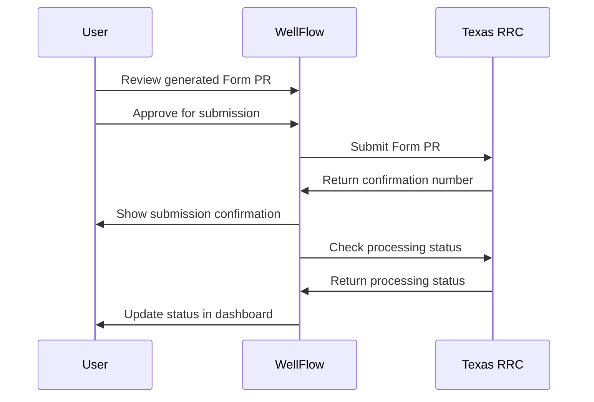

# Sprint 11: Form PR Generation & Texas RRC Integration

## Sprint Overview

**Duration:** 3 weeks  
**Story Points:** 15 points  
**Sprint Goal:** Implement automated Texas RRC Form PR generation with
production data aggregation, tax calculations, and electronic filing
integration.

## Sprint Objectives

1. Build Form PR data aggregation and calculation engine
2. Implement Texas RRC Form PR template and PDF generation
3. Create tax calculation system (severance tax, gross receipts tax)
4. Develop electronic filing integration with Texas RRC
5. Build Form PR review, approval, and submission workflow

## Deliverables

### 1. Form PR Data Aggregation

- **Production Data Aggregation**
  - Monthly production totals by well
  - Oil, gas, and water volume calculations
  - Production day counting and proration
  - Multi-well lease aggregation
- **Well Information Compilation**
  - API number validation and formatting
  - Well location and lease information
  - Operator information and contact details
  - Well status and production dates

### 2. Tax Calculation Engine

- **Severance Tax Calculations**
  - Oil severance tax (4.6% of market value)
  - Gas severance tax (7.5% of market value)
  - Tax exemption handling (high-cost gas, etc.)
  - Market value determination algorithms
- **Gross Receipts Tax**
  - Gross receipts tax calculation (varies by county)
  - County-specific tax rates
  - Tax base calculations
  - Exemption and deduction handling

### 3. Form PR Template System

- **PDF Form Generation**
  - Official Texas RRC Form PR template
  - Dynamic field population from data
  - Multi-page form handling
  - Digital signature integration
- **Form Validation**
  - Required field validation
  - Data format validation
  - Business rule validation
  - Cross-field validation checks

### 4. Texas RRC Integration

- **Electronic Filing API**
  - Texas RRC webPR system integration
  - Authentication and authorization
  - Form submission and tracking
  - Response handling and error management
- **Filing Status Management**
  - Submission confirmation tracking
  - Processing status monitoring
  - Error handling and resubmission
  - Audit trail maintenance

### 5. Review & Approval Workflow

- **Form Review Interface**
  - Generated form preview
  - Data verification tools
  - Edit and correction capabilities
  - Approval workflow management
- **Submission Management**
  - Pre-submission validation
  - Electronic filing execution
  - Confirmation receipt handling
  - Post-submission tracking

## Technical Requirements

### Form PR Data Structure

```typescript
// Form PR data model
interface FormPRData {
  reportingPeriod: {
    month: number;
    year: number;
  };
  operator: {
    name: string;
    p5Number: string;
    address: Address;
    contact: ContactInfo;
  };
  wells: FormPRWell[];
  taxes: {
    severanceTax: TaxCalculation;
    grossReceiptsTax: TaxCalculation;
  };
  totals: ProductionTotals;
  certificationDate: Date;
  submittedBy: string;
}

interface FormPRWell {
  apiNumber: string;
  wellName: string;
  leaseNumber: string;
  county: string;
  field: string;
  production: {
    oil: number; // Barrels
    gas: number; // MCF
    water: number; // Barrels
    days: number; // Production days
  };
  disposition: {
    oilSold: number;
    gasSold: number;
    oilStock: number;
    gasFlared: number;
  };
}
```

### Tax Calculation Algorithms

```typescript
// Severance tax calculation service
@Injectable()
export class SeveranceTaxService {
  calculateOilSeveranceTax(
    oilVolume: number,
    marketPrice: number,
    wellInfo: WellInfo,
  ): TaxCalculation {
    const marketValue = oilVolume * marketPrice;
    const taxRate = 0.046; // 4.6%

    // Check for exemptions
    const exemptions = this.checkExemptions(wellInfo);
    const exemptionAmount = this.calculateExemptions(marketValue, exemptions);

    const taxableValue = marketValue - exemptionAmount;
    const taxOwed = taxableValue * taxRate;

    return {
      marketValue,
      taxableValue,
      taxRate,
      exemptions,
      taxOwed: Math.round(taxOwed * 100) / 100, // Round to cents
    };
  }

  calculateGasSeveranceTax(
    gasVolume: number,
    marketPrice: number,
    wellInfo: WellInfo,
  ): TaxCalculation {
    const marketValue = gasVolume * marketPrice;
    const taxRate = 0.075; // 7.5%

    // High-cost gas exemption check
    const isHighCostGas = this.checkHighCostGasStatus(wellInfo);
    const effectiveRate = isHighCostGas ? 0.0 : taxRate;

    const taxOwed = marketValue * effectiveRate;

    return {
      marketValue,
      taxableValue: marketValue,
      taxRate: effectiveRate,
      exemptions: isHighCostGas ? ["high_cost_gas"] : [],
      taxOwed: Math.round(taxOwed * 100) / 100,
    };
  }
}
```

### PDF Generation

```typescript
// Form PR PDF generation
@Injectable()
export class FormPRPDFService {
  async generateFormPR(data: FormPRData): Promise<Buffer> {
    const doc = new PDFDocument();

    // Header information
    this.addHeader(doc, data.operator, data.reportingPeriod);

    // Well production data
    this.addWellData(doc, data.wells);

    // Tax calculations
    this.addTaxCalculations(doc, data.taxes);

    // Totals and certification
    this.addTotalsAndCertification(doc, data.totals, data.certificationDate);

    return doc;
  }

  private addWellData(doc: PDFDocument, wells: FormPRWell[]): void {
    wells.forEach((well, index) => {
      const y = 200 + index * 20;

      doc.text(well.apiNumber, 50, y);
      doc.text(well.wellName, 150, y);
      doc.text(well.production.oil.toString(), 250, y);
      doc.text(well.production.gas.toString(), 300, y);
      doc.text(well.production.water.toString(), 350, y);
      doc.text(well.production.days.toString(), 400, y);
    });
  }
}
```

## Acceptance Criteria

### Data Aggregation

- [ ] Monthly production data aggregates correctly by well
- [ ] Multi-well lease totals calculate accurately
- [ ] Production day counting handles partial months
- [ ] Well information populates from master data
- [ ] Data validation prevents invalid aggregations

### Tax Calculations

- [ ] Oil severance tax calculates at 4.6% rate
- [ ] Gas severance tax calculates at 7.5% rate
- [ ] High-cost gas exemptions apply correctly
- [ ] Gross receipts tax uses correct county rates
- [ ] Tax calculations round to nearest cent
- [ ] Exemptions and deductions process properly

### Form Generation

- [ ] PDF forms match official Texas RRC format
- [ ] All required fields populate from data
- [ ] Form validation catches missing/invalid data
- [ ] Multi-page forms handle pagination correctly
- [ ] Generated forms are readable and properly formatted

### Texas RRC Integration

- [ ] Electronic filing API connects successfully
- [ ] Form submissions receive confirmation numbers
- [ ] Filing status updates track processing
- [ ] Error responses are handled gracefully
- [ ] Resubmission works for rejected forms

### Workflow Management

- [ ] Form review interface shows all data clearly
- [ ] Corrections can be made before submission
- [ ] Approval workflow prevents unauthorized submissions
- [ ] Submission tracking maintains complete audit trail
- [ ] Post-submission status monitoring works

## Team Assignments

### Backend Lead Developer

- Form PR data aggregation engine
- Tax calculation algorithms
- Texas RRC API integration
- Electronic filing workflow

### Backend Developer

- PDF generation system
- Form validation logic
- Database schema for Form PR data
- Background job processing

### Frontend Developer

- Form PR review interface
- Tax calculation display
- Submission workflow UI
- Status tracking dashboard

### Compliance Specialist

- Texas RRC requirements validation
- Tax calculation verification
- Form template accuracy review
- Filing process documentation

## Dependencies

### From Previous Sprints

- ✅ Production data management system
- ✅ Compliance framework and calendar
- ✅ Well and lease management
- ✅ Notification system

### External Dependencies

- Texas RRC webPR API access
- Official Form PR template specifications
- Current tax rates and exemption rules
- Market price data sources

## Texas RRC Integration

### API Endpoints

```typescript
// Texas RRC webPR integration
interface TexasRRCAPI {
  authenticate(credentials: RRCCredentials): Promise<AuthToken>;
  submitFormPR(formData: FormPRSubmission): Promise<SubmissionResponse>;
  getSubmissionStatus(confirmationNumber: string): Promise<StatusResponse>;
  downloadReceipt(confirmationNumber: string): Promise<Buffer>;
}

interface FormPRSubmission {
  operatorP5Number: string;
  reportingPeriod: string; // "YYYY-MM"
  formData: FormPRData;
  attachments?: FileAttachment[];
}

interface SubmissionResponse {
  success: boolean;
  confirmationNumber?: string;
  errors?: ValidationError[];
  warnings?: string[];
}
```

### Filing Workflow



## Market Price Integration

### Price Data Sources

```typescript
// Market price service
@Injectable()
export class MarketPriceService {
  async getOilPrice(date: Date, location: string): Promise<number> {
    // Integration with price data providers
    // WTI, Brent, or regional pricing
    return this.priceProvider.getOilPrice(date, location);
  }

  async getGasPrice(date: Date, location: string): Promise<number> {
    // Natural gas pricing (Henry Hub, regional)
    return this.priceProvider.getGasPrice(date, location);
  }

  async getHistoricalPrices(
    dateRange: DateRange,
    commodity: "oil" | "gas",
  ): Promise<PriceHistory[]> {
    return this.priceProvider.getHistoricalPrices(dateRange, commodity);
  }
}
```

## Performance Requirements

### Form Generation

- Form PR generation: < 10 seconds for 50 wells
- PDF creation: < 5 seconds per form
- Tax calculations: < 2 seconds for complex scenarios
- Data aggregation: < 3 seconds for monthly data

### Integration Performance

- Texas RRC API calls: < 30 seconds timeout
- Form submission: < 60 seconds for large forms
- Status checking: < 10 seconds response time
- Error handling: Immediate user feedback

## Risks & Mitigation

### Regulatory Risks

- **Form format changes**: Monitor RRC updates and maintain templates
- **Tax rate changes**: Implement configurable tax rates
- **API changes**: Build robust error handling and fallbacks

### Technical Risks

- **Integration failures**: Implement retry logic and manual fallback
- **Calculation errors**: Extensive testing with known datasets
- **PDF generation issues**: Test with various data scenarios

### Business Risks

- **Late submissions**: Automated deadline tracking and alerts
- **Incorrect data**: Multi-level validation and review process
- **Audit issues**: Comprehensive audit trail and documentation

## Definition of Done

### Functional Requirements

- [ ] Form PR generates accurately from production data
- [ ] Tax calculations match manual calculations
- [ ] PDF forms are properly formatted and complete
- [ ] Electronic filing integrates with Texas RRC
- [ ] Review and approval workflow functions correctly

### Quality Requirements

- [ ] Tax calculations validated by compliance expert
- [ ] Form generation tested with various data scenarios
- [ ] Integration tested with Texas RRC sandbox
- [ ] Performance testing meets requirements
- [ ] Error handling covers all failure scenarios

### Compliance Requirements

- [ ] Forms match official Texas RRC specifications
- [ ] Tax calculations follow current regulations
- [ ] Audit trail meets regulatory requirements
- [ ] Data retention policies implemented
- [ ] Security review completed for sensitive data

## Success Metrics

- **Calculation Accuracy**: 100% accurate tax calculations
- **Form Generation Success**: 99%+ successful PDF generation
- **Filing Success Rate**: 95%+ successful electronic submissions
- **Time Savings**: 4-8 hours saved per monthly filing
- **User Satisfaction**: Positive feedback on automation

## Next Sprint Preparation

- Partner management system design
- Joint Interest Billing (JIB) requirements
- Revenue distribution calculations
- Partner communication workflows

---

**Sprint 10 delivers the core compliance automation that provides significant
value to operators. Successful Form PR automation saves 4-8 hours monthly and
reduces compliance risk.**
