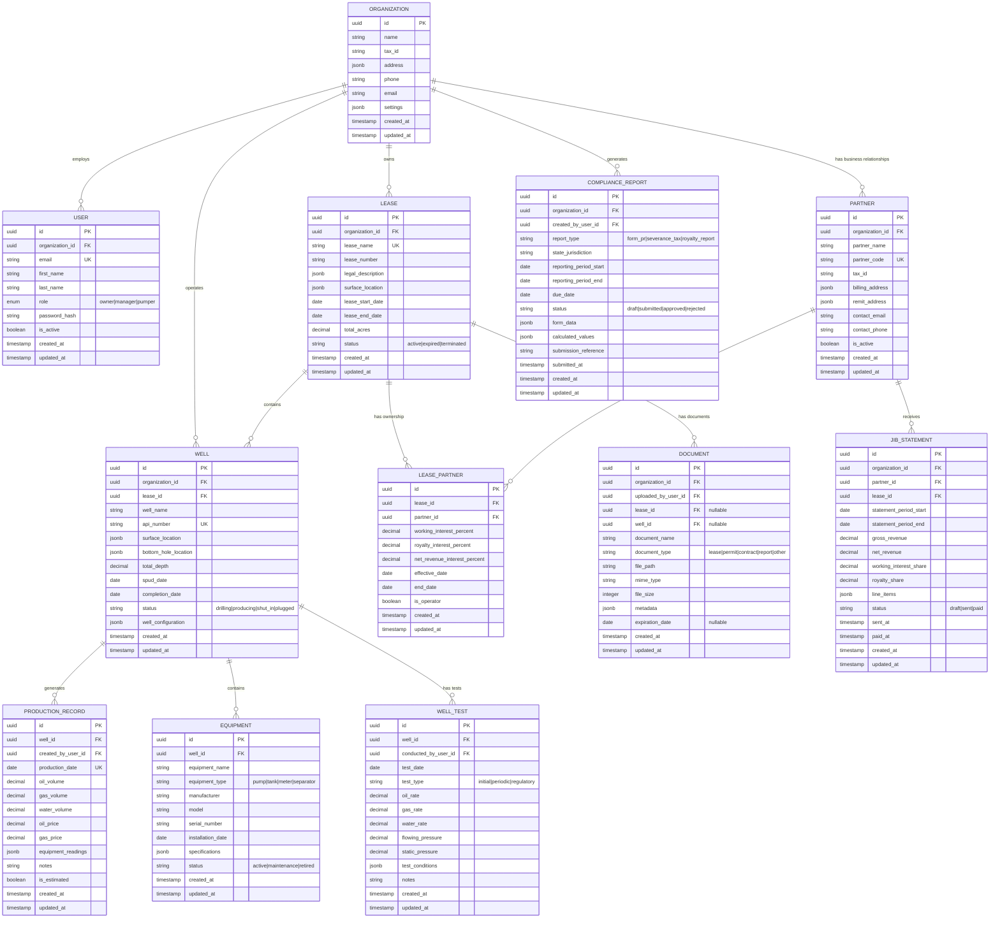

# WellFlow Data Models & Relationships

## Overview

This document defines the core data models for WellFlow's multi-tenant SaaS
platform, their relationships, and database schema design. The models are
designed to support small oil & gas operators (1-100 wells) with regulatory
compliance automation, Joint Interest Billing (JIB), and comprehensive business
management.

## Validation Status

✅ **FULLY VALIDATED** - Data models align with regulatory requirements and
industry standards. See `docs/architecture-validation-report.md` for detailed
validation.

## Core Entity Relationship Diagram



## Model Descriptions

### Core Business Models

#### Organization

**Purpose**: Multi-tenant root entity representing an oil & gas operator
company. **Key Features**:

- Tenant isolation boundary for all data
- Company settings and configuration
- Tax identification and billing information

#### User

**Purpose**: System users with role-based access control. **Roles**:

- **Owner**: Full system access, billing, user management
- **Manager**: Operations oversight, reporting, compliance
- **Pumper**: Field data entry, basic well information

#### Lease

**Purpose**: Legal agreements for oil & gas extraction rights. **Key Features**:

- Legal land descriptions and boundaries
- Lease terms and expiration tracking
- Multiple wells per lease support

#### Well

**Purpose**: Individual wellbores for oil & gas production. **Key Features**:

- API number tracking (regulatory requirement)
- Location coordinates (surface and bottom hole)
- Production status and configuration

### Production & Operations Models

#### Production Record

**Purpose**: Daily production data entry and tracking. **Key Features**:

- Oil, gas, and water volumes
- Commodity pricing information
- Equipment readings and field notes
- Audit trail with user attribution

#### Equipment

**Purpose**: Well equipment inventory and management. **Key Features**:

- Equipment specifications and maintenance
- Installation and retirement tracking
- Status monitoring for operational efficiency

#### Well Test

**Purpose**: Periodic well performance testing. **Key Features**:

- Flow rates and pressure measurements
- Regulatory compliance testing
- Performance trend analysis

### Financial & Compliance Models

#### Partner

**Purpose**: Joint venture partners and royalty owners. **Key Features**:

- Contact and billing information
- Tax identification for 1099 reporting
- Active/inactive status management

#### Lease Partner

**Purpose**: Ownership interests in specific leases. **Key Features**:

- Working interest and royalty percentages
- Net revenue interest calculations
- Time-based interest changes

#### JIB Statement

**Purpose**: Joint Interest Billing statements for partners. **Key Features**:

- Revenue distribution calculations
- Line-item expense tracking
- Payment status and history

#### Compliance Report

**Purpose**: Regulatory reporting and submissions. **Key Features**:

- Multi-state form support (Texas RRC, etc.)
- Automated calculations and validations
- Submission tracking and audit trail

### Document Management

#### Document

**Purpose**: Centralized document storage and management. **Key Features**:

- Lease and well document association
- Expiration date tracking for permits
- Metadata and search capabilities

## Database Design Considerations

### Multi-Tenancy

**Strategy**: Shared database with tenant isolation via `organization_id`
foreign keys. **Benefits**:

- Cost-effective for small operators
- Simplified maintenance and updates
- Row-level security (RLS) enforcement

### Indexing Strategy

```sql
-- Performance-critical indexes
CREATE INDEX idx_production_records_well_date ON production_records(well_id, production_date);
CREATE INDEX idx_production_records_org_date ON production_records(organization_id, production_date);
CREATE INDEX idx_wells_organization ON wells(organization_id);
CREATE INDEX idx_compliance_reports_due_date ON compliance_reports(due_date) WHERE status != 'submitted';
CREATE INDEX idx_jib_statements_partner_period ON jib_statements(partner_id, statement_period_start);
```

### Data Integrity Constraints

```sql
-- Business rule constraints
ALTER TABLE production_records ADD CONSTRAINT chk_positive_volumes
  CHECK (oil_volume >= 0 AND gas_volume >= 0 AND water_volume >= 0);

ALTER TABLE lease_partners ADD CONSTRAINT chk_valid_percentages
  CHECK (working_interest_percent >= 0 AND working_interest_percent <= 100);

-- ✅ Validated: 14-digit API number format per industry standard
-- Format: State(2) + County(3) + Well(5) + Directional(4) = 14 digits
ALTER TABLE wells ADD CONSTRAINT chk_valid_api_number
  CHECK (LENGTH(api_number) = 14 AND api_number ~ '^[0-9]+$');
```

### Audit Trail Implementation

**Strategy**: Automatic timestamping with user attribution for all data changes.
**Implementation**:

- `created_at` and `updated_at` timestamps on all tables
- `created_by_user_id` for tracking data entry responsibility
- Soft deletes with `deleted_at` for important records

## Time Series Data Optimization

### Production Data Storage

**Challenge**: High-volume daily production records across multiple wells.
**Solution**: PostgreSQL with TimescaleDB extension for time-series
optimization.

```sql
-- Convert production_records to hypertable
SELECT create_hypertable('production_records', 'production_date');

-- Automatic partitioning by time
SELECT add_retention_policy('production_records', INTERVAL '7 years');
```

### Benefits

- Automatic time-based partitioning
- Optimized queries for date ranges
- Efficient compression for historical data
- Regulatory compliance (7-year retention)

## Security & Privacy

### Row Level Security (RLS)

**Implementation**: PostgreSQL RLS policies for multi-tenant data isolation.

```sql
-- Enable RLS on all tenant tables
ALTER TABLE organizations ENABLE ROW LEVEL SECURITY;
ALTER TABLE users ENABLE ROW LEVEL SECURITY;
ALTER TABLE wells ENABLE ROW LEVEL SECURITY;

-- Example RLS policy
CREATE POLICY tenant_isolation ON wells
  FOR ALL TO application_role
  USING (organization_id = current_setting('app.current_organization_id')::uuid);
```

### Data Encryption

- **At Rest**: Database-level encryption for sensitive fields
- **In Transit**: TLS 1.3 for all API communications
- **Application**: Bcrypt for password hashing, AES-256 for PII

## Scalability Considerations

### Horizontal Scaling

- Read replicas for analytics and reporting queries
- Connection pooling with PgBouncer
- Redis caching for frequently accessed data

### Vertical Scaling

- Optimized for PostgreSQL 14+ performance features
- Efficient JSON indexing for flexible schema fields
- Partitioning strategy for large production datasets

## Database Technology Stack

**✅ DECISION: Railway PostgreSQL Until We Outgrow It**

**Primary Database**: Railway PostgreSQL 14+ with TimescaleDB

- **Rationale**: ACID compliance, complex relationships, JSON support,
  time-series optimization
- **Extensions**: TimescaleDB for production data (built into Railway
  PostgreSQL)
- **Cost**: $5/month (MVP) → AWS RDS when we hit scale triggers
- **Migration Path**: Railway → AWS RDS when >100GB or >100 customers

**ORM**: Drizzle ORM with TypeScript

- **Rationale**: Type-safe SQL queries, lightweight, excellent TypeScript
  integration
- **Benefits**: Better performance than TypeORM, schema-first development
- **Migration**: Drizzle Kit for database migrations and schema management

**Caching & Background Jobs**: Railway Redis

- **Use Cases**: BullMQ job queues, session storage, frequently accessed data
- **Cost**: $5/month (MVP) → AWS ElastiCache for enterprise scale
- **Background Processing**: BullMQ for automated compliance reports and JIB
  calculations

**File Storage**: UploadThing

- **Use Cases**: Well documents, compliance reports, JIB statements
- **Benefits**: Type-safe uploads, built-in security, Next.js integration
- **Cost**: $20/month base + usage

## Migration Strategy

### Schema Versioning

- Drizzle Kit for database migrations and schema management
- Backward-compatible changes during development
- Blue-green deployment for production updates

### Data Validation

- Zod schemas for runtime type validation at application layer
- Database constraints for critical business rules (API numbers, financial data)
- Regular data integrity checks and monitoring

### Hosting Migration Path

**Phase 1 (MVP)**: Railway PostgreSQL + Redis (~$10/month) **Phase 2 (Growth)**:
AWS RDS + ElastiCache (~$60-80/month) **Phase 3 (Enterprise)**: Multi-region AWS
with advanced features

This data model provides a solid foundation for WellFlow's regulatory compliance
automation, Joint Interest Billing, and comprehensive business management
features while maintaining the flexibility needed for diverse small operator
requirements.
