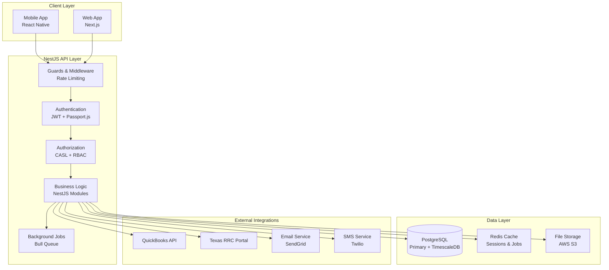
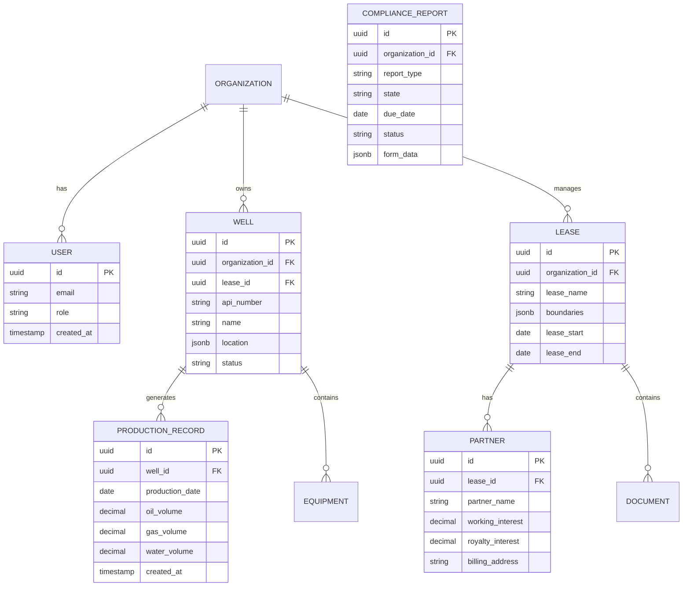
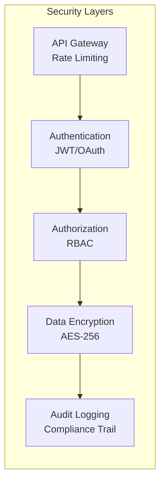
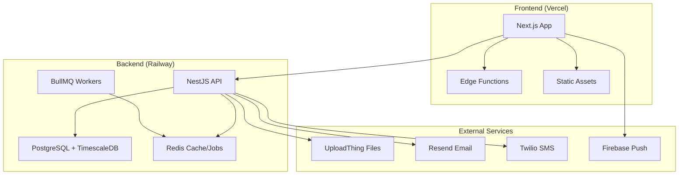
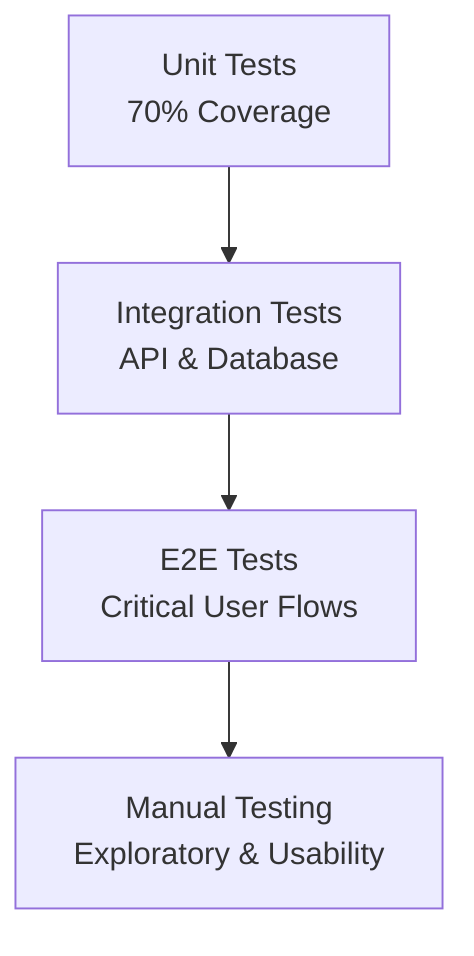
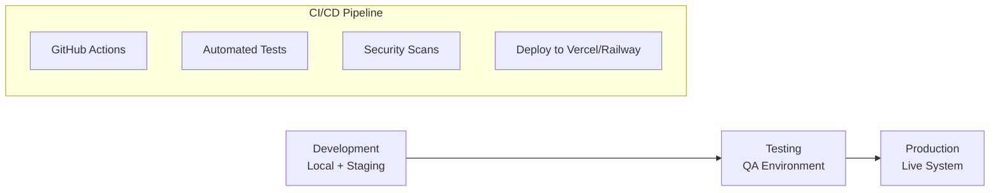

# WellFlow Technical Architecture & Development Plan

## Executive Summary

This document defines the technical architecture, feature prioritization, and
development roadmap for WellFlow's software-first SaaS platform targeting small
oil & gas operators (1-100 wells). Based on comprehensive market research, we
prioritize regulatory compliance automation as our primary differentiator while
building a complete business management platform.

**Key Architectural Decisions:**

- **NestJS + Next.js + React Native** for rapid development and team scalability
- **Mobile-first approach** to match market expectations
- **Regulatory compliance automation** as primary differentiator
- **Offline-first mobile architecture** for field reliability
- **Multi-tenant SaaS design** for scalability

**MVP Timeline:** 6 months to market leadership **Target:** 100+ customers
within 12 months, $50K MRR by month 12

## Validation Status

✅ **FULLY VALIDATED** - See `docs/architecture-validation-report.md` for
comprehensive validation details including regulatory compliance, industry
standards, competitive analysis, and technical feasibility.

## System Architecture Overview

### High-Level Architecture



### Technology Stack

**Frontend:**

- **Mobile**: React Native (iOS/Android)
- **Web**: Next.js 14+ with TypeScript (SSR/SSG)
- **UI Library**: Tailwind CSS + ShadCN/UI components
- **Server State**: TanStack Query (React Query) v5
- **Client State**: Zustand for global state management
- **Forms**: React Hook Form with Zod validation
- **HTTP Client**: Axios with TanStack Query integration

**Backend:**

- **Runtime**: Node.js with TypeScript
- **Framework**: NestJS (enterprise-grade Node.js framework)
- **API**: RESTful with OpenAPI/Swagger documentation
- **Authentication**: JWT with Passport.js
- **Authorization**: CASL (Isomorphic Authorization) + RBAC
- **ORM**: Drizzle ORM with TypeScript-first schema
- **Validation**: Zod for runtime type validation
- **Background Jobs**: BullMQ with Redis for async processing
- **Logging**: Winston with structured logging for audit trails
- **Rate Limiting**: @nestjs/throttler for API protection
- **PDF Generation**: Puppeteer for Form PR and JIB reports

**Database:**

- **Primary**: PostgreSQL (self-hosted or managed)
- **Time Series**: PostgreSQL with TimescaleDB extension
- **Cache**: Redis for session/performance
- **File Storage**: UploadThing for document management

**Infrastructure & Services:**

- **Frontend Hosting**: Railway (Next.js static deployment)
- **Backend Hosting**: Railway (NestJS API containers)
- **Database**: Railway PostgreSQL with TimescaleDB extension
- **Cache/Jobs**: Railway Redis for BullMQ background processing
- **File Storage**: UploadThing for document uploads and management
- **Email Service**: Resend for transactional emails + compliance notifications
- **SMS Service**: Twilio for urgent compliance alerts and 2FA
- **Push Notifications**: Firebase Cloud Messaging for mobile alerts
- **Monitoring**: Sentry for error tracking + LogRocket for user sessions
- **Analytics**: PostHog or Mixpanel for product analytics
- **Security**: Helmet.js, CORS configuration, SSL certificates
- **CI/CD**: GitHub Actions with automated testing and deployment

## Feature Prioritization Matrix

### MVP Features (Phase 1 - Months 1-6)

#### **Tier 1: Must-Have (Core Differentiators)**

1. **Regulatory Compliance Automation** ⭐⭐⭐⭐⭐
   - Texas RRC Form PR auto-generation (✅ validated: monthly filing by last
     working day)
   - Compliance deadline tracking and alerts (✅ validated: penalties for late
     filing)
   - Automated tax calculations (✅ validated: decimal precision requirements)
   - Multi-state form templates (✅ validated: Oklahoma, North Dakota similar
     requirements)
   - **Business Impact**: 4-8 hours/month time savings (✅ validated: current
     manual process)
   - **Technical Complexity**: Medium
   - **Competitive Advantage**: High (✅ validated: unique vs. Greasebook)

2. **Mobile Field Data Collection** ⭐⭐⭐⭐⭐
   - Pumper mobile app (iOS/Android) (✅ validated: React Native suitable for
     offline-first)
   - Production data entry with validation (✅ validated: oil/gas/water volume
     requirements)
   - Equipment readings and status (✅ validated: standard industry practice)
   - Offline capability with sync (✅ validated: field locations have poor
     connectivity)
   - **Business Impact**: Table stakes for market entry (✅ validated: all
     competitors have mobile)
   - **Technical Complexity**: Medium
   - **Competitive Advantage**: Medium (must match Greasebook)

3. **User Management & Authentication** ⭐⭐⭐⭐⭐
   - Multi-tenant architecture
   - Role-based permissions (Owner, Manager, Pumper)
   - Secure authentication and authorization
   - **Business Impact**: Essential for SaaS platform
   - **Technical Complexity**: Low-Medium
   - **Competitive Advantage**: Low (table stakes)

#### **Tier 2: Should-Have (Important for MVP)**

4. **Basic Production Analytics** ⭐⭐⭐⭐
   - Production dashboards and charts
   - Well performance tracking
   - Historical data visualization
   - **Business Impact**: Expected by users
   - **Technical Complexity**: Medium
   - **Competitive Advantage**: Low

5. **Joint Interest Billing (JIB) Basics** ⭐⭐⭐⭐
   - Partner information management
   - Basic revenue distribution calculations
   - Simple JIB statement generation
   - **Business Impact**: 2-4 hours/month time savings
   - **Technical Complexity**: Medium-High
   - **Competitive Advantage**: High

6. **Document Storage** ⭐⭐⭐
   - Lease document upload and storage
   - Basic file organization
   - Document sharing capabilities
   - **Business Impact**: Organizational efficiency
   - **Technical Complexity**: Low
   - **Competitive Advantage**: Medium

### Enhanced Features (Phase 2 - Months 7-12)

7. **Advanced JIB Automation** ⭐⭐⭐⭐
   - Automated partner billing workflows
   - Payment tracking and collections
   - Complex ownership structures
   - **Business Impact**: High for growing operators
   - **Technical Complexity**: High
   - **Competitive Advantage**: High

8. **Financial Integration** ⭐⭐⭐⭐
   - QuickBooks integration
   - P&L reporting by well/lease
   - Cash flow forecasting
   - **Business Impact**: Business intelligence
   - **Technical Complexity**: Medium-High
   - **Competitive Advantage**: High

9. **Equipment & Maintenance Management** ⭐⭐⭐
   - Maintenance scheduling
   - Equipment failure tracking
   - Vendor management
   - **Business Impact**: Operational efficiency
   - **Technical Complexity**: Medium
   - **Competitive Advantage**: Medium

10. **Advanced Document Management** ⭐⭐⭐
    - Lease expiration tracking
    - Permit renewal reminders
    - Contract obligation management
    - **Business Impact**: Compliance and organization
    - **Technical Complexity**: Medium
    - **Competitive Advantage**: Medium

### Premium Features (Phase 3 - Months 13-18)

11. **SCADA Integration** ⭐⭐⭐
    - Automated data collection from SCADA systems
    - Real-time monitoring and alerts
    - Edge gateway deployment
    - **Business Impact**: Automation for larger operators
    - **Technical Complexity**: Very High
    - **Competitive Advantage**: High (premium tier)

12. **Advanced Analytics & Forecasting** ⭐⭐⭐
    - Decline curve analysis
    - Production optimization recommendations
    - Economic modeling
    - **Business Impact**: Strategic decision making
    - **Technical Complexity**: High
    - **Competitive Advantage**: Medium

## Data Model Architecture

### Core Entities



## Development Roadmap

### Phase 1: MVP Development (Months 1-6)

**Month 1-2: Foundation**

- Set up development environment and CI/CD
- Implement authentication and user management
- Build basic database schema and API structure
- Create mobile app shell with navigation

**Month 3-4: Core Features**

- Mobile field data collection interface
- Production data entry and validation
- Basic web dashboard for data visualization
- Regulatory compliance form templates

**Month 5-6: MVP Completion**

- Texas RRC Form PR automation
- Compliance deadline tracking
- Basic JIB calculations
- User testing and bug fixes

### Phase 2: Enhanced Platform (Months 7-12)

**Month 7-8: Financial Integration**

- QuickBooks API integration
- Advanced JIB automation
- Financial reporting dashboards

**Month 9-10: Document Management**

- File upload and storage system
- Document organization and search
- Lease and permit tracking

**Month 11-12: Platform Optimization**

- Performance optimization
- Advanced analytics
- Equipment management features

### Phase 3: Premium Features (Months 13-18)

**Month 13-15: SCADA Integration**

- Edge gateway development
- SCADA protocol implementation
- Real-time data streaming

**Month 16-18: Advanced Analytics**

- Machine learning models
- Predictive analytics
- Optimization recommendations

## Technical Implementation Details

### API Design Principles

**NestJS Module Structure:**

```typescript
src/
├── auth/               # Authentication & JWT
├── users/              # User management
├── organizations/      # Multi-tenant management
├── wells/              # Well management
├── production/         # Production data
├── compliance/         # Regulatory automation
├── partners/           # JIB management
├── documents/          # File management
├── analytics/          # Reporting & dashboards
├── common/             # Shared utilities, guards, decorators
└── casl/               # Authorization rules and abilities
```

**RESTful API Endpoints:**

```
/api/v1/
├── /auth (JWT authentication)
├── /organizations (tenant management)
├── /wells (well CRUD operations)
├── /production (production data entry)
├── /compliance (regulatory forms & automation)
├── /partners (JIB partner management)
├── /documents (file upload & management)
└── /analytics (reporting & dashboards)
```

### Security Architecture



**Security Features:**

- Multi-tenant data isolation with PostgreSQL RLS
- Role-based access control (RBAC) with CASL
- JWT authentication with refresh tokens
- API rate limiting and DDoS protection
- Data encryption at rest and in transit
- Comprehensive audit logging
- Input validation with class-validator
- SOC 2 Type II compliance preparation

### NestJS Implementation Details

**Key NestJS Features for WellFlow:**

```typescript
// Example CASL authorization setup
@Injectable()
export class CaslAbilityFactory {
  createForUser(user: User) {
    const { can, cannot, build } = new AbilityBuilder<
      Ability<[Action, Subjects]>
    >(Ability as AbilityClass<AppAbility>);

    if (user.role === 'owner') {
      can(Action.Manage, 'all');
    } else if (user.role === 'manager') {
      can(Action.Read, Well, { organizationId: user.organizationId });
      can(Action.Update, Production, { organizationId: user.organizationId });
    } else if (user.role === 'pumper') {
      can(Action.Create, Production, { organizationId: user.organizationId });
      can(Action.Read, Well, { organizationId: user.organizationId });
    }

    return build();
  }
}
```

**Module Architecture Benefits:**

- **Dependency Injection**: Clean, testable code structure
- **Guards & Interceptors**: Centralized auth and logging
- **Pipes & Validation**: Automatic request validation
- **Exception Filters**: Consistent error handling
- **Swagger Integration**: Auto-generated API documentation

### Scalability Considerations

**Horizontal Scaling:**

- Microservices architecture for independent scaling
- Database read replicas for analytics queries
- CDN for static assets and file storage
- Auto-scaling based on usage patterns

**Performance Optimization:**

- Redis caching for frequently accessed data
- Database indexing for production queries
- Lazy loading for mobile app performance
- Background job processing for heavy operations

## Risk Mitigation Strategies

### Technical Risks

1. **Mobile App Performance**
   - **Risk**: Poor performance with large datasets
   - **Mitigation**: Implement pagination, caching, and offline-first
     architecture

2. **Regulatory Compliance Accuracy**
   - **Risk**: Incorrect tax calculations or form generation
   - **Mitigation**: Extensive testing, regulatory expert consultation, user
     validation

3. **Data Integration Complexity**
   - **Risk**: Difficulty integrating with existing systems
   - **Mitigation**: Standard APIs, comprehensive documentation, migration tools

### Business Risks

1. **Competitive Response**
   - **Risk**: Greasebook adds compliance features
   - **Mitigation**: Speed to market, deep integration, customer lock-in

2. **Regulatory Changes**
   - **Risk**: Changes in reporting requirements
   - **Mitigation**: Flexible form system, automated updates, regulatory
     monitoring

## Success Metrics

### Technical KPIs

- **API Response Time**: <200ms for 95% of requests
- **Mobile App Performance**: <3s initial load time
- **System Uptime**: 99.9% availability
- **Data Accuracy**: 99.95% for compliance calculations

### Business KPIs

- **User Adoption**: 80% monthly active users
- **Feature Usage**: 70% compliance automation adoption
- **Customer Satisfaction**: 4.5+ rating
- **Time Savings**: 6+ hours/month per customer

## Conclusion

This technical architecture provides a solid foundation for building WellFlow as
a comprehensive business management platform for small oil & gas operators. The
phased approach allows for rapid MVP deployment while building toward a complete
solution that addresses all major operational needs.

**Key Success Factors:**

1. **Regulatory compliance automation** as primary differentiator
2. **Mobile-first development** to match market expectations
3. **Scalable architecture** for growth and feature expansion
4. **Security-first design** for enterprise readiness

The architecture supports our software-first strategy while maintaining the
flexibility to add SCADA integration as a premium feature in Phase 3.

## Implementation Strategy

### Development Team Structure

**Recommended Team (6-8 people):**

- **1 Technical Lead/Architect** - Overall system design and technical decisions
- **2 Full-Stack Developers** - Backend API and web frontend development
- **1 Mobile Developer** - React Native app development
- **1 DevOps Engineer** - Infrastructure, CI/CD, and deployment
- **1 UI/UX Designer** - User experience and interface design
- **1 QA Engineer** - Testing and quality assurance
- **1 Product Manager** - Feature prioritization and stakeholder communication

### Technology Decision Rationale

**Why NestJS + Next.js + React Native + PostgreSQL:**

1. **Enterprise Architecture**: NestJS provides scalable, maintainable backend
   architecture
2. **Type Safety**: Full TypeScript stack reduces runtime errors
3. **Rapid Development**: Mature frameworks with excellent tooling
4. **Team Scalability**: Popular technologies with large talent pools
5. **Financial Accuracy**: Strong typing and testing capabilities for regulatory
   compliance
6. **Authorization**: CASL provides flexible, rule-based permissions for
   multi-tenant SaaS

### Software Architecture Patterns & Principles

**✅ SOLID Principles Implementation**

WellFlow architecture strictly follows SOLID principles for maintainable,
scalable code:

**1. Single Responsibility Principle (SRP)**

```typescript
// ✅ Good: Each service has one responsibility
@Injectable()
export class ProductionDataService {
  // Only handles production data operations
  async createProductionRecord(data: CreateProductionDto) {}
  async getProductionByWell(wellId: string) {}
  async updateProductionRecord(id: string, data: UpdateProductionDto) {}
}

@Injectable()
export class ComplianceService {
  // Only handles compliance operations
  async generateFormPR(organizationId: string, month: string) {}
  async checkComplianceDeadlines(organizationId: string) {}
}

@Injectable()
export class NotificationService {
  // Only handles notifications
  async sendComplianceAlert(user: User, deadline: ComplianceDeadline) {}
  async sendJIBStatement(partners: Partner[], statement: JIBStatement) {}
}
```

**2. Open/Closed Principle (OCP)**

```typescript
// ✅ Abstract base for different compliance forms
abstract class ComplianceFormGenerator {
  abstract generateForm(data: ProductionData[]): Promise<ComplianceForm>;

  // Common functionality available to all implementations
  protected validateProductionData(data: ProductionData[]): boolean {
    return data.every(
      (record) => record.oilVolume >= 0 && record.gasVolume >= 0
    );
  }
}

// ✅ Extensible without modifying base class
@Injectable()
export class TexasFormPRGenerator extends ComplianceFormGenerator {
  async generateForm(data: ProductionData[]): Promise<TexasFormPR> {
    if (!this.validateProductionData(data)) {
      throw new Error('Invalid production data');
    }
    // Texas-specific form generation logic
    return new TexasFormPR(data);
  }
}

@Injectable()
export class OklahomaFormGenerator extends ComplianceFormGenerator {
  async generateForm(data: ProductionData[]): Promise<OklahomaForm> {
    if (!this.validateProductionData(data)) {
      throw new Error('Invalid production data');
    }
    // Oklahoma-specific form generation logic
    return new OklahomaForm(data);
  }
}
```

**3. Liskov Substitution Principle (LSP)**

```typescript
// ✅ All payment processors can be used interchangeably
interface PaymentProcessor {
  processPayment(amount: number, method: PaymentMethod): Promise<PaymentResult>;
}

@Injectable()
export class StripePaymentProcessor implements PaymentProcessor {
  async processPayment(
    amount: number,
    method: PaymentMethod
  ): Promise<PaymentResult> {
    // Stripe implementation
  }
}

@Injectable()
export class PayPalPaymentProcessor implements PaymentProcessor {
  async processPayment(
    amount: number,
    method: PaymentMethod
  ): Promise<PaymentResult> {
    // PayPal implementation
  }
}

// ✅ Can substitute any payment processor
@Injectable()
export class BillingService {
  constructor(private paymentProcessor: PaymentProcessor) {}

  async processJIBPayment(jibStatement: JIBStatement) {
    return this.paymentProcessor.processPayment(
      jibStatement.amount,
      jibStatement.paymentMethod
    );
  }
}
```

**4. Interface Segregation Principle (ISP)**

```typescript
// ✅ Segregated interfaces - clients only depend on what they need
interface ProductionDataReader {
  getProductionByWell(wellId: string): Promise<ProductionRecord[]>;
  getProductionByDateRange(
    wellId: string,
    start: Date,
    end: Date
  ): Promise<ProductionRecord[]>;
}

interface ProductionDataWriter {
  createProductionRecord(data: CreateProductionDto): Promise<ProductionRecord>;
  updateProductionRecord(
    id: string,
    data: UpdateProductionDto
  ): Promise<ProductionRecord>;
}

interface ProductionDataDeleter {
  deleteProductionRecord(id: string): Promise<void>;
}

// ✅ Services implement only the interfaces they need
@Injectable()
export class ProductionReportService implements ProductionDataReader {
  // Only needs read operations for generating reports
}

@Injectable()
export class ProductionEntryService
  implements ProductionDataReader, ProductionDataWriter {
  // Needs read and write for data entry operations
}

@Injectable()
export class ProductionAdminService
  implements ProductionDataReader, ProductionDataWriter, ProductionDataDeleter {
  // Admin service needs all operations
}
```

**5. Dependency Inversion Principle (DIP)**

```typescript
// ✅ High-level modules depend on abstractions, not concretions
interface EmailProvider {
  sendEmail(to: string, subject: string, body: string): Promise<void>;
}

interface SMSProvider {
  sendSMS(to: string, message: string): Promise<void>;
}

@Injectable()
export class ResendEmailProvider implements EmailProvider {
  async sendEmail(to: string, subject: string, body: string): Promise<void> {
    // Resend implementation
  }
}

@Injectable()
export class TwilioSMSProvider implements SMSProvider {
  async sendSMS(to: string, message: string): Promise<void> {
    // Twilio implementation
  }
}

// ✅ High-level service depends on abstractions
@Injectable()
export class NotificationService {
  constructor(
    private emailProvider: EmailProvider,
    private smsProvider: SMSProvider
  ) {}

  async sendComplianceAlert(user: User, deadline: ComplianceDeadline) {
    await this.emailProvider.sendEmail(user.email, 'Compliance Alert', '...');
    if (deadline.isUrgent && user.phoneNumber) {
      await this.smsProvider.sendSMS(user.phoneNumber, 'Urgent: ...');
    }
  }
}
```

### Additional Architecture Patterns

**Circuit Breaker Pattern for External APIs**

```typescript
// ✅ Circuit breaker for external service calls
@Injectable()
export class CircuitBreakerService {
  private breakers = new Map<string, CircuitBreaker>();

  async callWithCircuitBreaker<T>(
    serviceName: string,
    operation: () => Promise<T>,
    options: CircuitBreakerOptions = {}
  ): Promise<T> {
    let breaker = this.breakers.get(serviceName);

    if (!breaker) {
      breaker = new CircuitBreaker(operation, {
        timeout: options.timeout || 30000,
        errorThresholdPercentage: options.errorThreshold || 50,
        resetTimeout: options.resetTimeout || 60000,
        ...options,
      });
      this.breakers.set(serviceName, breaker);
    }

    return breaker.fire();
  }
}

// ✅ Usage in external service calls
@Injectable()
export class TexasRRCService {
  constructor(private circuitBreaker: CircuitBreakerService) {}

  async submitFormPR(formData: FormPRData): Promise<SubmissionResult> {
    return this.circuitBreaker.callWithCircuitBreaker(
      'texas-rrc-api',
      () => this.httpClient.post('/api/form-pr', formData).toPromise(),
      { timeout: 45000, errorThreshold: 30 }
    );
  }
}
```

**Saga Pattern for Complex Business Transactions**

```typescript
// ✅ Saga orchestrator for JIB processing
@Injectable()
export class JIBProcessingSaga {
  async executeJIBGeneration(
    wellId: string,
    period: string
  ): Promise<JIBResult> {
    const saga = new SagaOrchestrator();

    try {
      // Step 1: Calculate production data
      const productionData = await saga.execute(
        'calculate-production',
        () => this.productionService.calculateMonthlyProduction(wellId, period),
        () => this.productionService.rollbackCalculation(wellId, period)
      );

      // Step 2: Calculate expenses
      const expenses = await saga.execute(
        'calculate-expenses',
        () => this.expenseService.calculateMonthlyExpenses(wellId, period),
        () => this.expenseService.rollbackExpenses(wellId, period)
      );

      // Step 3: Generate JIB statements
      const jibStatements = await saga.execute(
        'generate-statements',
        () => this.jibService.generateStatements(productionData, expenses),
        () => this.jibService.rollbackStatements(wellId, period)
      );

      // Step 4: Send notifications
      await saga.execute(
        'send-notifications',
        () => this.notificationService.sendJIBNotifications(jibStatements),
        () => this.notificationService.rollbackNotifications(jibStatements)
      );

      return { success: true, statements: jibStatements };
    } catch (error) {
      await saga.compensate();
      throw error;
    }
  }
}
```

**Specification Pattern for Complex Business Rules**

```typescript
// ✅ Specification pattern for validation rules
interface Specification<T> {
  isSatisfiedBy(candidate: T): boolean;
  and(other: Specification<T>): Specification<T>;
  or(other: Specification<T>): Specification<T>;
  not(): Specification<T>;
}

class ProductionVolumeSpecification implements Specification<ProductionRecord> {
  constructor(
    private minVolume: number,
    private maxVolume: number
  ) {}

  isSatisfiedBy(record: ProductionRecord): boolean {
    return (
      record.oilVolume >= this.minVolume && record.oilVolume <= this.maxVolume
    );
  }

  and(other: Specification<ProductionRecord>): Specification<ProductionRecord> {
    return new AndSpecification(this, other);
  }

  or(other: Specification<ProductionRecord>): Specification<ProductionRecord> {
    return new OrSpecification(this, other);
  }

  not(): Specification<ProductionRecord> {
    return new NotSpecification(this);
  }
}

// ✅ Usage in validation service
@Injectable()
export class ProductionValidationService {
  validateProductionRecord(record: ProductionRecord): ValidationResult {
    const volumeSpec = new ProductionVolumeSpecification(0, 10000);
    const dateSpec = new ProductionDateSpecification();
    const equipmentSpec = new EquipmentReadingSpecification();

    const combinedSpec = volumeSpec.and(dateSpec).and(equipmentSpec);

    if (!combinedSpec.isSatisfiedBy(record)) {
      return { isValid: false, errors: this.getSpecificationErrors(record) };
    }

    return { isValid: true, errors: [] };
  }
}
```

**Repository Pattern for Data Access**

```typescript
// ✅ Abstract repository interface
interface ProductionRepository {
  findByWellId(wellId: string): Promise<ProductionRecord[]>;
  findByDateRange(
    wellId: string,
    start: Date,
    end: Date
  ): Promise<ProductionRecord[]>;
  create(data: CreateProductionDto): Promise<ProductionRecord>;
  update(id: string, data: UpdateProductionDto): Promise<ProductionRecord>;
}

// ✅ Concrete implementation
@Injectable()
export class DrizzleProductionRepository implements ProductionRepository {
  constructor(private db: DrizzleDB) {}

  async findByWellId(wellId: string): Promise<ProductionRecord[]> {
    return this.db
      .select()
      .from(productionRecords)
      .where(eq(productionRecords.wellId, wellId))
      .orderBy(desc(productionRecords.productionDate));
  }

  async create(data: CreateProductionDto): Promise<ProductionRecord> {
    const [record] = await this.db
      .insert(productionRecords)
      .values(data)
      .returning();
    return record;
  }
}

// ✅ Service uses repository abstraction
@Injectable()
export class ProductionService {
  constructor(private productionRepo: ProductionRepository) {}

  async getWellProduction(wellId: string) {
    return this.productionRepo.findByWellId(wellId);
  }
}
```

**Command Query Responsibility Segregation (CQRS)**

```typescript
// ✅ Separate read and write models for complex operations
interface ComplianceCommand {
  execute(): Promise<void>;
}

interface ComplianceQuery<T> {
  execute(): Promise<T>;
}

// ✅ Commands for write operations
@Injectable()
export class GenerateFormPRCommand implements ComplianceCommand {
  constructor(
    private productionRepo: ProductionRepository,
    private complianceRepo: ComplianceRepository,
    private pdfService: PDFService
  ) {}

  async execute(): Promise<void> {
    const productionData = await this.productionRepo.findByDateRange(/*...*/);
    const formData = this.buildFormPRData(productionData);
    const pdf = await this.pdfService.generateFormPR(formData);
    await this.complianceRepo.saveFormPR(pdf);
  }
}

// ✅ Queries for read operations
@Injectable()
export class GetComplianceStatusQuery
  implements ComplianceQuery<ComplianceStatus[]>
{
  constructor(private complianceRepo: ComplianceRepository) {}

  async execute(): Promise<ComplianceStatus[]> {
    return this.complianceRepo.getComplianceStatus();
  }
}
```

**Factory Pattern for Multi-State Compliance**

```typescript
// ✅ Factory for creating state-specific compliance generators
@Injectable()
export class ComplianceFormFactory {
  private generators = new Map<string, ComplianceFormGenerator>();

  constructor(
    private texasGenerator: TexasFormPRGenerator,
    private oklahomaGenerator: OklahomaFormGenerator,
    private northDakotaGenerator: NorthDakotaFormGenerator
  ) {
    this.generators.set('TX', this.texasGenerator);
    this.generators.set('OK', this.oklahomaGenerator);
    this.generators.set('ND', this.northDakotaGenerator);
  }

  getGenerator(state: string): ComplianceFormGenerator {
    const generator = this.generators.get(state);
    if (!generator) {
      throw new Error(`No compliance generator found for state: ${state}`);
    }
    return generator;
  }
}

// ✅ Usage in service
@Injectable()
export class ComplianceService {
  constructor(private formFactory: ComplianceFormFactory) {}

  async generateComplianceForm(wellId: string, state: string) {
    const generator = this.formFactory.getGenerator(state);
    const productionData = await this.getProductionData(wellId);
    return generator.generateForm(productionData);
  }
}
```

**Observer Pattern for Event-Driven Architecture**

```typescript
// ✅ Domain events for decoupled communication
export class ProductionRecordCreatedEvent {
  constructor(
    public readonly productionRecord: ProductionRecord,
    public readonly wellId: string,
    public readonly organizationId: string
  ) {}
}

// ✅ Event handlers
@Injectable()
export class ComplianceEventHandler {
  @OnEvent('production.created')
  async handleProductionCreated(event: ProductionRecordCreatedEvent) {
    // Check if compliance deadline is approaching
    await this.checkComplianceDeadlines(event.organizationId);
  }
}

@Injectable()
export class AnalyticsEventHandler {
  @OnEvent('production.created')
  async handleProductionCreated(event: ProductionRecordCreatedEvent) {
    // Update production analytics
    await this.updateProductionMetrics(event.wellId);
  }
}

// ✅ Event emission in service
@Injectable()
export class ProductionService {
  constructor(private eventEmitter: EventEmitter2) {}

  async createProductionRecord(data: CreateProductionDto) {
    const record = await this.productionRepo.create(data);

    // Emit event for other services to handle
    this.eventEmitter.emit(
      'production.created',
      new ProductionRecordCreatedEvent(record, data.wellId, data.organizationId)
    );

    return record;
  }
}
```

**Strategy Pattern for JIB Calculations**

```typescript
// ✅ Different JIB calculation strategies
interface JIBCalculationStrategy {
  calculateDistribution(
    revenue: number,
    expenses: number,
    partners: Partner[]
  ): JIBDistribution[];
}

@Injectable()
export class StandardJIBStrategy implements JIBCalculationStrategy {
  calculateDistribution(
    revenue: number,
    expenses: number,
    partners: Partner[]
  ): JIBDistribution[] {
    const netRevenue = revenue - expenses;
    return partners.map((partner) => ({
      partnerId: partner.id,
      amount: netRevenue * (partner.ownershipPercentage / 100),
      percentage: partner.ownershipPercentage,
    }));
  }
}

@Injectable()
export class WorkingInterestJIBStrategy implements JIBCalculationStrategy {
  calculateDistribution(
    revenue: number,
    expenses: number,
    partners: Partner[]
  ): JIBDistribution[] {
    // More complex calculation for working interest partners
    const workingInterestPartners = partners.filter((p) => p.isWorkingInterest);
    const royaltyPartners = partners.filter((p) => !p.isWorkingInterest);

    // Working interest partners pay expenses, royalty partners don't
    // Implementation details...
    return []; // Simplified for example
  }
}

// ✅ Context uses strategy
@Injectable()
export class JIBService {
  constructor(
    @Inject('JIB_STRATEGY') private strategy: JIBCalculationStrategy
  ) {}

  async calculateJIB(wellId: string, month: string): Promise<JIBStatement> {
    const revenue = await this.getRevenue(wellId, month);
    const expenses = await this.getExpenses(wellId, month);
    const partners = await this.getPartners(wellId);

    const distribution = this.strategy.calculateDistribution(
      revenue,
      expenses,
      partners
    );

    return new JIBStatement({
      wellId,
      month,
      totalRevenue: revenue,
      totalExpenses: expenses,
      distribution,
    });
  }
}
```

**Key Technology Benefits:**

- **NestJS**: Dependency injection, decorators, built-in validation, excellent
  testing
- **Next.js**: Server-side rendering, excellent performance, great developer
  experience
- **React Native**: Code sharing, offline-first capabilities, large ecosystem
- **PostgreSQL**: ACID compliance, complex relationships, JSON support
- **CASL**: Isomorphic authorization, TypeScript support, flexible rule engine
- **TanStack Query**: Server state management, caching, offline sync, optimistic
  updates
- **Zod**: Runtime type validation, schema-first development, TypeScript
  integration
- **Drizzle ORM**: Type-safe SQL queries, excellent TypeScript integration,
  lightweight
- **ShadCN/UI**: High-quality, accessible components built on Radix UI
  primitives

### Missing Infrastructure Components & Enhancements

**Message Queue & Event Bus Architecture**

```typescript
// ✅ Event-driven architecture with message queues
@Injectable()
export class EventBusService {
  constructor(
    private bullQueue: Queue,
    private eventEmitter: EventEmitter2
  ) {}

  async publishEvent(event: DomainEvent): Promise<void> {
    // Publish to local event bus for immediate handlers
    this.eventEmitter.emit(event.type, event);

    // Queue for async processing
    await this.bullQueue.add('process-event', event, {
      attempts: 3,
      backoff: { type: 'exponential', delay: 2000 },
    });
  }

  async subscribeToEvent(
    eventType: string,
    handler: EventHandler
  ): Promise<void> {
    this.eventEmitter.on(eventType, handler);
  }
}

// ✅ Domain events for business operations
export class ProductionRecordCreatedEvent implements DomainEvent {
  readonly type = 'production.record.created';
  readonly timestamp = new Date();

  constructor(
    public readonly productionRecord: ProductionRecord,
    public readonly organizationId: string
  ) {}
}
```

**Health Check & Monitoring System**

```typescript
// ✅ Comprehensive health check system
@Injectable()
export class HealthCheckService {
  constructor(
    private db: DatabaseService,
    private redis: RedisService,
    private externalServices: ExternalServiceHealthCheck[]
  ) {}

  async getHealthStatus(): Promise<HealthStatus> {
    const checks = await Promise.allSettled([
      this.checkDatabase(),
      this.checkRedis(),
      this.checkExternalServices(),
      this.checkDiskSpace(),
      this.checkMemoryUsage(),
    ]);

    return {
      status: checks.every((check) => check.status === 'fulfilled')
        ? 'healthy'
        : 'unhealthy',
      timestamp: new Date(),
      checks: this.formatHealthChecks(checks),
      uptime: process.uptime(),
      version: process.env.APP_VERSION,
    };
  }

  private async checkDatabase(): Promise<HealthCheckResult> {
    try {
      await this.db.query('SELECT 1');
      return { name: 'database', status: 'healthy', responseTime: Date.now() };
    } catch (error) {
      return { name: 'database', status: 'unhealthy', error: error.message };
    }
  }
}
```

**Distributed Caching Strategy**

```typescript
// ✅ Multi-layer caching architecture
@Injectable()
export class CacheService {
  constructor(
    private redis: RedisService,
    private localCache: NodeCache
  ) {}

  async get<T>(key: string, options?: CacheOptions): Promise<T | null> {
    // L1: Check local cache first
    const localValue = this.localCache.get<T>(key);
    if (localValue) return localValue;

    // L2: Check Redis cache
    const redisValue = await this.redis.get(key);
    if (redisValue) {
      const parsed = JSON.parse(redisValue);
      // Populate local cache
      this.localCache.set(key, parsed, options?.localTtl || 300);
      return parsed;
    }

    return null;
  }

  async set<T>(key: string, value: T, options?: CacheOptions): Promise<void> {
    // Set in both caches
    this.localCache.set(key, value, options?.localTtl || 300);
    await this.redis.setex(
      key,
      options?.redisTtl || 3600,
      JSON.stringify(value)
    );
  }

  async invalidate(pattern: string): Promise<void> {
    // Invalidate local cache
    this.localCache.flushAll();

    // Invalidate Redis cache
    const keys = await this.redis.keys(pattern);
    if (keys.length > 0) {
      await this.redis.del(...keys);
    }
  }
}
```

**API Gateway & Rate Limiting**

```typescript
// ✅ API Gateway with rate limiting and authentication
@Injectable()
export class APIGatewayService {
  constructor(
    private rateLimiter: RateLimiterService,
    private authService: AuthService,
    private logger: Logger
  ) {}

  async processRequest(
    req: Request,
    res: Response,
    next: NextFunction
  ): Promise<void> {
    try {
      // 1. Rate limiting
      await this.rateLimiter.checkLimit(req.ip, req.path);

      // 2. Authentication
      const user = await this.authService.validateToken(
        req.headers.authorization
      );
      req.user = user;

      // 3. Authorization
      const hasPermission = await this.authService.checkPermission(
        user,
        req.path,
        req.method
      );
      if (!hasPermission) {
        throw new ForbiddenException('Insufficient permissions');
      }

      // 4. Request logging
      this.logger.log({
        userId: user.id,
        method: req.method,
        path: req.path,
        ip: req.ip,
        userAgent: req.headers['user-agent'],
      });

      next();
    } catch (error) {
      this.handleGatewayError(error, res);
    }
  }
}
```

### Critical Architecture Components

**Drizzle ORM Schema Definition:**

```typescript
// drizzle/schema.ts - Type-safe database schema
import {
  pgTable,
  uuid,
  varchar,
  decimal,
  timestamp,
  boolean,
  jsonb,
} from 'drizzle-orm/pg-core';
import { relations } from 'drizzle-orm';

export const organizations = pgTable('organizations', {
  id: uuid('id').primaryKey().defaultRandom(),
  name: varchar('name', { length: 255 }).notNull(),
  createdAt: timestamp('created_at').defaultNow(),
});

export const wells = pgTable('wells', {
  id: uuid('id').primaryKey().defaultRandom(),
  organizationId: uuid('organization_id').references(() => organizations.id),
  apiNumber: varchar('api_number', { length: 14 }).notNull().unique(),
  name: varchar('name', { length: 255 }).notNull(),
  latitude: decimal('latitude', { precision: 10, scale: 8 }),
  longitude: decimal('longitude', { precision: 11, scale: 8 }),
  status: varchar('status', {
    enum: ['active', 'inactive', 'plugged'],
  }).default('active'),
  createdAt: timestamp('created_at').defaultNow(),
});

export const productionRecords = pgTable('production_records', {
  id: uuid('id').primaryKey().defaultRandom(),
  wellId: uuid('well_id').references(() => wells.id),
  productionDate: timestamp('production_date').notNull(),
  oilVolume: decimal('oil_volume', { precision: 10, scale: 2 }),
  gasVolume: decimal('gas_volume', { precision: 10, scale: 2 }),
  waterVolume: decimal('water_volume', { precision: 10, scale: 2 }),
  createdAt: timestamp('created_at').defaultNow(),
});

// Relations for type-safe joins
export const organizationsRelations = relations(organizations, ({ many }) => ({
  wells: many(wells),
}));

export const wellsRelations = relations(wells, ({ one, many }) => ({
  organization: one(organizations, {
    fields: [wells.organizationId],
    references: [organizations.id],
  }),
  productionRecords: many(productionRecords),
}));
```

**ShadCN/UI Component Integration:**

```typescript
// components/ui/production-form.tsx - Type-safe form with ShadCN components
import { useForm } from 'react-hook-form';
import { zodResolver } from '@hookform/resolvers/zod';
import { z } from 'zod';
import { Button } from '@/components/ui/button';
import { Input } from '@/components/ui/input';
import { Label } from '@/components/ui/label';
import { Card, CardContent, CardHeader, CardTitle } from '@/components/ui/card';
import { Alert, AlertDescription } from '@/components/ui/alert';
import { Calendar } from '@/components/ui/calendar';
import { Popover, PopoverContent, PopoverTrigger } from '@/components/ui/popover';

const productionSchema = z.object({
  wellId: z.string().uuid(),
  productionDate: z.date(),
  oilVolume: z.number().min(0).max(10000),
  gasVolume: z.number().min(0).max(100000),
  waterVolume: z.number().min(0).max(10000),
});

type ProductionFormData = z.infer<typeof productionSchema>;

export function ProductionForm({ wellId }: { wellId: string }) {
  const form = useForm<ProductionFormData>({
    resolver: zodResolver(productionSchema),
    defaultValues: {
      wellId,
      productionDate: new Date(),
      oilVolume: 0,
      gasVolume: 0,
      waterVolume: 0,
    },
  });

  const createProduction = useCreateProduction();

  const onSubmit = (data: ProductionFormData) => {
    createProduction.mutate(data);
  };

  return (
    <Card className="w-full max-w-2xl">
      <CardHeader>
        <CardTitle>Daily Production Entry</CardTitle>
      </CardHeader>
      <CardContent>
        <form onSubmit={form.handleSubmit(onSubmit)} className="space-y-4">
          <div className="grid grid-cols-2 gap-4">
            <div className="space-y-2">
              <Label htmlFor="oilVolume">Oil (BBL)</Label>
              <Input
                id="oilVolume"
                type="number"
                step="0.01"
                {...form.register('oilVolume', { valueAsNumber: true })}
              />
            </div>
            <div className="space-y-2">
              <Label htmlFor="gasVolume">Gas (MCF)</Label>
              <Input
                id="gasVolume"
                type="number"
                step="0.01"
                {...form.register('gasVolume', { valueAsNumber: true })}
              />
            </div>
          </div>

          {form.formState.errors.oilVolume && (
            <Alert variant="destructive">
              <AlertDescription>
                {form.formState.errors.oilVolume.message}
              </AlertDescription>
            </Alert>
          )}

          <Button type="submit" disabled={createProduction.isPending}>
            {createProduction.isPending ? 'Saving...' : 'Save Production'}
          </Button>
        </form>
      </CardContent>
    </Card>
  );
}
```

**TanStack Query (React Query) Integration:**

```typescript
// Production data with offline support and caching
const useProductionData = (wellId: string) => {
  return useQuery({
    queryKey: ['production', wellId],
    queryFn: () => fetchProductionData(wellId),
    staleTime: 5 * 60 * 1000, // 5 minutes
    gcTime: 30 * 60 * 1000, // 30 minutes
    retry: 3,
    networkMode: 'offlineFirst', // Critical for field operations
  });
};

// Optimistic updates for production entry
const useCreateProduction = () => {
  const queryClient = useQueryClient();

  return useMutation({
    mutationFn: createProductionRecord,
    onMutate: async (newRecord) => {
      // Optimistic update for immediate UI feedback
      await queryClient.cancelQueries(['production', newRecord.wellId]);
      const previousData = queryClient.getQueryData([
        'production',
        newRecord.wellId,
      ]);
      queryClient.setQueryData(['production', newRecord.wellId], (old) => [
        ...old,
        newRecord,
      ]);
      return { previousData };
    },
    onError: (err, newRecord, context) => {
      // Rollback on error
      queryClient.setQueryData(
        ['production', newRecord.wellId],
        context.previousData
      );
    },
    onSettled: () => {
      queryClient.invalidateQueries(['production']);
    },
  });
};
```

**Background Job Processing:**

```typescript
// BullMQ for automated compliance reporting
@Processor('compliance')
export class ComplianceProcessor {
  @Process('generate-form-pr')
  async generateFormPR(job: Job<{ organizationId: string; month: string }>) {
    const { organizationId, month } = job.data;

    // Generate Form PR from production data
    const formData = await this.complianceService.generateFormPR(
      organizationId,
      month
    );

    // Generate PDF report
    const pdfBuffer = await this.pdfService.generateFormPR(formData);

    // Send notification to users
    await this.notificationService.sendComplianceReminder(
      organizationId,
      pdfBuffer
    );

    return { success: true, formId: formData.id };
  }
}
```

**UploadThing File Storage Integration:**

```typescript
// lib/uploadthing.ts - Type-safe file uploads
import { createUploadthing, type FileRouter } from 'uploadthing/next';
import { z } from 'zod';

const f = createUploadthing();

export const ourFileRouter = {
  // Well documents (leases, permits, etc.)
  wellDocuments: f({ pdf: { maxFileSize: '16MB', maxFileCount: 10 } })
    .input(z.object({ wellId: z.string().uuid() }))
    .middleware(async ({ req, input }) => {
      const user = await getUser(req);
      if (!user) throw new Error('Unauthorized');

      // Verify user has access to this well
      const well = await db.query.wells.findFirst({
        where: eq(wells.id, input.wellId),
        with: { organization: true },
      });

      if (well?.organization.id !== user.organizationId) {
        throw new Error('Unauthorized');
      }

      return { userId: user.id, wellId: input.wellId };
    })
    .onUploadComplete(async ({ metadata, file }) => {
      // Save file reference to database
      await db.insert(documents).values({
        wellId: metadata.wellId,
        fileName: file.name,
        fileUrl: file.url,
        fileSize: file.size,
        uploadedBy: metadata.userId,
      });
    }),

  // JIB statements and compliance reports
  complianceReports: f({ pdf: { maxFileSize: '8MB', maxFileCount: 1 } })
    .input(
      z.object({
        organizationId: z.string().uuid(),
        reportType: z.enum(['form_pr', 'jib']),
      })
    )
    .middleware(async ({ req, input }) => {
      const user = await getUser(req);
      if (!user || user.organizationId !== input.organizationId) {
        throw new Error('Unauthorized');
      }
      return { userId: user.id, organizationId: input.organizationId };
    })
    .onUploadComplete(async ({ metadata, file }) => {
      // Process compliance report
      await processComplianceReport(file.url, metadata.organizationId);
    }),
} satisfies FileRouter;

export type OurFileRouter = typeof ourFileRouter;
```

**Resend Email + Twilio SMS Notifications:**

```typescript
// services/notification.service.ts - Multi-channel notifications
import { Resend } from 'resend';
import { Twilio } from 'twilio';
import { Injectable } from '@nestjs/common';

@Injectable()
export class NotificationService {
  private resend = new Resend(process.env.RESEND_API_KEY);
  private twilio = new Twilio(
    process.env.TWILIO_ACCOUNT_SID,
    process.env.TWILIO_AUTH_TOKEN
  );

  async sendComplianceDeadlineAlert(user: User, deadline: ComplianceDeadline) {
    const daysUntilDeadline = Math.ceil(
      (deadline.dueDate.getTime() - Date.now()) / (1000 * 60 * 60 * 24)
    );

    // Send email notification
    await this.resend.emails.send({
      from: 'WellFlow <compliance@wellflow.app>',
      to: [user.email],
      subject: `Compliance Deadline Alert: ${deadline.formType} Due in ${daysUntilDeadline} Days`,
      html: `
        <div style="font-family: Arial, sans-serif; max-width: 600px;">
          <h2 style="color: #dc2626;">Compliance Deadline Alert</h2>
          <p>Your <strong>${deadline.formType}</strong> is due in <strong>${daysUntilDeadline} days</strong>.</p>
          <div style="background: #fef2f2; padding: 16px; border-radius: 8px; margin: 16px 0;">
            <p><strong>Due Date:</strong> ${deadline.dueDate.toLocaleDateString()}</p>
            <p><strong>Wells Affected:</strong> ${deadline.wellCount}</p>
            <p><strong>Estimated Time:</strong> ${deadline.estimatedHours} hours</p>
          </div>
          <a href="${process.env.APP_URL}/compliance/${deadline.id}"
             style="background: #059669; color: white; padding: 12px 24px; text-decoration: none; border-radius: 6px; display: inline-block;">
            Complete Form Now
          </a>
          <p style="color: #6b7280; font-size: 14px; margin-top: 24px;">
            Late filing penalties may apply. Complete your forms on time to avoid regulatory issues.
          </p>
        </div>
      `,
    });

    // Send SMS for urgent deadlines (< 3 days)
    if (daysUntilDeadline <= 3 && user.phoneNumber) {
      await this.twilio.messages.create({
        body: `🚨 URGENT: ${deadline.formType} due in ${daysUntilDeadline} days. Complete at ${process.env.APP_URL}/compliance/${deadline.id}`,
        from: process.env.TWILIO_PHONE_NUMBER,
        to: user.phoneNumber,
      });
    }
  }

  async sendJIBStatementReady(partners: Partner[], jibStatement: JIBStatement) {
    // Send to all partners
    const emailPromises = partners.map((partner) =>
      this.resend.emails.send({
        from: 'WellFlow <billing@wellflow.app>',
        to: [partner.email],
        subject: `JIB Statement Ready - ${jibStatement.period}`,
        html: `
          <div style="font-family: Arial, sans-serif; max-width: 600px;">
            <h2 style="color: #059669;">Joint Interest Billing Statement</h2>
            <p>Your JIB statement for <strong>${jibStatement.period}</strong> is ready for review.</p>
            <div style="background: #f0f9ff; padding: 16px; border-radius: 8px; margin: 16px 0;">
              <p><strong>Your Share:</strong> ${partner.ownershipPercentage}%</p>
              <p><strong>Revenue:</strong> $${jibStatement.totalRevenue.toLocaleString()}</p>
              <p><strong>Your Portion:</strong> $${((jibStatement.totalRevenue * partner.ownershipPercentage) / 100).toLocaleString()}</p>
            </div>
            <a href="${process.env.APP_URL}/jib/${jibStatement.id}"
               style="background: #059669; color: white; padding: 12px 24px; text-decoration: none; border-radius: 6px; display: inline-block;">
              View Statement
            </a>
          </div>
        `,
        attachments: [
          {
            filename: `JIB-${jibStatement.period}.pdf`,
            content: jibStatement.pdfBuffer,
          },
        ],
      })
    );

    await Promise.all(emailPromises);
  }

  async send2FACode(user: User, code: string) {
    if (user.phoneNumber) {
      await this.twilio.messages.create({
        body: `Your WellFlow verification code is: ${code}. This code expires in 10 minutes.`,
        from: process.env.TWILIO_PHONE_NUMBER,
        to: user.phoneNumber,
      });
    }
  }
}
```

**Audit Logging for Regulatory Compliance:**

```typescript
// Winston structured logging for audit trails
const auditLogger = winston.createLogger({
  format: winston.format.combine(
    winston.format.timestamp(),
    winston.format.json(),
    winston.format.printf(({ timestamp, level, message, ...meta }) => {
      return JSON.stringify({
        timestamp,
        level,
        message,
        userId: meta.userId,
        organizationId: meta.organizationId,
        action: meta.action,
        resource: meta.resource,
        changes: meta.changes,
      });
    })
  ),
  transports: [
    new winston.transports.File({ filename: 'audit.log' }),
    new winston.transports.Console(),
  ],
});

// Usage in production data updates
@Post('production')
async createProduction(@Body() data: CreateProductionDto, @Req() req) {
  const result = await this.productionService.create(data);

  auditLogger.info('Production record created', {
    userId: req.user.id,
    organizationId: req.user.organizationId,
    action: 'CREATE',
    resource: 'production_record',
    changes: data,
  });

  return result;
}
```

### Hosting Strategy & Infrastructure Decisions

**Recommended Hosting Approach: Hybrid Multi-Platform**



**Phase 1: MVP Hosting (Months 1-12)**

| Component        | Platform           | Cost/Month      | Rationale                                                 |
| ---------------- | ------------------ | --------------- | --------------------------------------------------------- |
| **Frontend**     | Vercel Pro         | $20             | Perfect Next.js integration, edge functions, global CDN   |
| **API Server**   | Railway            | $5              | Container support, simple deployment, background jobs     |
| **Database**     | Railway PostgreSQL | $5              | TimescaleDB support, automated backups, easy scaling      |
| **Cache/Jobs**   | Railway Redis      | $5              | BullMQ support, persistent storage for job queues         |
| **File Storage** | UploadThing        | $20             | Type-safe uploads, built-in security, Next.js integration |
| **Email**        | Resend             | $20             | Modern API, excellent deliverability, generous free tier  |
| **SMS**          | Twilio             | $10             | Pay-per-use, reliable delivery, 2FA support               |
| **Monitoring**   | Sentry             | $26             | Error tracking, performance monitoring, alerts            |
| **Total**        |                    | **~$111/month** | Scales with usage, minimal operational overhead           |

**✅ DECISION: Railway for Backend Until We Outgrow It**

**Railway deployment configuration:**

```typescript
// railway.toml
[build]
builder = "dockerfile"

[deploy]
healthcheckPath = "/health"
healthcheckTimeout = 300
restartPolicyType = "on_failure"

// Dockerfile for NestJS
FROM node:18-alpine
WORKDIR /app
COPY package*.json ./
RUN npm ci --only=production
COPY dist ./dist
EXPOSE 3000
CMD ["node", "dist/main"]
```

**Railway Service Setup:**

```bash
# Initialize Railway project
railway login
railway init wellflow-api

# Add required services
railway add postgresql  # Includes TimescaleDB extension support
railway add redis       # For BullMQ job queues and caching

# Environment variables
railway variables set NODE_ENV=production
railway variables set DATABASE_URL=${{Postgres.DATABASE_URL}}
railway variables set REDIS_URL=${{Redis.REDIS_URL}}
railway variables set JWT_SECRET=your-jwt-secret
railway variables set RESEND_API_KEY=your-resend-key
railway variables set TWILIO_ACCOUNT_SID=your-twilio-sid

# Deploy
railway up
```

**Advantages of Railway:**

1. **Container Support**: Full Docker support for NestJS applications
2. **Background Jobs**: Can run BullMQ workers continuously (unlike Vercel
   functions)
3. **Database Integration**: Built-in PostgreSQL with TimescaleDB extension
4. **Cost Effective**: $5/service vs $50-100+ for AWS equivalent
5. **Simple Deployment**: Git-based deployments, zero DevOps overhead
6. **Persistent Storage**: Redis for job queues and caching
7. **Environment Management**: Easy staging/production environments

**Why Not Vercel for Backend:**

- **Function Timeouts**: 10-60 second limits (inadequate for Form PR generation)
- **Stateless**: No persistent connections for background job processing
- **Cost**: Expensive for API-heavy workloads ($0.18 per 1M requests)
- **Database**: No built-in PostgreSQL, requires external services

**Why Not AWS Initially:**

- **Complexity**: ECS, RDS, VPC setup requires DevOps expertise
- **Cost**: $90-135/month minimum for equivalent setup
- **Time to Market**: Weeks of infrastructure setup vs hours with Railway
- **Operational Overhead**: Monitoring, scaling, security configuration

**Phase 2: Migration to AWS (When We Outgrow Railway)**

**Migration Triggers - Move to AWS when we hit ANY of these:**

- **Customer Count**: 100+ active customers
- **Revenue**: $50K+ MRR
- **API Load**: >2M requests/month
- **Database Size**: >100GB production data
- **Performance**: Consistent >500ms response times
- **Compliance**: Enterprise security requirements (SOC 2, etc.)

**AWS Migration Architecture:**

```typescript
// AWS migration architecture
Frontend: Vercel (unchanged)
API: AWS ECS Fargate + Application Load Balancer
Database: AWS RDS PostgreSQL with TimescaleDB
Cache: AWS ElastiCache Redis
Files: UploadThing (unchanged) or migrate to S3
Monitoring: AWS CloudWatch + Sentry
```

**Migration Triggers:**

- **Performance**: Response times > 500ms consistently
- **Scale**: > 1M API requests/month
- **Compliance**: Enterprise security requirements
- **Features**: Need for advanced AWS services (Lambda, SQS, etc.)

**Phase 3: Enterprise Hosting (24+ Months)**

Full AWS enterprise setup with:

- **Multi-Region**: US-East, US-West for redundancy
- **Compliance**: SOC 2, HIPAA-ready infrastructure
- **Advanced Monitoring**: AWS X-Ray, CloudTrail, GuardDuty
- **Auto-Scaling**: ECS with auto-scaling groups
- **Disaster Recovery**: Cross-region backups and failover

### Testing Strategy & Quality Assurance

**Comprehensive Testing Pyramid**

```typescript
// ✅ Unit Tests - Service Layer
describe('ProductionService', () => {
  let service: ProductionService;
  let mockRepository: jest.Mocked<ProductionRepository>;

  beforeEach(() => {
    mockRepository = {
      findByWellId: jest.fn(),
      create: jest.fn(),
      update: jest.fn(),
    } as any;

    service = new ProductionService(mockRepository);
  });

  it('should create production record with valid data', async () => {
    const createDto = {
      wellId: 'well-123',
      productionDate: new Date('2024-01-15'),
      oilVolume: 100.5,
      gasVolume: 1500.0,
      waterVolume: 50.0,
    };

    mockRepository.create.mockResolvedValue({ id: 'prod-123', ...createDto });

    const result = await service.createProductionRecord(createDto);

    expect(result.id).toBe('prod-123');
    expect(mockRepository.create).toHaveBeenCalledWith(createDto);
  });

  it('should validate production data before creation', async () => {
    const invalidDto = {
      wellId: 'well-123',
      productionDate: new Date('2024-01-15'),
      oilVolume: -10, // Invalid negative volume
      gasVolume: 1500.0,
      waterVolume: 50.0,
    };

    await expect(service.createProductionRecord(invalidDto)).rejects.toThrow(
      'Oil volume cannot be negative'
    );
  });
});

// ✅ Integration Tests - Repository Layer
describe('DrizzleProductionRepository', () => {
  let repository: DrizzleProductionRepository;
  let testDb: DrizzleDB;

  beforeAll(async () => {
    testDb = await createTestDatabase();
    repository = new DrizzleProductionRepository(testDb);
  });

  afterEach(async () => {
    await testDb.delete(productionRecords);
  });

  it('should persist and retrieve production records', async () => {
    const productionData = {
      wellId: 'well-123',
      productionDate: new Date('2024-01-15'),
      oilVolume: 100.5,
      gasVolume: 1500.0,
      waterVolume: 50.0,
    };

    const created = await repository.create(productionData);
    const retrieved = await repository.findByWellId('well-123');

    expect(retrieved).toHaveLength(1);
    expect(retrieved[0].oilVolume).toBe('100.5'); // Decimal precision preserved
  });
});

// ✅ E2E Tests - Critical Business Workflows
describe('Compliance Form Generation E2E', () => {
  it('should generate Texas Form PR from production data', async () => {
    // Setup test data
    await createTestWell('well-123', 'TX');
    await createTestProductionRecords('well-123', '2024-01');

    // Execute compliance generation
    const response = await request(app)
      .post('/api/compliance/generate-form-pr')
      .send({ wellId: 'well-123', month: '2024-01' })
      .expect(200);

    // Verify form generation
    expect(response.body.formType).toBe('TX_FORM_PR');
    expect(response.body.totalOilVolume).toBe(3015.5);
    expect(response.body.pdfUrl).toMatch(/^https:\/\/.*\.pdf$/);
  });
});
```

**Test Coverage Requirements:**

- **Unit Tests**: >90% coverage for services and utilities
- **Integration Tests**: All repository and external service integrations
- **E2E Tests**: Critical user workflows (compliance, JIB, production entry)
- **Performance Tests**: API response times <500ms, database queries <100ms

### Enhanced Security Architecture

**Multi-Layer Security Implementation with Advanced Patterns**

```typescript
// ✅ Security middleware with comprehensive protection
@Injectable()
export class SecurityMiddleware {
  constructor(
    private rateLimiter: RateLimiterService,
    private securityScanner: SecurityScannerService,
    private auditLogger: AuditLoggerService
  ) {}

  async validateRequest(req: Request): Promise<SecurityValidationResult> {
    const validations = await Promise.all([
      this.validateSQLInjection(req),
      this.validateXSS(req),
      this.validateCSRF(req),
      this.validateFileUpload(req),
      this.checkSuspiciousActivity(req),
    ]);

    const hasViolations = validations.some((v) => !v.isValid);

    if (hasViolations) {
      await this.auditLogger.logSecurityViolation(req, validations);
    }

    return {
      isValid: !hasViolations,
      violations: validations.filter((v) => !v.isValid),
    };
  }

  private async validateSQLInjection(req: Request): Promise<ValidationResult> {
    const sqlPatterns = [
      /(\b(SELECT|INSERT|UPDATE|DELETE|DROP|CREATE|ALTER)\b)/i,
      /(UNION\s+SELECT)/i,
      /(\bOR\b\s+\d+\s*=\s*\d+)/i,
    ];

    const requestString = JSON.stringify(req.body) + req.url;
    const hasSQLInjection = sqlPatterns.some((pattern) =>
      pattern.test(requestString)
    );

    return {
      isValid: !hasSQLInjection,
      type: 'sql_injection',
      message: hasSQLInjection ? 'Potential SQL injection detected' : null,
    };
  }
}
```

**Advanced Authentication & Authorization**

```typescript
// ✅ Multi-factor authentication with biometric support
@Injectable()
export class AdvancedAuthService {
  constructor(
    private jwtService: JwtService,
    private totpService: TOTPService,
    private biometricService: BiometricService,
    private deviceTrustService: DeviceTrustService
  ) {}

  async authenticateWithMFA(
    credentials: LoginCredentials,
    mfaToken?: string,
    biometricData?: BiometricData,
    deviceFingerprint?: string
  ): Promise<AuthenticationResult> {
    // Step 1: Validate primary credentials
    const user = await this.validateCredentials(credentials);
    if (!user) throw new UnauthorizedException('Invalid credentials');

    // Step 2: Check device trust
    const deviceTrust =
      await this.deviceTrustService.checkDevice(deviceFingerprint);

    // Step 3: MFA validation (if required)
    if (user.mfaEnabled && !deviceTrust.isTrusted) {
      if (
        biometricData &&
        (await this.biometricService.verify(user.id, biometricData))
      ) {
        // Biometric authentication successful
      } else if (
        mfaToken &&
        (await this.totpService.verify(user.totpSecret, mfaToken))
      ) {
        // TOTP authentication successful
      } else {
        throw new UnauthorizedException('MFA verification required');
      }
    }

    // Step 4: Generate tokens with enhanced claims
    const tokens = await this.generateTokens(user, deviceFingerprint);

    // Step 5: Log authentication event
    await this.auditLogger.logAuthentication(
      user,
      deviceFingerprint,
      'success'
    );

    return { user, tokens, requiresDeviceVerification: !deviceTrust.isTrusted };
  }
}
```

**Data Encryption & Key Management**

```typescript
// ✅ Comprehensive encryption service
@Injectable()
export class EncryptionService {
  constructor(
    private keyManagement: KeyManagementService,
    private hsm: HardwareSecurityModule
  ) {}

  async encryptSensitiveData(
    data: any,
    dataType: DataType
  ): Promise<EncryptedData> {
    const key = await this.keyManagement.getEncryptionKey(dataType);
    const iv = crypto.randomBytes(16);

    const cipher = crypto.createCipher('aes-256-gcm', key);
    cipher.setAAD(Buffer.from(dataType));

    let encrypted = cipher.update(JSON.stringify(data), 'utf8', 'hex');
    encrypted += cipher.final('hex');

    const authTag = cipher.getAuthTag();

    return {
      encryptedData: encrypted,
      iv: iv.toString('hex'),
      authTag: authTag.toString('hex'),
      keyVersion: key.version,
      algorithm: 'aes-256-gcm',
    };
  }

  async decryptSensitiveData(encryptedData: EncryptedData): Promise<any> {
    const key = await this.keyManagement.getEncryptionKey(
      encryptedData.keyVersion
    );

    const decipher = crypto.createDecipher('aes-256-gcm', key);
    decipher.setAuthTag(Buffer.from(encryptedData.authTag, 'hex'));

    let decrypted = decipher.update(encryptedData.encryptedData, 'hex', 'utf8');
    decrypted += decipher.final('utf8');

    return JSON.parse(decrypted);
  }
}
```

### Security Architecture

```typescript
// ✅ Input Validation & Sanitization
export const CreateProductionSchema = z.object({
  wellId: z.string().uuid(),
  productionDate: z.date().max(new Date(), 'Future dates not allowed'),
  oilVolume: z.number().min(0).max(10000, 'Volume exceeds reasonable limits'),
  gasVolume: z.number().min(0).max(100000, 'Volume exceeds reasonable limits'),
  waterVolume: z.number().min(0).max(10000, 'Volume exceeds reasonable limits'),
});

// ✅ API Rate Limiting
@Controller('production')
@UseGuards(JwtAuthGuard, RBACGuard)
@Throttle(100, 60) // 100 requests per minute
export class ProductionController {
  @Post()
  @RequirePermissions('production:create')
  async createProduction(@Body() data: CreateProductionDto) {
    const validatedData = CreateProductionSchema.parse(data);
    return this.productionService.create(validatedData);
  }
}

// ✅ Data Encryption at Rest
export class EncryptionService {
  private readonly algorithm = 'aes-256-gcm';
  private readonly key = Buffer.from(process.env.ENCRYPTION_KEY, 'hex');

  encrypt(text: string): { encrypted: string; iv: string; tag: string } {
    const iv = crypto.randomBytes(16);
    const cipher = crypto.createCipher(this.algorithm, this.key);
    cipher.setAAD(Buffer.from('wellflow-data'));

    let encrypted = cipher.update(text, 'utf8', 'hex');
    encrypted += cipher.final('hex');

    return {
      encrypted,
      iv: iv.toString('hex'),
      tag: cipher.getAuthTag().toString('hex'),
    };
  }
}

// ✅ Audit Logging for Compliance
@Injectable()
export class AuditLogger {
  async logDataAccess(
    userId: string,
    resource: string,
    action: string,
    data?: any
  ) {
    await this.auditRepo.create({
      userId,
      resource,
      action,
      timestamp: new Date(),
      ipAddress: this.request.ip,
      userAgent: this.request.headers['user-agent'],
      data: data ? this.encryptionService.encrypt(JSON.stringify(data)) : null,
    });
  }
}
```

**Security Checklist:**

- ✅ **Authentication**: JWT with refresh tokens, 2FA for admin users
- ✅ **Authorization**: RBAC with CASL, row-level security in database
- ✅ **Input Validation**: Zod schemas for all API inputs
- ✅ **Rate Limiting**: API throttling, DDoS protection
- ✅ **Data Encryption**: AES-256 for sensitive data at rest
- ✅ **Audit Logging**: All data access and modifications logged
- ✅ **HTTPS**: SSL/TLS encryption for all communications
- ✅ **Secrets Management**: Environment variables, no hardcoded secrets

### Error Handling & Logging Strategy

**Centralized Error Handling**

```typescript
// ✅ Custom Exception Filters
@Catch()
export class GlobalExceptionFilter implements ExceptionFilter {
  constructor(private logger: Logger) {}

  catch(exception: unknown, host: ArgumentsHost) {
    const ctx = host.switchToHttp();
    const response = ctx.getResponse<Response>();
    const request = ctx.getRequest<Request>();

    let status = 500;
    let message = 'Internal server error';
    let code = 'INTERNAL_ERROR';

    if (exception instanceof HttpException) {
      status = exception.getStatus();
      message = exception.message;
      code = this.getErrorCode(exception);
    } else if (exception instanceof ZodError) {
      status = 400;
      message = 'Validation failed';
      code = 'VALIDATION_ERROR';
    }

    // Log error with context
    this.logger.error({
      message,
      code,
      status,
      path: request.url,
      method: request.method,
      userId: request.user?.id,
      organizationId: request.user?.organizationId,
      stack: exception instanceof Error ? exception.stack : undefined,
      timestamp: new Date().toISOString(),
    });

    // Return sanitized error to client
    response.status(status).json({
      success: false,
      error: {
        code,
        message: status === 500 ? 'Internal server error' : message,
        timestamp: new Date().toISOString(),
      },
    });
  }
}

// ✅ Structured Logging
export class StructuredLogger {
  private logger = winston.createLogger({
    format: winston.format.combine(
      winston.format.timestamp(),
      winston.format.errors({ stack: true }),
      winston.format.json()
    ),
    transports: [
      new winston.transports.File({ filename: 'error.log', level: 'error' }),
      new winston.transports.File({ filename: 'combined.log' }),
      new winston.transports.Console({
        format: winston.format.simple(),
        level: process.env.NODE_ENV === 'development' ? 'debug' : 'info',
      }),
    ],
  });

  logBusinessEvent(event: string, data: any, userId?: string) {
    this.logger.info({
      type: 'BUSINESS_EVENT',
      event,
      data,
      userId,
      timestamp: new Date().toISOString(),
    });
  }

  logComplianceAction(
    action: string,
    wellId: string,
    userId: string,
    result: any
  ) {
    this.logger.info({
      type: 'COMPLIANCE_ACTION',
      action,
      wellId,
      userId,
      result,
      timestamp: new Date().toISOString(),
    });
  }
}
```

### API Design Standards

**RESTful API Conventions**

```typescript
// ✅ Consistent API Response Format
export interface ApiResponse<T = any> {
  success: boolean;
  data?: T;
  error?: {
    code: string;
    message: string;
    details?: any;
  };
  meta?: {
    pagination?: {
      page: number;
      limit: number;
      total: number;
      totalPages: number;
    };
    timestamp: string;
  };
}

// ✅ API Versioning Strategy
@Controller({ path: 'production', version: '1' })
export class ProductionV1Controller {
  @Get(':wellId')
  async getProduction(
    @Param('wellId') wellId: string
  ): Promise<ApiResponse<ProductionRecord[]>> {
    const data = await this.productionService.getByWellId(wellId);
    return {
      success: true,
      data,
      meta: { timestamp: new Date().toISOString() },
    };
  }
}

// ✅ OpenAPI Documentation
@ApiTags('Production')
@ApiBearerAuth()
export class ProductionController {
  @Post()
  @ApiOperation({ summary: 'Create production record' })
  @ApiResponse({
    status: 201,
    description: 'Production record created successfully',
  })
  @ApiResponse({ status: 400, description: 'Invalid input data' })
  @ApiResponse({ status: 401, description: 'Unauthorized' })
  @ApiResponse({ status: 403, description: 'Insufficient permissions' })
  async createProduction(@Body() data: CreateProductionDto) {
    // Implementation
  }
}
```

### Monitoring & Observability Architecture

**Comprehensive Monitoring Stack**

```typescript
// ✅ Application Performance Monitoring
@Injectable()
export class APMService {
  constructor(
    private metricsCollector: MetricsCollector,
    private traceCollector: TraceCollector,
    private alertManager: AlertManager
  ) {}

  async trackBusinessMetric(metric: BusinessMetric): Promise<void> {
    await this.metricsCollector.record({
      name: metric.name,
      value: metric.value,
      tags: {
        organizationId: metric.organizationId,
        wellId: metric.wellId,
        operation: metric.operation,
      },
      timestamp: new Date(),
    });

    // Check for alert conditions
    await this.checkAlertConditions(metric);
  }

  async startTrace(
    operationName: string,
    context?: TraceContext
  ): Promise<Span> {
    return this.traceCollector.startSpan(operationName, {
      parentSpan: context?.parentSpan,
      tags: {
        service: 'wellflow-api',
        version: process.env.APP_VERSION,
        ...context?.tags,
      },
    });
  }

  private async checkAlertConditions(metric: BusinessMetric): Promise<void> {
    const alertRules = await this.getAlertRules(metric.name);

    for (const rule of alertRules) {
      if (rule.condition(metric.value)) {
        await this.alertManager.triggerAlert({
          severity: rule.severity,
          message: rule.message,
          metric: metric,
          timestamp: new Date(),
        });
      }
    }
  }
}
```

**Distributed Tracing Implementation**

```typescript
// ✅ Distributed tracing across services
@Injectable()
export class TracingService {
  constructor(private tracer: Tracer) {}

  async traceAsyncOperation<T>(
    operationName: string,
    operation: (span: Span) => Promise<T>,
    parentSpan?: Span
  ): Promise<T> {
    const span = this.tracer.startSpan(operationName, { childOf: parentSpan });

    try {
      span.setTag('operation.type', 'async');
      span.setTag('service.name', 'wellflow-api');

      const result = await operation(span);

      span.setTag('operation.success', true);
      return result;
    } catch (error) {
      span.setTag('operation.success', false);
      span.setTag('error', true);
      span.log({ event: 'error', message: error.message });
      throw error;
    } finally {
      span.finish();
    }
  }

  injectTraceHeaders(headers: Record<string, string>, span: Span): void {
    this.tracer.inject(span.context(), FORMAT_HTTP_HEADERS, headers);
  }

  extractTraceContext(headers: Record<string, string>): SpanContext | null {
    return this.tracer.extract(FORMAT_HTTP_HEADERS, headers);
  }
}
```

**Business Intelligence & Analytics Monitoring**

```typescript
// ✅ Business metrics and KPI tracking
@Injectable()
export class BusinessMetricsService {
  constructor(
    private metricsService: APMService,
    private analyticsDB: AnalyticsDatabase
  ) {}

  async trackProductionDataEntry(record: ProductionRecord): Promise<void> {
    // Track data quality metrics
    await this.metricsService.trackBusinessMetric({
      name: 'production.data.quality_score',
      value: record.qualityScore,
      organizationId: record.organizationId,
      wellId: record.wellId,
      operation: 'data_entry',
    });

    // Track data entry efficiency
    const entryTime =
      record.createdAt.getTime() - record.productionDate.getTime();
    await this.metricsService.trackBusinessMetric({
      name: 'production.data.entry_delay_hours',
      value: entryTime / (1000 * 60 * 60),
      organizationId: record.organizationId,
      wellId: record.wellId,
      operation: 'data_entry',
    });

    // Store for business intelligence
    await this.analyticsDB.recordEvent({
      eventType: 'production_data_entered',
      organizationId: record.organizationId,
      wellId: record.wellId,
      metadata: {
        oilVolume: record.oilVolume,
        gasVolume: record.gasVolume,
        qualityScore: record.qualityScore,
        entryMethod: record.entryMethod,
      },
      timestamp: new Date(),
    });
  }

  async generateComplianceMetrics(
    organizationId: string
  ): Promise<ComplianceMetrics> {
    const metrics = await this.analyticsDB.query(
      `
      SELECT
        COUNT(*) as total_forms,
        COUNT(CASE WHEN submitted_on_time = true THEN 1 END) as on_time_submissions,
        AVG(processing_time_hours) as avg_processing_time,
        COUNT(CASE WHEN has_errors = true THEN 1 END) as error_count
      FROM compliance_submissions
      WHERE organization_id = $1
        AND created_at >= NOW() - INTERVAL '30 days'
    `,
      [organizationId]
    );

    return {
      complianceRate: (metrics.on_time_submissions / metrics.total_forms) * 100,
      averageProcessingTime: metrics.avg_processing_time,
      errorRate: (metrics.error_count / metrics.total_forms) * 100,
      totalSubmissions: metrics.total_forms,
    };
  }
}
```

### Additional Architecture Considerations

**Mobile-Specific Enhancements:**

```typescript
// React Native offline-first with TanStack Query
import { focusManager, onlineManager } from '@tanstack/react-query';
import NetInfo from '@react-native-async-storage/async-storage';

// Configure offline behavior
onlineManager.setEventListener((setOnline) => {
  return NetInfo.addEventListener((state) => {
    setOnline(!!state.isConnected);
  });
});

// Background sync when app becomes active
focusManager.setEventListener((handleFocus) => {
  const subscription = AppState.addEventListener('change', (state) => {
    handleFocus(state === 'active');
  });
  return () => subscription?.remove();
});
```

**Security & Compliance Features:**

- **Data Encryption**: AES-256 encryption for sensitive financial data at rest
- **API Security**: Rate limiting, request validation, SQL injection prevention
- **Audit Trails**: Comprehensive logging for regulatory compliance requirements
- **Backup Strategy**: Automated daily backups with point-in-time recovery
- **Access Control**: Role-based permissions with field-level security

**Performance Optimizations:**

- **Database Indexing**: Optimized indexes for production data queries
- **Caching Strategy**: Redis for session data and frequently accessed reports
- **CDN Integration**: Static asset delivery for mobile app updates
- **Query Optimization**: TimescaleDB for efficient time-series data handling

**Monitoring & Observability:**

- **Error Tracking**: Sentry for real-time error monitoring and alerting
- **Performance Monitoring**: Application performance monitoring (APM)
- **User Analytics**: Product usage analytics for feature optimization
- **Health Checks**: Automated system health monitoring and alerts

### MVP Development Priorities

**Week 1-2: Project Setup**

```bash
# Initialize repositories
npx @nestjs/cli new wellflow-api
npx create-next-app@latest wellflow-web --typescript --tailwind
npx react-native init WellFlowMobile --template react-native-template-typescript
```

**Week 3-4: Authentication & Database**

- PostgreSQL database setup and schema design
- NestJS authentication with JWT + Passport.js
- CASL authorization setup with RBAC
- Multi-tenant data architecture
- Basic API endpoints with validation

**Week 5-8: Core Mobile Features**

- Production data entry forms
- Offline data storage and sync
- Well management interface
- Basic validation and error handling

**Week 9-12: Compliance Automation**

- Texas RRC Form PR template system
- Automated tax calculations
- Compliance deadline tracking
- Form generation and export

**Week 13-16: Web Dashboard**

- Production data visualization
- Compliance status overview
- User management interface
- Basic reporting features

**Week 17-20: JIB Foundation**

- Partner management system
- Basic revenue calculations
- Simple JIB statement generation
- Email delivery system

**Week 21-24: Testing & Launch**

- Comprehensive testing (unit, integration, E2E)
- Performance optimization
- Security audit and penetration testing
- Beta customer onboarding

### Quality Assurance Strategy

**Testing Pyramid:**



**Testing Tools:**

- **Unit Tests**: Jest + React Testing Library
- **Integration Tests**: Supertest for API testing
- **E2E Tests**: Playwright for web, Detox for mobile
- **Performance**: Lighthouse, WebPageTest
- **Security**: OWASP ZAP, Snyk for dependencies

### Deployment Strategy

**Environment Setup:**



**Deployment Pipeline:**

1. **Code Commit** → Automated tests run
2. **Tests Pass** → Security and dependency scans
3. **Scans Pass** → Deploy to staging environment
4. **Manual Approval** → Deploy to production
5. **Health Checks** → Monitor system metrics

### Monitoring & Observability

**Monitoring Stack:**

- **Application Monitoring**: Sentry for error tracking
- **Performance Monitoring**: LogRocket for user sessions
- **Infrastructure Monitoring**: Supabase built-in + Uptime Robot
- **Business Metrics**: PostHog for product analytics

**Key Metrics to Track:**

- **Technical**: Response times, error rates, uptime
- **Business**: User engagement, feature adoption, churn
- **Compliance**: Form accuracy, submission success rates
- **Mobile**: App crashes, offline sync success

## Risk Assessment & Mitigation

### Technical Risks

| Risk                          | Probability | Impact | Mitigation Strategy                                       |
| ----------------------------- | ----------- | ------ | --------------------------------------------------------- |
| Regulatory calculation errors | Medium      | High   | Extensive testing, expert validation, user feedback loops |
| Mobile app performance issues | Medium      | Medium | Performance testing, optimization, progressive loading    |
| Data synchronization problems | Low         | High   | Robust offline-first architecture, conflict resolution    |
| Third-party API limitations   | Medium      | Medium | Fallback mechanisms, multiple provider options            |
| Scalability bottlenecks       | Low         | Medium | Load testing, horizontal scaling architecture             |

### Business Risks

| Risk                                 | Probability | Impact | Mitigation Strategy                                  |
| ------------------------------------ | ----------- | ------ | ---------------------------------------------------- |
| Competitive response from Greasebook | High        | High   | Speed to market, deep integration, customer lock-in  |
| Regulatory requirement changes       | Medium      | Medium | Flexible form system, automated updates              |
| Customer acquisition challenges      | Medium      | High   | Strong value proposition, pilot program, referrals   |
| Technical team scaling               | Medium      | Medium | Documentation, knowledge sharing, contractor network |

## Enhanced Success Metrics & KPIs

### Technical Performance

- **API Response Time**: <200ms for 95% of requests
- **Mobile App Load Time**: <3 seconds initial load
- **System Uptime**: 99.9% availability
- **Data Accuracy**: 99.95% for compliance calculations
- **Offline Sync Success**: 99% successful synchronization

### Business Performance

- **User Adoption**: 80% monthly active users within 6 months
- **Feature Usage**: 70% of users using compliance automation
- **Customer Satisfaction**: 4.5+ rating on app stores
- **Time Savings**: Average 6+ hours/month per customer
- **Revenue Growth**: $50K MRR by month 12

### Product-Market Fit Indicators

- **Net Promoter Score**: >50
- **Customer Retention**: >90% after 6 months
- **Feature Request Alignment**: >80% requests align with roadmap
- **Organic Growth**: >30% of new customers from referrals

## Final Implementation Recommendations

### Next Steps (Immediate Actions)

1. **Validate technical architecture** with development team
2. **Set up development environment** and CI/CD pipeline
3. **Begin MVP development** with authentication and core features
4. **Establish customer feedback loops** for continuous validation
5. **Plan pilot customer program** for early validation and testimonials

### Success Factors for Implementation

1. **Regulatory compliance automation** as primary differentiator
2. **Mobile-first development** to match market expectations
3. **Rapid iteration** based on customer feedback
4. **Security-first design** for enterprise readiness
5. **Scalable architecture** for growth and feature expansion

With proper execution of this technical architecture and implementation plan,
WellFlow is positioned to capture significant market share in the underserved
small operator segment while building a sustainable, scalable business platform.
